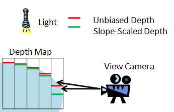
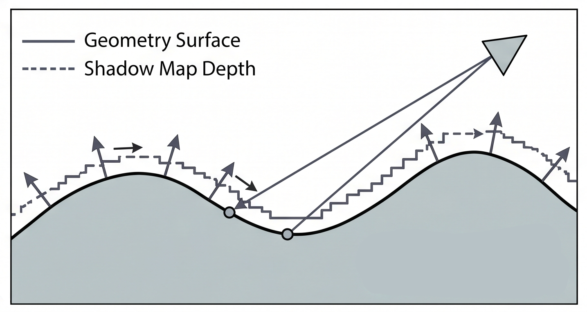

## Bias for Shadow

Shadow map에서 bias는 자기 자신이 자기 자신에게 그림자를 드리우는 문제, 즉 shadow acne를 줄이기 위한 보정이다.\
Shadow mapping은 빛의 시점에서 장면을 렌더링해 depth map을 만들고, 이후 카메라 시점에서 각 픽셀을 light space로\
변환해 shadow map에 저장된 depth와 비교한다. 이때 현재 픽셀이 shadow map에 기록된 깊이보다 더 멀리 있으면 그림자\
안에 있다고 판단한다.

문제는 이 비교가 완벽하지 않다는 점이다. Shadow map은 제한된 해상도의 텍스처이고, depth 값도 유한한 정밀도를 가진다.\
또한 같은 표면이라도 shadow map을 만들 때의 rasterization 결과와 나중에 픽셀 셰이더에서 다시 계산한 light-space 위치가\
미세하게 어긋날 수 있다. 그 결과 실제로는 빛을 받아야 하는 표면이 자기 자신보다 뒤에 있다고 판정되어 검은 점이나 줄무늬가 생긴다.\
이것이 shadow acne다.
다.

### 1. constant bias

가장 기본적인 해결책은 constant bias다. 이는 shadow depth 비교에 작은 여유값을 추가한다.\
개념적으로는 shadow map에 저장된 depth에 bias를 더하거나, 현재 픽셀의 depth에서 bias를 빼서 비교한다.

```text
shadowDepth + bias < currentDepth 이면 그림자
```

이렇게 하면 아주 작은 오차 때문에 자기 자신이 그림자로 판정되는 일을 줄일 수 있다. 하지만 모든 표면에\
같은 bias를 주는 방식이라 한계가 있다. Bias가 너무 작으면 acne가 남고, 너무 크면 그림자가 물체에서\
떨어져 보이는 Peter Panning 현상이 생긴다.

### 2. slope bias

이 한계를 보완하기 위한 게 slope bias다. Slope bias는 빛의 시점에서 봤을 때 표면이 얼마나 비스듬한지를 기준으로\
bias를 조절한다. 표면이 빛에서 정면으로 보이면 shadow map texel 하나 안에서 depth 변화가 작지만, 비스듬하게 보이면\
texel 하나 안에서도 depth 변화가 커진다. 그래서 기울어진 표면일수록 shadow acne가 더 잘 생긴다.\
그리고 Slope bias는 이런 상황에서 bias를 더 크게 준다.

<p>
  
</p>


```text
최종 bias = constant bias + slope scale × surface slope
```

다시 말해 slope bias는 light-space에서 표면의 깊이 변화가 클수록 더 강하게 적용되는 bias다.

### 3. normal bias

반면 normal bias는 depth 값만 보정하는 방식이 아니라, 그림자 판정에 사용할 위치 자체를 표면 normal 방향으로\
조금 이동시키는 방식이다. 원래 월드 위치가 `P`라면, shadow map을 샘플링할 때 다음처럼 약간 띄운 위치를 사용한다.

<p>
  
</p>

```text
P' = P + N × normalBias
```

즉 normal bias는 표면 위의 점을 그대로 검사하지 않고, 표면에서 살짝 떨어진 위치를 기준으로 shadow test를 수행한다.\
이 방식은 곡면, 복잡한 메시, 캐릭터, normal mapping이 적용된 표면에서 도움이 된다.

CSM에서는 이 bias들을 cascade마다 다르게 조절하는 경우가 많다. 가까운 cascade는 작은 영역을 높은 밀도로 덮기 때문에 texel\
하나의 월드 크기가 작고, 먼 cascade는 넓은 영역을 같은 해상도로 덮기 때문에 texel 하나의 월드 크기가 크다. 따라서 멀리 있는\
cascade일수록 더 큰 bias가 필요할 수 있다. 그래서 bias를 고정값으로만 두기보다는 cascade의 texel density를 고려하는 편이\
안정적이다.