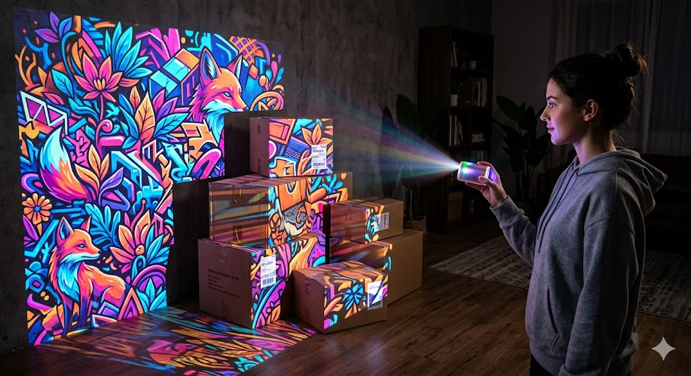
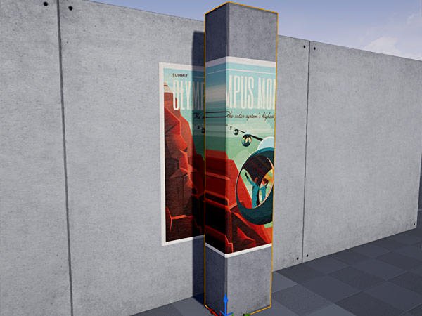
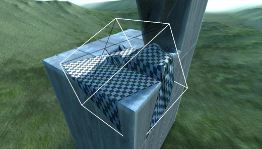

## Decal

### 1. Decal이란 무엇인가

데칼을 검색하면 흔히 말하길 데칼이 스티커란다. 실제로 벽이 있다면 그 위에 붙이는 스티커처럼 작동하는데,\
이 비유로는 데칼의 특징을 다 담아낼 수 없다.

영상에서는 동적으로 움직이는 걸 보여주는데, 마치 어떤 한 방향에서 투영하는 것처럼 작동한다. 그래서 마치\
스프레이를 뿌려 그린 그래피티 느낌이 들 수도 있는데 그건 또 아니다.

Decal을 가장 쉽게 비유하면 **“벽이나 바닥에 그림을 쏘는 작은 빔 프로젝터”** 이다.

예를 들어 생각해보자.

- 방 안에 벽, 바닥, 상자가 있다.
- 손에는 작은 프로젝터가 들려 있다.
- 그 프로젝터는 어떤 그림을 앞으로 쏘고 있다.
- 그 앞에 있는 표면들에 그림이 찍힌다.

<p>
  
</p>


그러면 바닥에도 보이고, 벽에도 보이고, 상자 표면에도 보인다.

하지만 실제 엔진은 진짜 프로젝터처럼 빛을 쏘는게 아니라. **”이 영역 안에 있는 표면의 재질 값을 바꿔서”**\
결과적으로 프로젝터처럼 보이게 만든다.

좀 더 구체적으로는 그 지점의 color, normal, specular, noise 등을 완전히 대체하거나 블렌딩한다.\
따라서 원래 오브젝트가 가지고 있던 머티리얼에 새롭게 섞어 쓰는 머티리얼이기도 하다.

즉, 핵심은 아래와 같다.

> Decal은 오브젝트에 스티커를 직접 붙이는 기능이 아니라. 특정 공간 안의 표면에 대해 “이 부분은 이렇게 보여라”라고 덮어쓰는 기능이다.

### 2. Decal은 왜 벽을 뚫는가


데칼을 쓸 경우 아래 사진과 같은 경우가 있기 때문이다. 기둥에 포스터가 걸려 있는데, 앞의 기둥에\
그려진 부분이 벽면에도 그려져 있다.

<p>
  
</p>

이번에 구현하게 된 projection decal은 어떠한  공간(decal box) 속 표면에 projection시키는 것이기 때문이다.\
처음 닿은 표면에만 그려지지 않고 decal box 전부 그려진다. 이게 확 와 닿지 않을 수도 있다.

데칼은 충돌에 막히는 레이가 아니라, 어떤 공간 범위 안에 들어온 표면을 후처리로 수정하는 방식이기 때문이다.\
무엇보다 애초에 데칼이 이렇게 적용되더라도 위 이미지처럼 직관적이지 못한 모습을 직접 조우할 일은 없다.

플레이어에게는 이런 상황이 없다. depth test를 통과한 표면만 보이기 때문이다.\
그러나 눈에 보이지 않을 뿐 계산된다는 점을 기억하자.

<p>
  
</p>

그럼 이제 위의 그림도 어느정도 이해가 된다. Decal이라고 검색하면 나오는 저 이미지의 의미가 무엇인지 확실히 알았을 테다.

Decal이 무엇이고, Decal의 문제점에 대해서도 짚었다. 이제 본격적으로 게임 엔진에서의 Decal로 넘어가야 한다.\
그전에 그래픽스 파이프라인, 특히 forward rendering에서 Decal이 어떻게 구현되는지 짚고자 한다.

### 3. 그래픽스 파이프라인을 통해 만들어지는 Projection Decal

Forward Rendering에서는 각 픽셀 셰이딩 단계에서 Decal 연산이 포함되므로\
데칼 개수가 많아질수록 비용이 증가한다.

반면 Deferred Rendering에서는 G-buffer를 수정하는 방식으로 처리되므로\
여러 데칼을 상대적으로 효율적으로 적용할 수 있다.

아무튼 Forward Rendering에서 한 픽셀마다 아래와 같은 처리가 이루어진다.

World space에서의 위치

→ Decal space로 변환

→ Decal Volume 내부인지 판정

→ Decal space에서 UV 좌표 계산

→ Decal Texture sample

→ Sampling 결과를 기존 Material과 Blending

→ shading 끝

**구체적인 구현은 다르겠지만 각 단계를 pixel shader 내에서 전부 확인할 수 있다.**

---

#### 3.1. World space에서의 위치

이건 그냥 model matrix를 곱해준다. 오브젝트의 local space에 있던 point 하나가 world로 왔다. 마찬가지로 decal box도 전부 world로 보내준다

---

#### 3.2. Decal space로 변환

방금 구한 world space에서의 point에 Decal의 model matrix의 역행렬을 곱해준다.

**[왜 Decal space로 가는가?]**
```
A, B 오브젝트가 있다고 가정하자. 둘 다 model matrix를 곱해서 world space로 보내고 그 다음 B의 model matrix의
inverse를 A에 곱해주면 A와 B의 상대적인 위치를 알 수 있다. 왜냐면 A를 B 기준 좌표계, B의 로컬 좌표계로
보내 버렸기 때문이다. 여기에는 location, rotation, scale 등 상대적인 transform이 전부 반영되어 있다.
```
```
이제 보니 decal이 왜 중요한 지도 잘 알겠다. decal은 vertex shader에서의 transform 전 과정에 대한 이해가
선행되어야 하는 아주 좋은 예시이기 때문이다. pixel shader로 넘어가기 전 마지막으로 두드려보고 건너는 징검다리인 셈이다.
```

**[그럼 걍 World에서 바로 해도 되지 않는가?]**
```
왜 world에 전부 처리하면 되지 굳이 decal의 local space로 가는지 궁금해진다. 이유는 명쾌하다.
결국 성능 때문이다. 월드 공간에서 데칼을 판정하려면 픽셀마다 회전된 박스의 OBB 충돌 검사를 해야 하지만,
데칼의 local space로 넘어오는 순간 단순한 AABB 판정으로 바뀐다. 범위 체크만 하면 되니 빠를 수밖에 없다.

이 방식은 레이캐스팅에서 자주 쓰이는 기법과 정확히 일치한다. 오브젝트를 월드에서 레이와 충돌하는지 확인하는 게
아니라, 월드 행렬의 역행렬을 활용해 레이를 오브젝트의 로컬 공간으로 보내 계산을 단순화한다.

밑에서 첨언하겠지만 x, y가 -1 ~ 1 범위로 맵핑되니 UV좌표를 구하기도 쉬워진다.
```

**[Decal과 Forward rendering의 관계에 대하여]**
```
model matrix의 역행렬을 곱한다는 점을 곰곰히 생각해보니 카메라와 비슷하다. veiw matrix는 결국 camera의 model
matrix의 역행렬이다. 이와 비슷한 것으로 light도 있다. 이제 왜 forwarding pipeline에서 decal이 비효율적인지
알겠다.

교재에서는 deferred rendering 다음에 곧바로 decal로 넘어간다. 이는 Forward rendering을 사용이 강제되어
픽셀 하나하나 파이프라인이 돌아가야 하는 상황에서 데칼에 최적화가 왜 필요한지 시사한다.
(토마스 아케나인 몰러 외 5인,『리얼-타임 렌더링』, 권구주 외 2인 옮김, 에이콘출판, 2023, 1156쪽.)
```

---

#### 3.3. Decal Volume 내부인지 판정

$$
|x| \le 0.5, \quad |y| \le 0.5, \quad |z| \le 0.5
$$

Decal 공간에서 박스는 보통 [-0.5, 0.5] 범위를 가지는 단위 박스로 정규화된다.\
따라서 각 축에 대해 해당 범위 안에 들어오는지만 확인하면 된다.

여기서 셰이더 내 코드로 clipping도 이루어진다. Decal volume 바깥에 있다면 discard하면 된다.

---

#### 3.4. Decal space에서 UV 좌표 계산

$$
UV = (P_{decal}.x, P_{decal}.y),UV = P_{decal}.xy \times 0.5 + 0.5
$$

데칼 상자의 중심은 (0,0,0)일 테고 로컬에서의 크기가 보통 1을 기준으로 한다. 내부 좌표는 -1에서 1의 값을\
가질 테니 이걸  0에서 1의 값을 가지는 UV로 Remapping해 주어야 한다. 이렇게 decal box의 x,y를 텍스처의\
u,v처럼 사용하며 projection이 되는 듯한 느낌이 난다. 즉, Decal의 로컬 XY 평면이 그대로 텍스처 공간(UV)에 대응된다.

---

#### 3.5. Decal Texture sample

$$
Cdecal=Texture(UV)
$$

decal 전용 셰이더에서 신경써야 될 부분이다.
구체적인 코드는 언급하지 않겠다.

---

#### 3.6. Sampling 결과를 기존 Material과 Blending

$$
C=lerp(Cbase,Cdecal,α)
$$
$$
N=normalize(Nbase+Ndecal)
$$

렌더러 쪽의 레스터라이저 설정에서 신경써야 될 부분이다.
구체적인 코드는 언급하지 않겠다.

#### 3.7. shading 끝

여기서는 구체적으로 뭔가를 하지 않는다. 사실 위에서 이제 material에 대한 정의가 끝났으니 light가 들어가야\
하니 음영을 내지 않는다면 굳이 필요하지 않은 파트다.

지금까지를 요약하자면 다음과 같다.

```
월드 공간의 표면을 데칼 공간으로 변환해서 박스 내부인지 확인한 뒤,
그 위치를 UV로 매핑해 텍스처를 샘플링하고 기존 머티리얼에 섞는다.
```

forward shading에서는 decal과 shading이 붙어 있고 곧바로 최종 shading을 하므로 사실 2.6에서 끝이 난다고 볼 수 있다.\
그러나 deferred shading은 다르다. G-Buffer만 수정해두고 나중에 lighting pass를 거치면서 셰이딩을 완성한다.


**이어서 Unreal의 UDecalComponent가 왜 다른 Primitive 표면 위에 붙어 보이는지를 쉽게 설명한다.**

> 위와 아래의 작성자가 각각 다르므로 위와 중복되는 내용이 있을 수 있으나 언리얼 관점에서 좀 더 자세히 접근하므로 필독하길 바란다.

# Unreal UDecalComponent
## 4. 이 문서의 목적

여기서는 다음을 설명한다.

```
- 어떻게 다른 메시 위에 붙어 보이는지
- 엔진이 어떤 순서로 처리하는지
- 직접 구현한다면 어떤 식으로 생각해야 하는지
```

이 문서는 렌더러 입장에서의 작동 원리만 다룬다.

---

## 5. UDecalComponent 실제 역할

UDecalComponent는 쉽게 말해서

<aside>
💡

**위치, 회전, 크기를 가진 데칼 박스와 그 안에서 사용할 머티리얼**

</aside>

이라고 보면 된다.

즉, UDecalComponent에는 개념적으로 이런 것이 들어 있다.

- 어디에 있는가
- 어느 방향을 보는가
- 얼마나 큰가
- 어떤 머티리얼을 사용할 것인가
- 여러 데칼이 겹치면 어떤 순서로 그릴 것인가.

중요한 점은, Decal은 보통 **“하나의 박스 영역”** 으로 생각해야 한다는 것이다.

즉 “이 텍스처를 메시 UV 위에 올린다”가 아니라.

**“이 박스 안으로 들어온 표면들에 영향을 준다.”**

가 더 정확한 이해다.

---

## 6. 어떻게 다른 Primitive 위에 붙어 보이는가

<aside>
💡

Decal은 Primitive 자체를 바꾸는 것이 아니라, 화면에 보이는 그 Primitive의 표면 픽셀을 나중에 수정하기 때문이다.

</aside>

조금 더 쉽게 설명하자면,

예를 들면 화면에 이런 게 있다고 하자.

- 바닥 메시
- 벽 메시
- 상자 메시

카메라는 이 셋을 보고 있다.

엔진은 먼저 이 오브젝트들을 렌더링해서
”화면의 각 픽셀이 어떤 표면인지”를 어느 정도 알고 있게 된다.

그 다음 Decal이 들어오면 이렇게 생각한다.

- 이 Decal 박스 안에 있는 표면인가?
- 지금 화면에 실제로 보이는 표면인가?
- 이 표면은 데칼을 받을 수 있는가?

이 조건을 만족하면그 픽셀의 색, 노멀, 거칠기 같은 값을 일부 바꾼다.

그래서 결과적으로는

- 바닥 위에 자국이 생기고
- 벽 위에 얼룩이 생기고
- 상자 위에 페인트가 묻은 것처럼

보인다.

> 즉, “메시에 직접 붙였다”기보다, “그 메시가 화면에 보여주는 표면 결과를 수정했다”고 이해하는 게 맞다.
> 

---

## 7. 많은 사람이 처음에 오해하는 부분

처음에는 보통 이렇게 생각하기 쉽다.

> Decal이 바닥 메시를 찾아서
그 메시의 삼각형에다가 텍스처를 투영해서 그리는 거 아닌가?
> 

완전히 틀린 말은 아니지만,
언리얼의 일반적인 Decal의 구현 방식은 그것보다 **버퍼/표면 수정 방식**에 더 가깝다.

즉, 이렇게 생각하는 게 좋다.

- “이 메시에 데칼을 붙인다”
    
    보다는
    
- “이 데칼 박스 안에 들어온 표면 결과를 수정한다”

이 차이가 중요합니다.

---

## 8. Decal의 기준은 대상 Primitive가 아니라 Decal 자신이다.

Decal은 보통 **대상 오브젝트의 축 기준**으로 동작하지 않는다.

- 바닥이 눕혀져 있든
- 벽이 세워져 있든
- 상자가 비스듬히 회전해 있든

상관없이,

**Decal 자신의 위치, 회전, 크기**가 기준이다.

즉, Decal은 자기만의 로컬 공간을 가진다.

표면의 어떤 점이 있을 때, 엔진은 그 점을 **”Decal의 로컬 공간으로 옮겨서”** 본다.

그리고 그 점이 데칼 박스 안에 들어오면, 그 점은 Decal의 영향을 받을 수 있다.

정리하면

- 표면이 기준이 아니다.
- Decal 박스가 기준이다.

---

## 9. 실제로 어떤 순서로 처리되는가

---

### 9.1. 먼저 씬의 표면들을 그린다.

엔진은 먼저

- 어떤 픽셀이 바닥인지
- 어떤 픽셀이 벽인지
- 어떤 픽셀이 상자인지
- 깊이는 얼마인지
- 표면 노멀은 어떤지

같은 정보를 확보한다.

이 단계는 **“화면에 보이는 표면 정보를 먼저 준비하는 단계”**이다.

---

### 9.2. Decal 박스를 이용해 다시 검사한다.

그 다음 엔진은 Decal을 처리한다.

이때 Decal은 보통 박스 형태의 영향 범위를 가진다.

엔진은 대략 이렇게 판단한다.

- 현재 화면의 이 픽셀은 실제로 어떤 월드 위치의 표면인가?
- 그 표면 위치를 Decal 공간으로 바꾸면 어디인가?
- Decal 박스 안에 들어오는가?

들어오면 계속 진행한다.
안 들어오면 무시한다.

---

### 9.3 그 표면이 데칼을 받을 수 있는지 확인한다.

모든 표면이 무조건 데칼을 받는 건 아니다.

예를 들어 어떤 Primitive는 설정상 데칼을 안 받을 수도 있고,
머티리얼도 특정 데칼 채널에 반응하지 않을 수 있다.

즉, 엔진은 보통 이렇게 한 번 더 확인한다.

- 이 표면은 데칼 수신 가능?
- 이 머티리얼은 Color/Normal/Roughness 같은 변경을 허용함?

허용되면 데칼 적용.
아니면 무시

---

### 9.4 Decal 머티리얼을 계산해서 표면 결과를 바꾼다.

이제 실제 데칼 머티리얼을 계산한다.

예를 들어

- 피자국 텍스처
- 먼저 텍스처
- 탄흔 텍스처
- 페인트 얼룩

같은 걸 생각하면 된다.

이 머티리얼의 결과를 기존 표면에 섞는다.

예를 들면

- Base Color를 조금 바꾼다.
- Normal을 바꿔서 표면이 울퉁불퉁해 보이게 한다.
- Roughness를 바꿔서 더 젖어 보이게 한다.

그래서 단순히 “그림 한 장 올린 것”이 아니라
**표면 성질 자체가 바뀐 것처럼** 보일 수 있다.

---

## 10. 그래서 Decal이 Primitive 위에 그려진다는 말의 진짜 의미

정리해보자면

“Decal이 Primitive 위에 그려진다”는 말은 보통 사람이 듣기엔

- 메시 표면에 텍스처를 직접 붙인다.

처럼 들리는데,

렌더러 관점에서는 좀 더 정확히 이렇게 말해야 한다.

**“Decal 불륨 안에 있고 화면에 보이는 Primitive의 표면 결과를 수정한다.”**

즉 중요한 것은

- Primitive를 다시 만드는 게 아님
- 메시 UV를 다시 굽는 게 아님
- 기존 메시를 변형하는 게 아님

대신,

- 이미 있는 표면에 대해
- Decal 영역 안에서만
- 표면 속성을 덮어써서

붙어 보이게 만든다.

---

## 11. 왜 바닥에도 찍히고 벽에도 찍히고 상자에도 찍히는가

Decal은 “특정 메시 전용”이 아니라
”공간 전용”에 가깝다.

즉 하나의 Decal 박스가 있을 때

- 그 박스와 겹치는 바닥 표면
- 그 박스와 겹치는 벽 표면
- 그 박스와 겹치는 상자 표면

이 모두가 영향을 박을 수 있다.

그래서 데칼이 여러 표면에 동시에 걸치는 경우가 생긴다.

---

## 12. 직접 구현할 때 가져가야할 사고방식

커스텀 엔진에서 UDecalComponent 비슷한 걸 만든다고 하면,
가장 먼저 버려야 할 생각은 아래와 같다.

> “데칼이 어떤 메시 하나를 골라서 그 메시 위에서만 그려야 한다”
> 

### 올바른 사고방식

1. Decal은 박스 볼륨이다.
2. 이 박스는 방향을 가진다.
3. 화면에 보이는 표면 점을 가져온다.
4. 그 점을 데칼 공간으로 바꾼다.
5. 박스 안이면 데칼 머티리얼을 계산한다
6. 그 결과를 기존 표면 속성에 섞는다.
