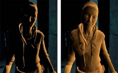

# 셰이딩 수식의 직관적 이해: 수학이 어떻게 예술이 되는가

그래픽스에서 사용하는 **셰이딩 수식**은 단순한 계산식이 아니다.
이 수식은 픽셀의 밝기를 결정하는 **직접적인 함수**이며, 결과적으로 화면에 보이는 이미지를 만들어내는 **디자인 도구**다.

따라서 수식을 단순히 “공식”으로 보는 것이 아니라,
**입력 값이 어떻게 변할 때 출력이 어떻게 변하는지**, 즉 “그래프의 형태”로 이해하는 순간부터
우리는 결과를 예측하고, 나아가 의도적으로 설계할 수 있게 된다.

이 관점에서 대표적인 셰이딩 모델들을 살펴보자.

---

## 1. Lambert vs Half Lambert: 그림자가 만들어지는 방식

먼저 디퓨즈(Diffuse) 셰이딩을 보자.

* **Lambert (왼쪽)**: 그림자가 강하게 떨어지며 어두운 영역의 형태가 묻힌다
* **Half Lambert (오른쪽)**: 명암이 부드럽게 이어지며 형태가 더 잘 드러난다

이 차이는 단순한 취향의 문제가 아니라, 수식의 구조에서 바로 나온다.

두 모델의 수식은 다음과 같다:

$$
\text{Lambert} = \max(\text{dot}(N, L), 0)
$$

$$
\text{Half Lambert} = (\text{dot}(N, L) \times 0.5) + 0.5
$$

이 두 수식을 하나의 그래프로 보면 차이가 훨씬 명확해진다.

<em>(빨간색: Lambert, 파란색: Half Lambert)</em>

그래프를 그대로 해석해보자.

* x축: `dot(N, L)` (빛과 표면의 각도)
* y축: 최종 밝기

여기서 핵심은 **0 이하 영역을 어떻게 처리하느냐**다.

* **Lambert (빨간선)**

  * 0 이하를 모두 잘라낸다 (clamp)
  * 그래프가 0에서 갑자기 평평해진다

* **Half Lambert (파란선)**

  * 값을 [0, 1] 범위로 재매핑한다
  * 0 이하 영역도 부드럽게 이어진다

즉,

> Lambert는 밝기가 특정 지점에서 “끊기고”,
> Half Lambert는 같은 구간에서도 “계속 이어진다”.

이 차이가 그대로 이미지로 나타난다.

* Lambert → **경계가 강한, 대비가 큰 그림자**
* Half Lambert → **부드럽게 이어지는 자연스러운 명암**

---

## 2. Phong vs Blinn-Phong: 하이라이트의 퍼짐

이번에는 스페큘러(Specular), 즉 하이라이트를 보자.

* **Phong**: 하이라이트가 작고 날카롭게 집중됨
* **Blinn-Phong**: 하이라이트가 넓고 부드럽게 퍼짐

이 역시 수식의 형태에서 비롯된다.

$$
\text{Phong} = (\text{dot}(R, V))^n
$$

$$
\text{Blinn-Phong} = (\text{dot}(N, H))^n
\quad (H = \text{normalize}(L + V))
$$

이 두 수식도 그래프로 함께 보면 차이가 명확하다.

<em>(빨간색: Phong, 파란색: Blinn-Phong)</em>

그래프를 기준으로 해석하면 다음과 같다.

* **Phong (빨간선)**

  * 반사 벡터와 시선 벡터를 직접 비교
  * 조건이 매우 엄격함
  * 그래프가 좁고 뾰족하게 솟는다

* **Blinn-Phong (파란선)**

  * 빛과 시선의 평균 방향(H)을 사용
  * 조건이 더 완화됨
  * 그래프가 넓고 완만하게 퍼진다

즉,

> Phong은 “정확히 맞아야 밝고”,
> Blinn-Phong은 “대충 맞아도 꽤 밝다”.

그래서 결과적으로:

* Phong → **날카롭고 집중된 하이라이트**
* Blinn-Phong → **넓고 부드러운 하이라이트**

---

## 핵심 정리: 수식의 형태가 결과를 만든다

지금까지의 내용을 한 줄로 요약하면 다음과 같다:

> 셰이딩 결과는 물리 법칙이 아니라 **수식의 형태가 만든다**

그래프 관점에서 보면:

* 값을 잘라내면 → 경계가 생긴다 (Lambert)
* 값을 재배치하면 → 부드러워진다 (Half Lambert)
* 조건이 엄격하면 → 결과가 집중된다 (Phong)
* 조건이 완화되면 → 결과가 퍼진다 (Blinn-Phong)

---

## 결론

수식을 그래프로 이해하기 시작하면,
셰이딩은 더 이상 “정해진 모델을 사용하는 것”이 아니다.

* 그림자를 부드럽게 만들고 싶다면 → 값을 재매핑하고
* 하이라이트를 날카롭게 만들고 싶다면 → 조건을 더 엄격하게 만들고
* 특정 스타일을 만들고 싶다면 → 수식을 직접 변형하면 된다

결국 셰이딩은

> 원하는 이미지를 만들기 위한 **함수 설계의 문제**다