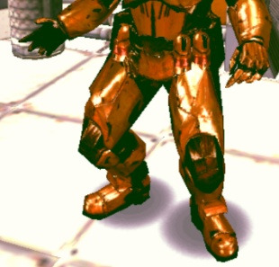
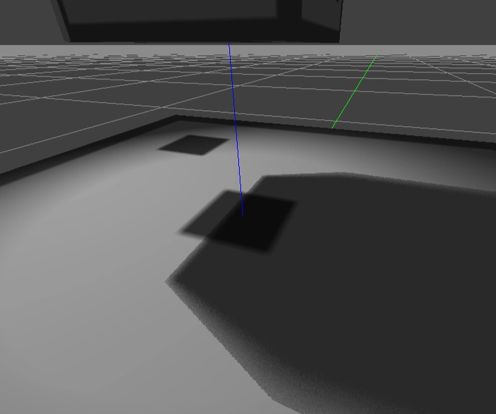

# Shadow Rendering Techniques in Real-Time Graphics

## 1. 들어가며: 실시간 렌더리에 그림자의 의미

실시간 렌더링에서 그림자는 장면의 입체감과 공간감을 만드는 핵심 요소이다. 물체가 바닥에 붙어 있는지, 어떤 물체가 다른 물체보다 앞에 있는지, 빛이 어느 방향에서 돌어오는지 같은 정보를 그림자는 매우 직관적으로 전달한다. 같은 모델과 같은 조명이라도 그림자가 없으면 장면은 쉽게 평면적으로 보이고, 물체들 사이의 공간 관계도 약해진다.

하지만 그림자는 단순히 표면을 어둡게 칠하는 문제가 아니다. 렌더링 관점에서 그림자의 본질은 **현재 표면점의 특정 광원에서 보이는가, 아니면 다른 물체에 의해 가려져 있는가**를 판단하는 것이다. 즉 그림자는 색상 계산 이전에 필요한 **visibility 문제**에 가깝다.

일반적인 조명 계산은 현재 픽셀의 위치, 법선, 재질, 광원 정보를 이용해 밝기를 계산한다. 그러나 그림자를 계산하려면 여기에 한 가지 질문이 추가된다.

> 이 표면점은 카메라에서 보이지만, 광원에서도 보이는가?
> 

만약 광원에서 보인다면 그 지점은 빛을 받을 수 있다. 반대로 광원과 표면점 사이에 다른 물체가 있다면, 그 지점은 그림자 영역이 된다. 이 단순한 딜문을 실시간으로 처리하기 위해서는 광원 기준의 깊이 정보, 추가 렌더 패스, 픽셀 단위 비교, 필터링, 메모리 대역폭, 다중 라이트 관리 등 여러 기술적 문제가 따라온다.

초기 게임에서는 하드웨어 설능과 그래픽 파이프라인의 한계 때문에 이러한 visibility 판정을 정확하게 수행하기 어려웠다. 그래서 실제 그림자를 계산하기보다는, 캐릭터 발밑에 어두운 원형 텍스처를 깔거나, 물체를 바닥 평면에 투영하거나, 정적 배경의 그림자를 미리 구워두는 방식이 주로 사용되었다. 이러한 기법들은 정확한 self-shadowing이나 동적 cast shadow를 표현하지는 못했지만, 매우 낮은 비용으로 “그림자가 있다”는 시각적 단서를 제공할 수 있었다.

이후 GPU가 발전하면서 실시간 그림자 기술도 점차 복잡해졌다. 그림자 공간을 기하학적으로 표현하는 Shadow Volume, 광원 시점의 깊이 버퍼를 이용하는 Shadow Mapping, 그림자 경계를 부드럽게 만드는 PCF, 넓은 월드의 태양 그림자를 처리하기 위한 CSM, 부드러운 그림자를 근사하는 PCSS와 VSM, 그리고 현대의 Ray Traced Shadow와 Vitrual Shadow Map까지 다양한 기법들이 등장했다.

이 문서는 실시간 렌더링에서 그림자 기술이 어떤 문제를 해결하기 위해 등장했는지, 각 기술이 어떤 하드웨어 제약과 품질 문제를 가지고 있었는지, 그리고 그 한계가 다음 세대의 그림자 기법으로 어떻게 이어졌는지를 시대별로 정리한다. 단순히 그림자 기법의 목록을 나열하는 것이 아니라. **“광원 기준 visibility를 어떻게 더 싸고 안정적으로 근사해 왔는가”**라는 관점에서 그림자 기술의 발전 흐름을 살펴본다.

---

## 2. 1세대: 가짜 그림자와 정적 그림자

초기 실시간 렌더링에서 그림자는 지금처럼 광원 기준의 visibility를 정밀하게 계산하는 방식이 아니었다. 하드웨어 성능이 제한적이었고, 픽셀 셰이더, render-to-texture, depth texture, 고해상도 shadow map 같은 기능을 자유롭게 사용하기 어려웠기 때문이다.

그림자를 정확하게 계산하려면 현재 표면점이 카메라에서 보이는 것뿐만 아니라, 광원에서도 보이는지를 다시 판단해야 한다. 그러나 초기 GPU는 이러한 추가 visibility 판정을 매 프레임, 매 픽셀, 매 광원에 대해 처리하기에 적합하지 않았다.

따라서 초기 게임에서는 정확한 동적 **그림자보다 그림자처럼 보이는 시각적 단서**를 저렴하게 만드는 방식이 주로 사용되었다. 대표적인 기법으로는 Blob Shadow, Planar Shadow, Lightmap 또는 Baked Shadow가 있다.

이 시기의 핵심은 다음과 같다.

> 정확한 그림자의 계산 X
광원 기준 visibility 판정 X
저렴한 착시 효과 O
정적 장면은 미리 계산 O
> 

즉 1세대 그림자 기법은 “빛이 실제로 막혔는가?”를 계산하기보다, 플레이어가 장면을 볼 때 “그림자가 있는 것처럼 느끼게 하는 것”에 초점이 맞춰져 있었다.

---

### 2.1 Blob Shadow

Blob Shadow는 캐릭터나 오브젝트 아래에 원형 또는 타원형의 어두운 텍스처를 깔아 그림자처럼 보이게 하는 기법이다.

가장 단순한 형태는 캐릭터의 발밑에 반투명한 검은 원을 렌더링하는 것이다.



blob shadow

이 방식은 실제 광원 방향이나 물체의 형태를 정확하게 반영하지 않는다. 캐릭터가 팔을 들거나 무기를 휘둘러도 그림자의 모양은 대부분 변하지 않는다. 하지만 캐릭터가 바닥에 붙어 있다는 느낌을 주기에는 충분하다.

Blob Shadow의 목적은 정확한 그림자가 아니라 **접지감**이다. 그림자가 전혀 없으면 캐릭터가 바닥 위에 떠 있는 것처럼 보일 수 있다. Blob Shadow는 아주 낮은 비용으로 이 문제를 완화한다.

구현 방식은 보통 다음과 같다.

```
1. 캐릭터의 월드 위치를 구한다.
2. 캐릭터 아래 바닥 위치를 찾는다.
3. 그 위치에 원형 또는 타원형 그림자 텍스처를 배치한다.
4. Alpha Blend 또는 Multiply Blend로 바닥 위에 그린다.
```

따라서 Blob Shadow는 실제 그림자라기보다 **그림자를 흉내 낸 Decal 효과**에 가깝다.

---

### 2.2 Planar Shadow

Planar Shadow는 물체의 형태를 특정 평면에 투영하여 그림자처럼 렌더링하는 기법이다. Blob Shadow가 단순한 원형 텍스처를 사용하는 반면, Planar Shadow는 실제 caster geometry의 형태를 이용한다.

예를 들어 캐릭터 mesh를 빛 방향으로 바닥 평면에 투영하면, 바닥 위에 납작하게 눌린 캐릭터 모양의 그림자를 만들 수 있다.


planar shadow

개념적으로는 원본 mesh를 한 번 더 렌더링하되, 일반적인 world matrix 대신 평면 투영용 **shadow matrix**를 적용한다.

Planar Shadow의 핵심은 다음과 같다.

```
Caster Mesh를
Light Direction을 따라
Receiver Plane 위에 투영한다.
```

Planar Shadow의 장점은 다음과 같다.

```
장점:
- Blob Shadow보다 물체 형태를 더 잘 반영한다.
- Shadow Map 없이도 동적인 그림자처럼 보이게 만들 수 있다.
- 구현 비용이 비교적 낮다.
- 특정 평면 바닥이 많은 게임에서 효과적이다.
```

한계는 다음과 같다.

```
한계:
- 하나의 평면 receiver에만 적합하다.
- 복잡한 geometry에 자연스럽게 드리우기 어렵다.
- self-shadowing은 표현할 수 없다.
- 여러 물체가 서로 그림자를 주고받는 관계를 정확히 처리할 수 없다.
- z-fighting, depth bias, blending 문제가 발생할 수 있다.
```

---

### 2.3 Lightmap / Baked Shadow

Biob Shadow와 Planar Shadow가 동적 오브젝트를 위한 저비용 근사라면, Lightmap 또는 Baked Shadow는 정적 장면을 위한 고품질 그림자 방식이다.

Lightmap은 조명 결과를 미리 계산해서 texture에 저장해두는 방식이다. 런타임에서는 복잡한 조명 계산이나 그림자 판정을 하지 않고, 미리 구워진 텍스처를 표면에 샘플링한다.

```
개발/빌드 단계:
    조명 계산
    그림자 계산
    결과를 texture로 저장

런타임:
    lightmap texture sample
    material color와 조합
```

정적인 건물, 벽, 바닥, 실내 구조물에는 이 방식이 매우 효과적이다. 그림자를 매 프레임 계산하지 않기 때문에 런타임 비용이 낮고, 당시 하드웨어 기준으로도 비교적 높은 품질의 조명과 그림자를 표현할 수 있었다.

Lightmap의 장점은 강력하다.

```
장점:
- 런타임 비용이 매우 낮다.
- 복잡한 정적 그림자를 표현할 수 있다.
- 부드러운 간접광, ambient occlusion, color bleeding도 포함할 수 있다.
- 초기 하드웨어에서도 높은 시각 품질을 얻기 좋다.
```

하지만 Lightmap은 본질적으로 정적이다. 미리 계산된 결과이기 때문에 장면이 움직이면 맞지 않는다.

예를 들어 다음과 같은 경우에는 문제가 생긴다.

```
- 캐릭터가 움직인다.
- 문이 열린다.
- 상자가 이동한다.
- 광원이 움직인다.
- 시간이 지나 태양 방향이 바뀐다.
- 오브젝트가 파괴된다.
```

이런 상황에서는 baked shadow가 실제 장면과 맞지 않게 된다. 그래서 Lightmap은 주로 정적 배경에 사용되고, 동적 캐릭터나 움직이는 물체에는 별도의 동적 그림자 기법이 필요하다.

Lightmap의 한계는 다음과 같다.

```
한계:
- 동적 오브젝트 그림자에 약하다.
- 움직이는 광원에 대응하기 어렵다.
- UV unwrap과 lightmap 해상도 관리가 필요하다.
- 메모리를 추가로 사용한다.
- 런타임에서 그림자 형태를 자유롭게 바꾸기 어렵다.
```

그래도 초기 실시간 렌더링에서 Lightmap은 매우 중요한 역할을 했다. 당시 하드웨어로는 매 프레임 고품질 그림자를 계산하기 어려웠지만, 미리 계산해둔 결과를 텍스처로 읽는 것은 상대적으로 저렴했기 때문이다.

---

### 2.4 1세대 그림자 기법의 공통 특징

Blob Shadow, Planar Shadow, Lightmap은 서로 다른 방식이지만 공통점이 있다.

이들은 모두 광원 기준 visibility를 정확하게 계산하지 않는다.

```
Blob Shadow:
    그림자처럼 생긴 텍스처를 바닥에 배치한다.

Planar Shadow:
    물체를 특정 평면에 투영한다.

Lightmap:
    정적 장면의 그림자를 미리 계산해 텍스처로 저장한다.
```

즉 이 기법들은 실시간으로 다음 질문에 답하지 않는다.

```
현재 표면점과 광원 사이에
실제로 다른 물체가 존재하는가?
```

대신 각각 다른 방식으로 비용을 줄인다.

```
Blob Shadow:
    그림자 형태를 단순화한다.

Planar Shadow:
    receiver를 하나의 평면으로 제한한다.

Lightmap:
    계산 시점을 런타임 이전으로 옮긴다.
```

이 시기의 그림자 기법은 정확도보다 성능이 중요했다. 하드웨어가 제한된 상황에서, 그림자는 물리적으로 올바르기보다는 게임 화면에서 충분히 그럴듯하게 보여야 했다.

---

## 3. 2세대: 기하 기반 실시간 그림자

1세대 그림자 기법은 낮은 비용으로 “그림자가 있는 것처럼 보이는 효과”를 만들 수 있었지만, 실제로 물체가 빛을 막고 있는지를 정확하게 판단하지는 못했다. Blob Shadow는 단순한 텍스처를 바닥에 깔 뿐이고, Planar Shadow는 하나의 평면에만 그림자를 투영할 수 있으며, Lightmap은 정적인 장면에는 강하지만 동적인 물체와 광원에는 대응하기 어렵다.

이 한계를 넘기 위해 등장한 방식이 **기하 기반 실시간 그림자**이다.

기하 기반 그림자 기법은 그림자를 단순한 텍스처나 색상 효과로 보지 않고, **빛이 물체에 의해 차단되면서 만들어지는 3D공간**으로 다룬다. 대표적인 방식이 **Shadow Volume**이다.

Shadow Volume의 핵심 아이디어는 다음과 같다.

```cpp
빛을 막는 물체가 있다.
그 물체의 실루엣을 빛 방향으로 연장한다.
그렇게 만들어진 공간 안에 있는 픽셀은 그림자 영역이다.
```

즉 2세대 그림자 기법은 “바닥에 어두운 무언가를 그린다”는 접근에서 벗어나, **그림자가 차지하는 공간 자체를 계산하려는 시도**라고 볼 수 있다.

---

### 3.1 Shadow Volume

Shadow Volume은 물체가 광원을 가릴 때 생기는 그림자 영역을 실제 3D 기하 형태로 표현하는 기법이다.

예를 들어 광원 앞에 물체가 하나 있다고 하자.


이때 물체 뒤쪽에는 빛이 도달하지 못하는 공간이 생긴다. Shadow Volume은 이 공간을 하나의 volume geometry로 만든다.

조금 더 구체적으로 보면, 먼저 물체를 광원 방향에서 바라봤을 때의 **실루엣 edge**를 찾는다. 실루엣 edge란, 광원을 기준으로 한쪽 면은 빛을 향하고 있고 다른 한쪽 면은 빛을 등지고 있는 경계 edge를 말한다.

이 실루엣 edge를 빛의 반대 방향으로 길게 밀어내면, 물체 뒤쪽으로 그림자 공간이 만들어진다.


개념적으로는 다음과 같은 흐름이다.

```
1. 광원 기준으로 물체의 front face와 back face를 구분한다.
2. front face와 back face 사이의 경계 edge를 찾는다.
3. 그 edge를 빛의 반대 방향으로 연장한다.
4. 연장된 면들로 shadow volume geometry를 만든다.
5. 카메라에서 본 픽셀이 이 volume 안에 있으면 그림자로 판단한다.
```

즉 Shadow Volume은 Shadow Map처럼 텍스처 해상도에 의존하지 않는다. 그림자 경계는 shadow map texel이 아니라 실제 geometry의 실루엣에서 나오기 때문에, 원칙적으로는 매우 날카롭고 정확한 hard shadow를 만들 수 있다.

이 점이 Shadow Volume의 가장 큰 장점이다.

```
Shadow Map:
    빛 시점의 depth texture를 샘플링해서 그림자 판단

Shadow Volume:
    그림자 공간을 실제 geometry volume으로 만들어서 판단
```

따라서 Shadow Volume은 특히 다음과 같은 상황에서 강점을 가진다.

```
- 날카로운 hard shadow가 필요한 경우
- 낮은 shadow map 해상도로 인한 aliasing을 피하고 싶은 경우
- 점광원이나 스포트라이트의 명확한 그림자 경계가 필요한 경우
```

하지만 Shadow Volume만으로는 아직 문제가 있다. 화면의 각 픽셀이 shadow volume안에 있는지 어떻게 빠르게 판단할 것인가가 필요하다. 이때 사용되는 것이 Stencil Buffer이다.

---

### 3.2 Stencil Shadow

Shadow Volume은 그림자 공간을 기하 형태로 만들지만, 최종적으로는 화면의 픽셀이 그 공간 안에 있는지 판정해야 한다. 이를 위해 많이 사용된 방식이 **Stencil Buffer를 이용한 Shadow Volume 렌더링**이다.

Stencil Buffer는 각 픽셀마다 작은 정수 값을 저장하는 버퍼이다. 일반적으로 마스킹, 포털, 거울, 특수 렌더링 영역 제한 등에 사용되지만, Shadow Volume에서는 “이 픽셀이 shadow volume 안에 들어갔는가?”를 판정하는 데 사용된다.

기본 아이디어는 다음과 같다.

```
카메라에서 어떤 픽셀을 향해 ray를 쏜다고 생각한다.
그 ray가 shadow volume의 앞면을 통과하면 stencil 값을 증가시킨다.
그 ray가 shadow volume의 뒷면을 통과하면 stencil 값을 감소시킨다.

최종 stencil 값이 0이 아니면,
그 픽셀은 shadow volume 안에 있는 것으로 본다.
```

실제 렌더링 흐름은 보통 다음과 같이 구성된다.

```
1. 일반 scene depth를 먼저 렌더링한다.
2. 조명 계산 전 또는 조명 패스 중에 shadow volume을 stencil buffer에 렌더링한다.
3. shadow volume의 front face / back face에 따라 stencil 값을 증가 또는 감소시킨다.
4. stencil 값이 0인 영역은 lit 영역으로 처리한다.
5. stencil 값이 0이 아닌 영역은 shadow 영역으로 처리한다.
```

---

### 3.3 장점과 한계

Shadow Volume과 Stencil Shadow는 1세대 그림자 기법에 비해 훨씬 더 실제적인 동적 그림자를 만들 수 있었다. 물체의 실루엣을 기반으로 그림자 영역을 만들기 때문에, Blob Shadow나 Planar Shadow보다 훨씬 정확한 cast shadow를 표현할 수 있다.

특히 Shadow Volume은 shadow map 해상도에 의존하지 않기 때문에, 그림자 경계가 텍셀 단위로 깨지는 문제가 없다.

```
Shadow Volume의 장점:
- shadow map 해상도 문제가 없다.
- 그림자 경계가 매우 날카롭다.
- 동적 오브젝트의 cast shadow를 표현할 수 있다.
- point light, spot light 같은 local light와 잘 맞는다.
- hard shadow 표현에는 매우 정확한 편이다.
```

하지만 이 방식은 실시간 게임 엔진의 범용 그림자 기법으로 사용하기에는 한계가 많았다.

가장 큰 문제는 **실루엣 edge 추출**이다. Shadow Volume을 만들려면 매 프레임, 매 광원마다 물체의 실루엣 edge를 찾아야 한다.

```
광원 1개:
    각 shadow caster의 silhouette edge 계산

광원 4개:
    같은 물체라도 광원마다 silhouette edge가 달라짐

광원이 움직임:
    매 프레임 silhouette edge가 변함
```

즉 비용이 단순히 오브젝트 수에만 비례하는 것이 아니라, **오브젝트 수 × 광원 수**에 가깝게 증가한다.

또한 Shadow Volume은 mesh 구조에도 민감하다. 실루엣 edge를 안정적으로 찾으려면 mesh가 잘 닫혀 있어야 하고, edge adjacency 정보가 필요하다.

```
문제가 되는 경우:
- 구멍 난 mesh
- 열린 mesh
- 비정상적인 winding
- non-manifold geometry
- alpha test foliage
- billboard
- particle
```

특히 나뭇잎, 풀, 철망처럼 alpha texture로 모양을 만드는 오브젝트는 Shadow Volume과 잘 맞지 않는다. 겉보기에는 복잡한 실루엣이지만 실제 geometry는 단순한 quad이기 때문이다.

또 다른 큰 문제는 **fill-rate 비용**이다. Shadow Volume은 보이지 않는 volume geometry를 화면에 렌더링해서 stencil 값을 조작한다. 이 volume이 화면의 큰 영역을 덮으면, 실제 색을 쓰지 않더라도 depth/stencil 처리가 많이 발생한다.

```
비용 증가 요인:
- shadow volume geometry 수 증가
- 화면을 넓게 덮는 volume
- 여러 light의 반복 처리
- stencil increment/decrement pass
- front/back face 별도 처리
```

또한 Shadow Volume은 기본적으로 **hard shadow**에 적합하다. 현실적인 area light처럼 경계가 부드럽게 퍼지는 soft shadow를 만들기 어렵다. 부드러운 그림자를 만들려면 여러 개의 light sample을 사용하거나 추가적인 근사 기법이 필요한데, 이 경우 비용이 크게 증가한다.

```
Shadow Volume의 한계:
- 실루엣 edge 추출이 필요하다.
- mesh topology에 민감하다.
- alpha-tested geometry와 상성이 나쁘다.
- fill-rate 비용이 크다.
- 다중 라이트에서 비용이 빠르게 증가한다.
- soft shadow 표현이 어렵다.
- 구현 복잡도가 높다.
```

따라서 Shadow Volume은 기술적으로 강력했지만, 모든 장면과 모든 오브젝트에 적용하기에는 부담이 컸다.

---

## 4. 3세대: Shadow Mapping의 등장

Shadow Volume은 기하학적으로 정확한 hard shadow를 만들 수 있었지만, 실루엣 edge 추출, stencil 처리, mesh topology 제약, fill-rate 비용 같은 문제가 컸다. 특히 장면이 복잡해지고, 여러 광원과 동적 오브젝트가 많아질수록 Shadow Volume은 범용 그림자 시스템으로 확장하기 어려웠다.

이 한계를 넘기 위해 실시간 렌더링의 주류는 **Shadow Mapping**으로 이동했다.

Shadow Mapping의 핵심은 그림자 공간을 직접 geometry로 만드는 것이 아니라, 광원에서 바라본 장면의 depth 정보를 texture로 저장한 뒤, 카메라 렌더링 시 그 정보를 이용해 그림자 여부를 판단하는 것이다.

```
Shadow Volume:
    그림자 영역을 3D volume geometry로 만든다.

Shadow Mapping:
    광원에서 보이는 가장 가까운 depth를 texture로 저장한다.
```

즉 Shadow Mapping은 다음 질문에 답하기 위한 기법이다.

```
현재 픽셀은 카메라에서는 보인다.
그런데 광원에서도 보이는가?
```

현재 표면점이 광원에서도 보인다면 빛을 받는다.
반대로 광원 시점에서 이미 다른 물체가 그 위치보다 앞에 있다면, 현재 표면점은 그림자 안에 있다.

---

### 4.1 기본 Shadow Map

기본 Shadow Map은 두 단계로 구성된다.

```
1. Shadow Pass
   광원 시점에서 장면의 depth를 렌더링한다.

2. Main Render Pass
   카메라 시점에서 장면을 렌더링하면서,
   각 픽셀을 광원 공간으로 변환해 shadow map depth와 비교한다.
```

---

#### **1단계: 광원 시점에서 depth 렌더링**

먼저 카메라가 아니라 **광원 위치 또는 광원 방향 기준**으로 장면을 렌더링한다. 이때 색상은 필요 없고, 오직 depth만 필요하다.

```
Light View에서 장면 렌더링
→ 가장 가까운 표면의 depth 저장
→ Shadow Map 생성
```

예를 들어 빛에서 장면을 보면 다음과 같다.

```
Light View

가까운 물체 depth  → shadow map에 저장
그 뒤쪽 물체 depth → 저장되지 않음
```

Shadow Map에는 광원에서 보이는 가장 가까운 표면의 깊이만 저장된다.
이 값은 나중에 “현재 픽셀이 광원에서 보이는 가장 가까운 표면인가?”를 판단하는 기준이 된다.

렌더링 흐름은 대략 다음과 같다.

```cpp
// Shadow Pass
SetRenderTarget(nullptr,ShadowDepthDSV);
ClearDepth(ShadowDepthDSV);

SetViewProjection(LightView,LightProjection);

for (auto*Object :ShadowCasters)
{
RenderDepthOnly(Object);
}
```

---

#### **2단계: 카메라 렌더링에서 shadow map 비교**

이제 일반 카메라 시점에서 장면을 렌더링한다. 각 픽셀의 world position을 구한 뒤, 그 위치를 다시 light space로 변환한다.

```glsl
float4 lightClip = mul(float4(WorldPos, 1.0f), LightViewProjection);
float3 lightNDC = lightClip.xyz / lightClip.w;
```

Direct3D 기준으로 NDC의 x, y는 보통 `-1 ~ 1`, z는 `0 ~ 1` 범위이다.

이 값을 shadow map texture 좌표로 변환한다.

```glsl
float2 shadowUV;
shadowUV.x = lightNDC.x * 0.5f + 0.5f;
shadowUV.y = -lightNDC.y * 0.5f + 0.5f;

float currentDepth = lightNDC.z;
```

그 다음 shadow map에 저장된 depth와 현재 픽셀의 light-space depth를 비교한다.

```glsl
float shadowMapDepth = ShadowMap.Sample(PointSampler, shadowUV).r;

bool inShadow = currentDepth > shadowMapDepth + Bias;
```

의미는 다음과 같다.

```
currentDepth:
    현재 픽셀이 광원으로부터 떨어진 거리

shadowMapDepth:
    광원에서 봤을 때 해당 방향에서 가장 가까운 표면의 거리
```

따라서:

```
currentDepth <= shadowMapDepth
    → 현재 픽셀이 광원에서 보이는 가장 앞쪽 표면
    → 빛을 받음

currentDepth > shadowMapDepth
    → 현재 픽셀보다 앞에 다른 물체가 있음
    → 그림자 안에 있음
```

최종 조명에는 shadow factor를 곱한다.

```glsl
float shadowFactor = inShadow ? 0.0f : 1.0f;

float3 finalLighting =
    Ambient +
    shadowFactor * DirectLighting;
```

여기서 주의할 점은 ambient까지 그림자로 완전히 없애지는 않는 경우가 많다는 것이다. 그림자는 직접광을 차단하는 것이므로, 보통 direct light 항에만 shadow factor를 곱는다.

```
Ambient Light:
    주변광, 간접광에 가까운 항
    일반적으로 shadow factor를 강하게 적용하지 않음

Direct Light:
    특정 광원에서 직접 들어오는 빛
    shadow factor 적용 대상
```

---

#### **광원 종류별 Shadow Map**

Shadow Mapping은 광원 종류에 따라 projection이 달라진다.

```
Directional Light:
    Orthographic Projection 사용

Spot Light:
    Perspective Projection 사용

Point Light:
    Cube Shadow Map 사용
    또는 6개의 perspective shadow map 사용
```

Directional Light는 태양처럼 방향만 있고 위치가 사실상 무한히 먼 광원이므로, orthographic projection이 잘 맞는다.

```
Directional Light Shadow:
    Light View     = 빛 방향 기준 view matrix
    Light Projection = orthographic projection
```

Spot Light는 원뿔 형태의 조명 범위를 가지므로 perspective projection이 자연스럽다.

```
Spot Light Shadow:
    Light View       = spot light 위치와 방향
    Light Projection = perspective projection
```

Point Light는 모든 방향으로 빛을 쏘므로 한 장의 2D shadow map으로는 부족하다. 보통 6방향을 렌더링한 cube shadow map을 사용한다.

```
Point Light Shadow:
    +X, -X, +Y, -Y, +Z, -Z
    총 6방향 depth 렌더링
```

---

### 4.2 Self-shadowing과 Cast Shadow

Shadow Mapping이 중요한 이유는 self-shadowing과 cast shadow를 비교적 범용적으로 처리할 수 있기 때문이다.

**Self-shadowing**

Self-shadowing은 물체가 자기 자신에서 그림자를 드리우는 것이다.

예를 들어 캐릭터의 팔이 몸통에 그림자를 만들거나, 얼굴의 코가 뺨에 그림자를 만드는 경우가 이에 해당한다.

Shadow Mapping에서는 같은 물체가 shadow pass에도 렌더링되고, main pass에도 렌더링된다. 따라서 한 물체의 일부가 shadow map에 먼저 기록되면, 같은 물체의 다른 픽셀이 그 depth와 비교되면서 그림자로 판정될 수 있다.

```
Shadow Pass:
    캐릭터 전체를 광원 시점 depth map에 기록

Main Pass:
    캐릭터의 각 픽셀을 light space로 변환
    shadow map depth와 비교

결과:
    팔 뒤쪽의 몸통 픽셀은 shadow로 판정 가능
```

즉 Shadow Mapping은 별도의 특별한 self-shadowing 알고리즘을 추가하지 않아도, shadow caster와 shadow receiver를 같은 오브젝트로 허용하면 self-shadowing을 만들 수 있다.

```glsl
Self-shadowing 조건:
    같은 오브젝트가 shadow caster이면서 shadow receiver여야 한다.
```

---

#### **Cast Shadow**

Cast Shadow는 한 물체가 다른 물체에 그림자를 드리우는 것이다.

예를 들어 상자가 바닥에 그림자를 만들거나, 캐릭터가 벽에 그림자를 드리우는 경우이다.

```
Caster:
    빛을 막는 물체

Receiver:
    그림자를 받는 물체
```

Shadow Mapping에서는 caster와 receiver가 직접 서로를 알 필요가 없다.

광원 시점에서 가장 가까운 depth가 shadow map에 저장되어 있기 때문에, receiver는 단지 자신의 light-space depth와 shadow map depth를 비교하기만 하면 된다.

---

### 4.3 Shadow Acne, Peter-panning, Aliasing

Shadow Mapping은 GPU rasterizer와 texture sampling 구조에 잘 맞고, 대부분의 mesh에 적용할 수 있는 강력한 기법이다. 하지만 구조적으로 몇 가지 고질적인 문제가 있다.

대표적인 문제는 다음 세 가지다.

```glsl
1. Shadow Acne
2. Peter-panning
3. Aliasing
```

---

#### **Shadow Acne**

Shadow Acne는 그림자를 받아야 할 필요가 없는 표면에 줄무늬나 점 형태의 자기 그림자가 생기는 현상이다.

예를 들어 평평한 바닥이 빛을 직접 받고 있는데도, 표면 위에 검은 줄무늬가 생기는 경우이다.


원인은 shadow pass에서 저장된 depth와 main pass에서 다시 계산한 depth가 완전히 일치하지 않기 때문이다.

같은 표면이라도 다음 요인 때문에 depth 값에 미세한 차이가 생긴다.

```
- 부동소수점 정밀도 차이
- rasterization 위치 차이
- shadow map texel 중심과 현재 픽셀 위치 불일치
- light projection에서의 depth precision 문제
- 표면이 빛 방향에 대해 비스듬할 때 생기는 오차 확대
```

결과적으로 현재 픽셀이 자기 자신이 shadow map에 기록한 depth보다 아주 조금 뒤에 있다고 판정될 수 있다.


이를 완화하기 위해 bias를 사용한다.


```glsl
bool inShadow = currentDepth > shadowMapDepth + Bias;
```

Bias는 “아주 작은 차이는 그림자로 보지 않겠다”는 보정값이다.

```
Bias의 역할:
    depth 비교 기준을 약간 뒤로 밀어
    자기 자신에 의한 잘못된 shadow 판정을 줄인다.
```

하지만 bias를 너무 크게 주면 다른 문제가 생긴다. 그것이 Peter-panning이다.

---

#### **Peter-panning**


Peter-panning은 그림자가 물체에서 떨어져 보이는 현상이다.
이름처럼 물체가 바닥에 떠 있고, 그림자도 분체와 분리된 것처럼 보인다.


Bias를 과도하게 줬을 때의 상황

원인은 bias가 너무 크기 때문이다.

Bias가 크면 실제로는 그림자여야 하는 영역도 “depth 차이가 bias보다 작다”는 이유로 lit 영역으로 판정된다.

```
Bias가 작음:
    Shadow Acne 발생 가능

Bias가 큼:
    그림자가 caster에서 떨어짐
    Peter-panning 발생
```

즉 Shadow Mapping에서는 항상 다음 균형이 필요하다.

```
Bias를 줄이면:
    acne 증가

Bias를 키우면:
    peter-panning 증가
```

그래서 단순 constant bias만으로는 충분하지 않은 경우가 많다. 표면의 기울기와 빛 방향에 따라 bias를 조절하는 방식이 필요하다.

대표적으로 다음과 같은 bias 기법들이 사용된다.

```
Constant Depth Bias:
    항상 일정한 depth offset 적용

Slope-scaled Depth Bias:
    표면이 빛 방향에 대해 비스듬할수록 bias 증가

Normal Bias:
    표면 위치를 normal 방향으로 약간 밀어서 shadow test
```

---

#### **Aliasing**


Aliasing은 shadow map의 해상도가 부족해서 그림자 경계가 계단처럼 보이는 문제이다.

Shadow Map은 결국 texture이다.
따라서 광원 시점에서 저장한 depth texture의 texel 하나가 화면에서는 넓은 영역을 덮을 수 있다.

```
Shadow Map Texel 하나
    ↓
화면의 여러 픽셀에 대응

결과:
    그림자 경계가 계단처럼 보임
```

이 문제는 특히 다음 상황에서 두드러진다.

```
- shadow map 해상도가 낮을 때
- 카메라 가까이에 그림자 경계가 있을 때
- 넓은 영역을 하나의 shadow map에 담을 때
- directional light로 큰 월드를 덮을 때
- 표면이 빛 방향에 대해 비스듬할 때
```

Shadow Mapping의 aliasing은 단순히 “텍스처 해상도가 낮다”로만 설명할 수 없다. 중요한 것은 **shadow map texel density와 screen pixel density가 서로 맞지 않는다**는 점이다.

```
화면에서는 가까운 물체:
    많은 screen pixel을 차지함

shadow map에서는 같은 물체:
    적은 texel만 차지할 수 있음

결과:
    화면에서는 그림자가 크게 보이는데,
    shadow map 정보는 부족함
```

특히 Directional Light에서는 이 문제가 심하다. 태양 그림자를 만들기 위해 넓은 월드 영역을 하나의 orthographic shadow map에 담으면, 가까운 캐릭터나 바닥의 그림자에 충분한 texel을 배정하기 어렵다.

---

### 4.4 정리

Shadow Mapping은 실시간 그림자 기술에서 매우 중요한 전환점이다.

이전의 Shadow Volume이 그림자 공간을 기하학적으로 직접 만들었다면, Shadow Mapping은 광원 기준 depth texture를 이용해 visibility를 판정한다.

이 방식은 다음과 같은 이유로 실시간 렌더링의 주류가 되었다.

```
장점:
- GPU rasterizer와 잘 맞는다.
- 대부분의 triangle mesh에 적용할 수 있다.
- self-shadowing과 cast shadow를 모두 처리할 수 있다.
- skinned mesh, dynamic object에도 적용 가능하다.
- spot light, directional light, point light로 확장 가능하다.
- shader에서 texture sampling으로 그림자 판정을 처리할 수 있다.
```

하지만 Shadow Mapping은 텍스처 기반 기법이므로 고유한 문제가 남는다.

```
한계:
- shadow map 해상도에 따른 aliasing
- shadow acne
- peter-panning
- bias 튜닝 문제
- shimmering
- 넓은 월드에서 texel density 부족
- soft shadow 표현의 어려움
```

따라서 이후의 그림자 기술은 대부분 기본 Shadow Mapping의 약점을 보완하는 방향으로 발전했다.

```
Shadow Acne / Peter-panning 문제:
    → Depth Bias, Slope-scaled Bias, Normal Bias

Aliasing 문제:
    → PCF, Shadow Filtering

넓은 월드의 Directional Shadow 문제:
    → PSM, LiSPSM, CSM/PSSM

부드러운 그림자 문제:
    → PCSS, VSM, ESM, EVSM, MSM
```

즉 Shadow Mapping은 끝이 아니라 출발점이다.

현대 실시간 그림자 기술의 상당수는 기본 Shadow Map 위에 품질 개선, 필터링, 분할, 캐싱, 가상화 기법을 덧붙이는 방식으로 발전해 왔다.

---

## 5. 4세대: Shadow Map 품질 개선

기본 Shadow Mapping은 실시간 렌더링에서 동적 그림자를 범용적으로 처리할 수 있게 만든 중요한 기술이다. 하지만 기본 Shadow Map만으로는 품질 문제가 매우 쉽게 드러난다.

대표적인 문제는 다음과 같다.

```
1. 그림자 경계가 계단처럼 보인다.
2. 표면에 자기 그림자 줄무늬가 생긴다.
3. 그림자가 물체에서 떨어져 보인다.
4. 카메라가 움직일 때 그림자가 흔들린다.
5. 넓은 영역을 하나의 shadow map에 담으면 해상도가 부족하다.
```

4세대 그림자 기술은 Shadow Map 자체를 완전히 대체하기보다는, **기본 Shadow Mapping의 결과를 더 안정적이고 보기 좋게 만드는 방향**으로 발전했다.

이 시기의 핵심은 크게 세 가지다.

```
PCF:
	여러 depth compare 결과를 평균내서 그림자 경계를 부드럽게 만든다.

Bias:
	depth 비교 오차를 보정해서 shadow acne와 peter-panning을 줄인다.
	
Shadow Filtering:
	shadow map sampling 방식을 개선해서 aliasing과 noise를 완화한다.
```

즉 이 세대의 목적은 “그림자를 계산할 수 있게 만드는 것”이 아니라, 이미 계산된 shadow map을 **게임 화면에서 안정적으로 보이게 만드는 것**이다.

---

### 5.1 PCF

PCF는 Percentage-Closer Filtering의 약자이다.
Shadow Map에서 가장 기본적으로 사용되는 그림자 경계 완화 기법이다.

기본 Shadow Mapping에서는 현재 픽셀에 대해 shadow map depth를 한 번만 샘플링하고, 현재 픽셀의 light-space depth와 비교한다.

```glsl
float shadowMapDepth = ShadowMap.Sample(PointSampler, shadowUV).r;

float shadow = currentDepth > shadowMapDepth + Bias ? 0.0f : 1.0f;
```

이 방식은 결과가 완전히 이진적이다.

```
빛을 받음   → 1
그림자 안   → 0
```

따라서 그림자 경계가 shadow map texel 단위로 딱딱하게 끊어진다.


PCF는 이 문제를 해결하기 위해 shadow map을 한 번만 비교하지 않고, 주변 여러 texel에 대해 depth compare를 수행한 뒤 그 결과를 평균낸다.

```
한 번 비교:
    shadow = 0 또는 1

여러 번 비교:
    0, 0, 1, 1, 1, 0, 1, 1, 0
    평균 = 0.55

결과:
    부분적으로 그림자인 값 표현 가능
```

즉 PCF는 depth 값을 평균내는 것이 아니라, **depth 비교 결과를 평균내는 방식**이다.

이 차이가 중요하다.

```
잘못된 이해:
    주변 depth 값을 평균낸 뒤 한 번 비교한다.

PCF:
    주변 depth 각각을 currentDepth와 비교한다.
    그 compare 결과를 평균낸다.
```

예를 들어 3x3 PCF는 다음과 같이 구현할 수 있다.

```glsl
float ComputeShadowPCF3x3(
    Texture2D shadowMap,
    SamplerState pointSampler,
    float2 shadowUV,
    float currentDepth,
    float bias,
    float2 texelSize)
{
    float result = 0.0f;

    [unroll]
    for (int y = -1; y <= 1; ++y)
    {
        [unroll]
        for (int x = -1; x <= 1; ++x)
        {
            float2 offsetUV = shadowUV + float2(x, y) * texelSize;
            float mapDepth = shadowMap.Sample(pointSampler, offsetUV).r;

            result += currentDepth <= mapDepth + bias ? 1.0f : 0.0f;
        }
    }

    return result / 9.0f;
}
```

이렇게 하면 그림자 경계 근처에서 0과 1사이의 값이 나오게 된다.


PCF 적용 결과

하지만 PCF가 실제 물리적인 soft shadow를 계산하는 것은 아니라는 것이다.

PCF는 그림자 경계를 부드럽게 보이게 만들지만, 실제 area light처럼 caster와 receiver 거리 차이에 따라 penumbra가 자연스럽게 넓어지는 것은 아니다.

```
PCF:
	그림자 경계의 aliasing을 완화한다.
	
실제 Soft Shadow:
	광원의 면적과 blocker/receiver 거리 관게에 따라 penumbra가 변한다.
```

즉 PCF는 filtered hard shadow에 가깝다.

---

#### **PCF Kernel Size**

PCF의 품질은 샘플 개수와 샘플 분포에 따라 달라진다.

대표적인 방식은 다음과 같다.

```
2x2 PCF:
    매우 저렴하지만 부드러움이 약하다.

3x3 PCF:
    기본적인 경계 완화에 적합하다.

5x5 PCF:
    더 부드럽지만 비용이 증가한다.

Poisson Disk PCF:
    규칙적인 격자 패턴을 줄이고 자연스러운 분포를 만든다.
```

샘플 수가 증가할수록 경계는 부드러워진다.

하지만 비용도 증가한다.

```
3x3 PCF:
    픽셀당 9회 shadow sample

5x5 PCF:
    픽셀당 25회 shadow sample

7x7 PCF:
    픽셀당 49회 shadow sample
```

라이트가 여러 개라면 비용은 더 빠르게 증가한다.

```
Spot Light 4개
각각 5x5 PCF 사용

25 samples × 4 lights = 픽셀당 100 shadow samples
```

따라서 PCF는 단순히 크게 잡는다고 좋은 것이 아니다. 실제 엔진에서는 라이트 종류, 거리, 중요도에 따라 PCF kernel 크기를 다르게 설정한다.

```
가까운 주요 Directional Light:
    3x3 또는 5x5 PCF

작은 Spot Light:
    2x2 또는 3x3 PCF

멀리 있는 Light:
    shadow sample 수 감소

저사양 옵션:
    작은 kernel 사용
```

---

#### DX11의 Comparison Sampler

DX11에서는 depth compare를 셰이더에서 직접 구현할 수도 있지만, `SamplerComparisonState` 와 `SampleCmp`를 사용할 수도 있다.

개념적으로는 다음과 같다.

```glsl
Texture2D ShadowMap : register(t0);
SamplerComparisonState ShadowSampler : register(s0);

float shadow = ShadowMap.SampleCmpLevelZero(
    ShadowSampler,
    shadowUV,
    currentDepth - Bias
);
```

이 방식은 shadow map sampling과 depth compare를 하드웨어 comparison sampler에 맡긴다.

일반 sampler는 텍스처 값을 가져온다.

```glsl
float depth = ShadowMap.Sample(Sampler, uv).r;
```

comparison sampler는 텍스처 값을 가져와서 지정한 reference depth와 비교한 결과를 반환한다.

```glsl
float compareResult = ShadowMap.SampleCmp(SamplerCmp, uv, referenceDepth);
```

comparison sampler를 사용할 때는 보통 shadow map SRV format과 depth format 구성이 중요하다.

예를 들어 DX11에서는 shadow map을 만들 때 typeless format을 사용하고, DSV와 SRV를 다르게 해석하는 식으로 구성하는 경우가 많다.

```
Texture Format:
    DXGI_FORMAT_R24G8_TYPELESS

DSV:
    DXGI_FORMAT_D24_UNORM_S8_UINT

SRV:
    DXGI_FORMAT_R24_UNORM_X8_TYPELESS
```

또는 32비트 depth를 쓴다면 다음과 같은 구성을 사용할 수 있다.

```
Texture Format:
    DXGI_FORMAT_R32_TYPELESS

DSV:
    DXGI_FORMAT_D32_FLOAT

SRV:
    DXGI_FORMAT_R32_FLOAT
```

---

### 5.2 Depth Bias / Slope-scaled Bias / Normal Bias

Shadow Map의 가장 대표적인 문제는 **Shadow Acen**와 **Peter-panning**이다.

이 둘은 서로 반대 방향의 문제다.

```glsl
Shadow Acne:
    bias가 부족해서 자기 자신을 그림자로 잘못 판단하는 현상

Peter-panning:
    bias가 과해서 그림자가 물체에서 떨어져 보이는 현상
```

즉 bias는 Shadow Mapping에서 피할 수 없는 보정값이다.
문제는 bias를 너무 작게 주면 acne가 생기고, 너무 크게 주면 peter-panning이 생긴다는 점이다.

```glsl
Bias ↓
    Shadow Acne 증가

Bias ↑
    Peter-panning 증가
```

따라서 좋은 shadow 품질을 얻으려면 단순히 bias 값을 크게 잡는 것이 아니라, 상황에 맞게 bias를 조정해야 한다.

---

#### **Constant Depth Bias**

가장 단순한 방식은 모든 픽셀에 일정한 bias를 적용하는 것이다.

```
bool inShadow = currentDepth > shadowMapDepth + Bias;
```

또는 reference depth를 약간 줄여서 비교할 수도 있다.

```
float shadow = ShadowMap.SampleCmpLevelZero(
    ShadowSampler,
    shadowUV,
    currentDepth - Bias
);
```

의미는 같다.

```
currentDepth가 shadowMapDepth보다 아주 조금 큰 경우는
그림자로 보지 않는다.
```

Constant Bias는 구현이 간단하지만, 모든 표면에 같은 값을 적용하기 때문에 한계가 있다.

빛을 정면으로 받는 표면에서는 작은 bias로 충분하지만, 빛에 대해 비스듬한 표면에서는 depth 차이가 더 크게 발생한다.

```
빛을 정면으로 받는 표면:
    depth 오차가 작다.

빛을 비스듬히 받는 표면:
    shadow texel 하나 안에서 depth 변화가 크다.
    acne가 더 쉽게 발생한다.
```

그래서 나온 방식이 Slope-scaled Bias이다.

---

#### **Slope-scaled Depth Bias**

Slope-scaled Depth Bias는 표면이 빛 방향에 대해 얼마나 비스듬한지에 따라 bias를 증가시키는 방식이다.

표면이 빛을 정면으로 받으면 bias를 작게 사용하고, 표면이 빛에 대해 거의 평행하면 bias를 크게 사용한다.

```
빛과 표면 법선이 가까움:
    작은 bias

빛과 표면 법선이 많이 어긋남:
    큰 bias
```

직관적으로 보면 다음과 같다.

```
빛 방향 ↓

평평한 표면:
    depth 변화가 작음
    작은 bias로 충분

기울어진 표면:
    shadow map texel 안에서 depth 변화가 큼
    더 큰 bias 필요
```

셰이더에서는 대략 `NdotL`을 이용해 bias를 조절할 수 있다.

```
float NdotL = saturate(dot(normalWS, lightDirWS));

float slopeBias = lerp(MaxBias, MinBias, NdotL);

bool inShadow = currentDepth > shadowMapDepth + slopeBias;
```

또는 다음과 같이 쓸 수도 있다.

```
float slope = 1.0f - saturate(dot(normalWS, lightDirWS));
float bias = ConstantBias + slope * SlopeBias;
```

개념은 다음과 같다.

```
NdotL이 1에 가까움:
    표면이 빛을 정면으로 받음
    bias 작음

NdotL이 0에 가까움:
    표면이 빛에 대해 비스듬함
    bias 큼
```

DX11의 Rasterizer State에도 관련 설정이 있다.

```
D3D11_RASTERIZER_DESCdesc = {};
desc.DepthBias =DepthBias;
desc.SlopeScaledDepthBias =SlopeScaledDepthBias;
desc.DepthBiasClamp =DepthBiasClamp;
```

여기서 각 값의 역할은 다음과 같다.

```
DepthBias:
    일정한 depth offset

SlopeScaledDepthBias:
    polygon의 depth slope에 따라 추가되는 bias

DepthBiasClamp:
    bias가 과도하게 커지는 것을 제한
```

이 방식은 shadow pass에서 depth를 기록할 때 polygon depth를 약간 밀어내는 데 사용된다.

```
Shader Bias:
    shadow compare 시점에서 보정

Rasterizer Depth Bias:
    shadow map에 depth를 기록할 때 보정
```

둘 다 사용할 수 있지만, 어떤 쪽에서 얼마나 보정할지는 엔진 정책에 따라 정해야 한다.

---

#### **Normal Bias**

Normal Bias는 표면 위치를 normal 방향으로 약간 이동시켜 shadow test를 수행하는 방식이다.

기본 Shadow Mapping에서는 현재 픽셀의 world position을 그대로 light space로 변환한다.

```
float4 lightClip = mul(float4(worldPos, 1.0f), LightViewProjection);
```

Normal Bias는 이 위치를 표면 normal 방향으로 조금 밀어낸 뒤 shadow test를 수행한다.

```
float3 biasedWorldPos = worldPos + normalWS * NormalBias;

float4 lightClip = mul(float4(biasedWorldPos, 1.0f), LightViewProjection);
```

이렇게 하면 현재 표면이 자기 자신에 의해 shadow로 잘못 판정되는 현상을 줄일 수 있다.

```
원래 위치:
    표면이 자기 depth와 거의 같은 위치에서 비교됨

Normal Bias 적용:
    표면을 normal 방향으로 약간 띄운 위치에서 비교함
    자기 그림자 오차 감소
```

Normal Bias는 특히 캐릭터, 지형, 곡면에서 유용할 수 있다.

하지만 너무 크게 적용하면 그림자가 표면에서 밀려 보이거나, 얇은 물체 주변에서 그림자가 부정확해질 수 있다.

```
Normal Bias 장점:
    shadow acne 감소
    곡면 self-shadowing 안정화

Normal Bias 단점:
    접촉부 그림자가 약해질 수 있음
    얇은 geometry에서 누락 발생 가능
    peter-panning과 유사한 분리감 발생 가능
```

---

#### Front-face Culling을 이용한 방법

Shadow Pass에서 back face가 아니라 front face를 cull하는 방식도 acne를 줄이는데 사용될 수 있다.

일반 렌더링에서는 보통 back-face culling을 사용한다.

하지만 shadow map을 렌더링할 때 front face를 cull하면, shadow map에는 주로 물체의 뒤쪽 면 depth가 기록된다. 이롤 인해 표면의 자기 그림자 오차가 줄어드는 경우가 있다.

```
Shadow Pass:
    Front-face Cull

효과:
    shadow caster depth가 약간 뒤쪽으로 밀리는 효과
    acne 감소 가능
```

하지만 이 방법도 만능은 아니다.

```
한계:
- 얇은 geometry에서 그림자가 부정확해질 수 있다.
- single-sided mesh에서는 문제가 생길 수 있다.
- alpha-tested geometry에는 적합하지 않을 수 있다.
```

따라서 보통 다음을 조합한다.

```
1. 적절한 rasterizer depth bias
2. slope-scaled bias
3. shader-side constant bias
4. 필요 시 normal bias
5. light 종류별 bias 값 분리
```

라이트별로 bias 값도 다르게 잡는 것이 일반적이다.

---

### 5.3 Shadow Filtering

Shadow Filtering은 Shadow Map의 샘플링 결과를 더 부드럽고 안정적으로 만드는 기법 전체를 의미한다.

PCF도 Shadow Filtering의 한 종류이다.
하지만 Shadow Filtering이라는 범위는 PCF보다 넓다.

```
Shadow Filtering:
    shadow map을 샘플링하고 해석하는 방식 전체

PCF:
    여러 depth compare 결과를 평균내는 대표적인 filtering 방식
```

기본 Shadow Map에서 filtering이 어려운 이유는 shadow map이 일반 color texture와 다르기 때문이다.

일반 color texture는 주변 texel 값을 bilinear filtering해도 의미가 있다.

```
Color Texture:
		빨간색과 파란색을 섞으면 보라색
		중간값이 시각적으로 자연스러움
```

하지만 shadow map의 depth는 단순히 색상 값이 아니라 **가려짐 판정을 위한 거리 값**이다.

```
Shadow Map Depth:
		0.3 = 광원에서 가까운 표면
		0.8 = 광원에서 먼 표면
```

이 값을 그냥 평균내면, 실제로 존재하지 않는 가짜 depth가 만들어진다.

```
Depth A = 0.3
Depth B = 0.8

평균 depth = 0.55

하지만 0.55 위치에 실제 표면이 있는 것은 아님
```

따라서 기본 shadow map은 color texture처럼 단순 blur하거나 mipmap을사용하기 어렵다.

이것이 PCF가 “depth 값을 필터링”하지 않고, “depth compare 결과를 필터링”하는 이유다.

```
일반 Texture Filtering:
    texel 값을 먼저 섞는다.

PCF:
    각 texel을 먼저 비교한다.
    비교 결과를 나중에 섞는다.
```

---

#### Bilinear PCF

가장 기본적인 PCF는 point sampling을 여러 번 수행하는 방식이다.

하지만 하드웨어 comparison sampler를 사용하면 2x2 bilinear PCF와 유사한 결과를 얻을 수 있다.

```glsl
float shadow = ShadowMap.SampleCmpLevelZero(
    ShadowSampler,
    shadowUV,
    currentDepth - Bias
);
```

이때 comparison sampler의 filter를 comparison linear로 설정하면 주변 texel의 비교 결과를 선형 보간한 값을 얻을 수 있다.

```glsl
D3D11_SAMPLER_DESCsamp = {};
samp.Filter =D3D11_FILTER_COMPARISON_MIN_MAG_LINEAR_MIP_POINT;
samp.AddressU =D3D11_TEXTURE_ADDRESS_BORDER;
samp.AddressV =D3D11_TEXTURE_ADDRESS_BORDER;
samp.ComparisonFunc =D3D11_COMPARISON_LESS_EQUAL;
```

이 방식은 수동 2x2 PCF보다 간단하고 빠를 수 있다.

다만 더 넓은 kernel을 원하면 여전히 여러 번 `SampleCmp`를 호출해야 한다.

```glsl
float shadow = 0.0f;

shadow += ShadowMap.SampleCmpLevelZero(ShadowSampler, shadowUV + offset0, currentDepth - bias);
shadow += ShadowMap.SampleCmpLevelZero(ShadowSampler, shadowUV + offset1, currentDepth - bias);
shadow += ShadowMap.SampleCmpLevelZero(ShadowSampler, shadowUV + offset2, currentDepth - bias);
shadow += ShadowMap.SampleCmpLevelZero(ShadowSampler, shadowUV + offset3, currentDepth - bias);

shadow *= 0.25f;
```

---

#### Poisson Disk Filtering

격자형 PCF는 샘플 분포가 너무 규칙적이라서 패턴이 보일 수 있다.

```glsl
정규 격자 샘플:
    + + +
    + + +
    + + +
```

Poisson Disk Filtering은 샘플 위치를 더 불규칙하게 배치해서 반복 패턴을 줄인다.

```glsl
Poisson Disk 샘플:
      +
  +       +
     +  +
 +        +
```

예시 코드를 아래와 같다.

```glsl
static const float2 PoissonDisk[16] =
{
    float2(-0.94201624, -0.39906216),
    float2( 0.94558609, -0.76890725),
    float2(-0.09418410, -0.92938870),
    float2( 0.34495938,  0.29387760),
    float2(-0.91588581,  0.45771432),
    float2(-0.81544232, -0.87912464),
    float2(-0.38277543,  0.27676845),
    float2( 0.97484398,  0.75648379),
    float2( 0.44323325, -0.97511554),
    float2( 0.53742981, -0.47373420),
    float2(-0.26496911, -0.41893023),
    float2( 0.79197514,  0.19090188),
    float2(-0.24188840,  0.99706507),
    float2(-0.81409955,  0.91437590),
    float2( 0.19984126,  0.78641367),
    float2( 0.14383161, -0.14100790)
};

float ComputePoissonPCF(
    Texture2D shadowMap,
    SamplerComparisonState shadowSampler,
    float2 shadowUV,
    float currentDepth,
    float bias,
    float2 texelSize,
    float radius)
{
    float result = 0.0f;

    [unroll]
    for (int i = 0; i < 16; ++i)
    {
        float2 offsetUV = shadowUV + PoissonDisk[i] * texelSize * radius;

        result += shadowMap.SampleCmpLevelZero(
            shadowSampler,
            offsetUV,
            currentDepth - bias
        );
    }

    return result / 16.0f;
}
```

Poisson PCF는 같은 샘플 수에서도 규칙적인 계단 패턴을 줄이는 데 도움이 된다.

하지만 샘플 위치가 불규칙하기 때문에 noise가 생길 수 있고, 카메라가 움직일 때 샘플 패턴이 흔들리면 temporal artifact가 발생할 수 있다.

이를 줄이기 위해 다음과 같은 방법을 사용하기도 한다.

```
- 픽셀별 random rotation
- frame별 temporal accumulation
- blue noise pattern 사용
- distance에 따른 filtering radius 조정
```

다만 이 단계부터는 단순한 PCF를 넘어, temporal filtering과 noise control까지 포함하는 시스템 문제가 된다.

---

#### Receiver Plane Depth Bias

Shadow Filtering을 할 때는 kernel이 넓어질수록 bias 문제도 커진다.

이유는 간단하다.
PCF는 현재 픽셀의 주변의 여러 shadow texel을 비교한다. 그런데 receiver 표면이 기울어져 있으면, 주변 샘플 위치마다 올바른 currentDepth가 조금씩 달라져야 한다.

하지만 단순 PCF에서는 같은 currentDepth를 모든 샘플에 사용한다.

```
문제 상황:
    receiver 표면이 기울어져 있음

PCF:
    여러 shadow texel을 샘플링
    그런데 모든 샘플에 같은 currentDepth 사용

결과:
    kernel이 넓을수록 depth 비교 오차 증가
```

Reveicer Plane Depth Bias는 현재 receiver 표면의 light-space depth 기울기를 추정해서, 샘플 offset에 따라 reference depth를 보정하는 방식이다.

개념적으로는 다음과 같다.

```
샘플 위치가 shadowUV에서 멀어질수록
receiver plane 위의 예상 depth도 함께 변해야 한다.
```

셰이더에서는 `ddx`, `ddy` 를 이용해 light-space depth 변화율을 추정할 수 있다.

```glsl
float dz_du = ddx(currentDepth);
float dz_dv = ddy(currentDepth);
```

실제 구현은 projection, UV 변화율, light-space depth 기울기까지 고려해야 해서 단순하지 않다. 하지만 핵심은 다음과 같다.

```
일반 PCF:
    모든 샘플에 같은 currentDepth 사용

Receiver Plane Bias:
    샘플 offset에 따라 currentDepth를 보정
```

이 방식은 넓은 PCF kernel에서 acne를 줄이는 데 도움이 되지만, 구현 복잡도가 높고 모든 상황에서 안정적인 것은 아니다.

---

#### Pre-filter 가능한 Shadow Map 계열

기본 Shadow Map은 depth compare 전의 depth 값을 단순 필터링하기 어렵다.
그래서 이후에는 아예 shadow map에 저장하는 값을 바꿔서, blur나 mipmap이 가능한 방식들이 등장한다.

대표적인 기법은 다음과 같다.

```
VSM:
    depth와 depth²를 저장한다.

ESM:
    exponential depth 값을 저장한다.

EVSM:
    exponential transform과 variance 방식을 결합한다.

MSM:
    여러 moment를 저장해 visibility를 근사한다.
```

```glsl
PCF 계열:
    depth compare 결과를 여러 번 평균낸다.
    기본 shadow map에 바로 적용 가능하다.
    샘플 수가 늘수록 비용이 증가한다.

VSM/ESM 계열:
    shadow map에 저장하는 값을 바꾼다.
    blur, mipmap, separable filtering이 가능하다.
    대신 light leaking 같은 새로운 문제가 생긴다.
```

Shadow Filtering은 두 방향으로 발전했다.

```
1. 기본 shadow map을 유지하고 sampling 방식을 개선한다.
   예: PCF, Poisson PCF, hardware PCF

2. shadow map 표현 자체를 바꿔서 pre-filter 가능하게 만든다.
   예: VSM, ESM, EVSM, MSM
```

---

### 5.4 정리

PCF, Bias, Shadow Filtering은 Shadow Mapping을 실전에서 사용할 수 있게 만든 핵심 품질 개선 기법이다.

기본 Shadow Map만 사용하면 그림자 경계는 거칠고, 표면에는 acne이 생기며, bias를 잘못 잡으면 그림자가 물체에서 떨어져 보인다. PCF와 bias 보정은 이러한 문제를 완화해서 Shadow Mapping을 게임 화면에 적용 가능한 수준으로 만든다.

이 세대의 성과는 다음과 같다.

```
성과:
- 그림자 경계의 계단 현상 완화
- shadow acne 감소
- peter-panning 제어
- hardware comparison sampler 활용
- 다양한 PCF kernel과 sampling pattern 사용
```

하지만 여전히 근본적인 한계가 남아 있다.

```
남은 한계:
- PCF는 실제 soft shadow가 아니다.
- kernel이 커질수록 비용이 증가한다.
- shadow map 해상도 부족 문제를 완전히 해결하지 못한다.
- Directional Light의 넓은 범위 그림자에는 여전히 취약하다.
- bias 튜닝은 장면, 라이트, cascade별로 달라질 수 있다.
```

특히 Directional Light에서는 하나의 shadow map으로 넓은 월드를 덮어야 하므로, PCF만으로는 가까운 그림자의 품질 문제를 해결하기 어렵다.

```
PCF:
    이미 부족한 shadow map 정보를 부드럽게 보간한다.

하지만:
    shadow map에 애초에 충분한 texel 정보가 없으면
    PCF만으로는 고품질 그림자를 만들 수 없다.
```

---

## 6. 5세대: 대규모 월드와 Directional Light Shadow

기본 Shadow Map과 PCF만으로도 Spot Light나 제한된 범위의 Local Light 그림자는 어느 정도 처리할 수 있다. 하지만 **Directional Light**, 특히 태양광 그림자는 훨씬 어렵다.

Directional Light는 보통 게임 월드 전체를 비추는 주광원으로 사용된다. 따라서 그림자도 캐릭터 주변 및 미터만이 아니라, 지형, 건물, 나무, 원거리 배경까지 넓은 영역을 덮어야 한다.

문제는 Shadow Map이 결국 **고정 해상도의 텍스처**라는 점이다.

```
2048x2048 Shadow Map 하나로
가까운 캐릭터 그림자와
먼 지형 그림자를
동시에 표현해야 한다.
```

이 경우 가까운 물체 주변에는 높은 texel density가 필요하지만, 원거리까지 모두 담기 위해 shadow projection을 크게 잡으면 가까운 영역에 사용할 수 있는 texel 수가 부족해진다.

```
넓은 영역을 shadow map 하나에 담음
-> texel 하나가 월드 공간에서 큰 면적을 차지함
-> 가까운 그림자 경계가 뭉개지거나 계단처럼 보임
```

즉 Directional Light Shadow의 핵심 문제는 단순한 필터링 문제가 아니라, **shadow map texel을 화면에서 중요한 영역에 어떻게 효율적으로 배분할 것인가**이다.

이 문제를 해결하기 위해 등장한 기법들이 다음과 같다.

```
PSM:
    카메라 perspective 공간을 이용해 가까운 영역에 shadow texel을 더 많이 배분한다.

LiSPSM:
    Light Space에서 perspective warping을 적용해 PSM의 단점을 완화한다.

CSM / PSSM:
    카메라 frustum을 거리별로 나누고 각 구간마다 별도 shadow map을 사용한다.

Cascade Stabilization:
    카메라 이동 시 cascade shadow가 흔들리는 문제를 줄인다.
```

이 세대의 핵심은 **Shadow Map의 해상도를 높이는 것**이 아니라, **같은 해상도를 더 필요한 곳에 배치하는 것**이다.

---

### 6.1 PSM

PSM은 Perspective Shadow Maps의 약자이다.

기본 Shadow Map에서는 광원 시점에서 장면을 렌더링하고, 그 결과를 shadow map에 저장한다. 하지만 이 방식은 카메라에서 가까운 영역과 먼 영역의 중요도를 동일하게 취급하기 쉽다.

실제 화면에서는 카메라에 가까운 물체가 더 크게 보인다. 가까운 물체의 그림자는 많은 screen pixel을 자치하므로 더 높은 shadow texel density가 필요하다. 반대로 멀리 있는 물체는 화면에서 작게 보이므로 상대적으로 적은 texel만 사용해도 된다.

PSM의 핵심 아이디어는 이 차이를 이용하는 것이다.

```
화면에서 가까운 영역:
    더 많은 shadow texel을 배정

화면에서 먼 영역:
    상대적으로 적은 shadow texel을 배정
```

즉 PSM은 shadow map 공간을 단순한 light space가 아니라, **카메라의 perspective projection을 고려한 공간**으로 왜곡한다.

기본 Shadow Map의 texel 배분을 단순화하면 다음과 같다.

```
화면에서 가까운 영역:
    더 많은 shadow texel을 배정

화면에서 먼 영역:
    상대적으로 적은 shadow texel을 배정
```

PSM은 이를 다음처럼 바꾸려 한다.

```
Camera Perspective 기준으로 shadow texel 배분
→ near 영역에 texel 집중
→ far 영역은 texel 밀도 감소
```

개념적으로는 이런 흐름이다.

```
1. 카메라 frustum을 기준으로 장면을 본다.
2. 카메라 perspective projection으로 공간을 왜곡한다.
3. 왜곡된 공간에서 light projection을 구성한다.
4. 가까운 영역이 shadow map에서 더 크게 차지하도록 만든다.
```

그림으로 보면 다음과 같다.


PSM은 이 관찰에서 출발한다.

```
카메라 perspective에서 가까운 것은 크게 보인다.
그렇다면 shadow map도 가까운 영역에 더 많은 해상도를 써야한다.
```

이 방식은 이론적으로 매우 매력적이다. 하나의 shadow map만 사용하면서도 near 영역의 그림자 품질을 크게 개선할 수 있게 때문이다.

하지만 PSM에는 큰 문제가 있다.

가장 큰 문제는 **light direction과 view direction의 관계에 매우 민감하다**는 점이다. 카메라 방향과 및 방향이 특정 각도 관계를 가질 때는 효과적이지만, 반대로 빛과 카메라가 거의 같은 방향이거나 반대 방향일 때는 projection이 불안정해질 수 있다.

```
PSM의 문제:
- light direction과 view direction의 관계에 민감하다.
- near plane 주변에서 왜곡이 과도해질 수 있다.
- 카메라가 움직일 때 shadow map 분포가 크게 변할 수 있다.
- 구현과 수학적 처리가 복잡하다.
- 모든 상황에서 안정적인 품질을 보장하기 어렵다.
```

특히 카메라 near plane 근처의 공간이 지나치게 확대되거나, 특정 방향에서 shadow map이 비효율적으로 사용되는 문제가 생길 수 있다.

```
장점:
    하나의 shadow map으로 near 영역 품질을 개선할 수 있다.

단점:
    projection warping이 상황에 따라 불안정하다.
```

따라서 PSM은 중요한 연구적 의미가 있지만, 범용 게임 엔진에서 가장 널리 쓰이는 방식이 되지는 못했다. 이 후에는 PSM의 아이디어를 개선하거나, 아예 다른 방식으로 texel density 문제를 해결하려는 시도가 이어진다.

그중 하나가 LiSPSM이다.

---

### 6.2 LiSPSM

LiSPSM은 Light Space Perspective Shadow Maps의 약자이다.

PSM이 카메라의 perspective 공간을 이용해 shadow map을 왜곡했다면, LiSPSM은 이름 그대로 **Light Space에서 perspective warping을 적용**한다.

PSM의 목표는 좋았다.

```
카메라 가까운 곳에 shadow texel을 더 많이 배정한다.
```

하지만 PSM은 카메라 projection에 강하게 의존하기 때문에, 빛 방향과 카메라 방향의 관계에 따라 불안정해지는 문제가 있었다.

LiSPSM은 이 문제를 완화하기 위해, warping을 카메라 clip space가 아니라 light space에서 더 안정적으로 수행하려는 방식이다.

개념적으로는 다음과 같다.

```
기본 Shadow Map:
    Light View → Light Projection → Shadow Map

PSM:
    Camera Perspective 공간을 이용해 Shadow Map 분포 왜곡

LiSPSM:
    Light Space 안에서 Perspective Transform을 적용해 분포 왜곡
```

LiSPSM의 목적은 PSM과 유사하다.

```
가까운 receiver 영역:
		shadow texel density wmdrk
		
먼 receiver 영역:
		shadow texel density 감소
		

```

하지만 LiSPSM은 광원의 시점 공간에서 perspective transform을 조절하기 때문에, PSM보다 특정 상황에서 더 안정적인 texel 분포를 얻을 수 있다.

조금 더 직관적으로 표현하면 다음과 같다.

```
Directional Light의 shadow projection은 기본적으로 orthographic이다.

Orthographic projection:
    가까운 영역과 먼 영역을 동일한 비율로 shadow map에 배치한다.

LiSPSM:
    light space에 perspective-like warping을 추가한다.
    카메라에 가까운 영역이 shadow map에서 더 많은 면적을 차지하게 만든다.
```

즉 LiSPSM은 Directional Light의 orthographic shadow map에 **원근 왜곡을 의도적으로 추가하는 기법**이라고 볼 수 있다.

```
기존 Directional Shadow:
    Orthographic

LiSPSM:
    Light Space + Perspective Warping
```

LiSPSM의 장점은 다음과 같다.

```
장점:
- PSM보다 일부 상황에서 더 안정적인 texel 분포를 제공한다.
- 카메라 가까운 영역의 shadow aliasing을 줄일 수 있다.
- 하나의 shadow map으로 품질 개선을 시도할 수 있다.
```

하지만 LiSPSM 역시 완전한 해결책은 아니다.

```
한계:
- 구현이 복잡하다.
- light/view 방향 관계에 여전히 영향을 받는다.
- near/far plane 설정에 민감하다.
- 카메라 이동에 따라 shadow projection이 변하면서 shimmering이 발생할 수 있다.
- 넓은 오픈월드 전체를 안정적으로 처리하기 어렵다.
```

PSM과 LiSPSM 계열은 모두 **shadow map 공간을 비선형적으로 왜곡해서 texel density를 개선하려는 접근**이다.

하지만 게임 엔진 관점에서는 이런 문제가 남는다.

```
1. projection warping 수학이 복잡하다.
2. 상황에 따라 품질이 크게 달라진다.
3. 카메라 이동 시 안정화가 어렵다.
4. 디버깅과 튜닝이 까다롭다.
5. 큰 월드에서 일관된 품질을 유지하기 어렵다.
```

그래서 실전 게임 엔진에서는 이후 더 단순하고 제어하기 쉬운 방식이 널리 사용된다.

그것이 **CSM / PSSM**이다.

---

### 6.3 CSM / PSSM

CSM은 **Cascaded Shadow Maps**의 약자이고, PSSM은 **Parallel-Split Shadow Maps**의 약자이다.

둘은 세부 용어와 분할 방식에서 차이가 있지만, 실전 엔진 관점에서는 거의 같은 계열로 이해해도 된다.

핵심 아이디어는 매우 직관적이다.

```
카메라 frustum 전체를 shadow map 하나로 처리하지 말고,
거리별로 여러 구간으로 나눈다.

각 구간마다 별도의 shadow map을 사용한다.
```

예를 들어 카메라의 가시 거리가 500m라고 하자.
이 전체를 하나의 shadow map으로 처리하면 가까운 0~10m 구간의 그림자 품질이 부족해진다.

CSM은 이를 여러 구간으로 나눈다.

```
Cascade 0:   0m ~ 10m
Cascade 1:  10m ~ 40m
Cascade 2:  40m ~ 150m
Cascade 3: 150m ~ 500m
```

각 cascade는 독립적인 light view-projection과 shadow map을 가진다.

```
Cascade 0:
    가까운 영역만 포함
    작은 월드 공간을 shadow map 전체에 사용
    높은 texel density

Cascade 3:
    먼 영역 포함
    넓은 월드 공간을 shadow map 전체에 사용
    낮은 texel density
```

이 방식의 핵심은 **가까운 곳에 더 많은 shadow map 해상도를 주는 것**이다.

```
하나의 2048 shadow map:
    0m ~ 500m 전체를 덮음

CSM 4개:
    2048 shadow map 4개가
    각 거리 구간을 따로 덮음
```

이렇게 하면 카메라 근처 그림자 품질이 크게 좋아진다.

---

#### CSM의 기본 흐름

CSM의 기본 흐름은 다음과 같다.

```
1. 카메라 frustum을 여러 depth range로 분할한다.
2. 각 cascade 구간의 frustum corner를 world space로 구한다.
3. 해당 corner들을 light view space로 변환한다.
4. 그 bounds를 감싸는 orthographic projection을 만든다.
5. cascade별 shadow map을 렌더링한다.
6. main pass에서 현재 픽셀의 view depth에 따라 사용할 cascade를 선택한다.
7. 선택된 cascade shadow map으로 shadow test를 수행한다.
```

즉 Directional Light의 기본 shadow map을 여러 개로 쪼갠 구조라고 볼 수 있다.

```
Directional Light 기본 Shadow Map:
    LightViewProj 1개
    ShadowMap 1개

CSM:
    LightViewProj 여러 개
    ShadowMap 여러 개
```

코드 구조는 대략 다음과 같다.

```cpp
struct FCascadeShadowData
{
	Matrix LightView;
	Matrix LightProjection;
	Matrix LightViewProjection;

	float SplitNear;
	float SplitFar;

	Vector4 ShadowMapViewport;// atlas 사용 시 x, y, w, h
};
```

셰이더에서는 현재 픽셀의 view-space depth를 기준으로 cascade를 고른다.

```glsl
int SelectCascade(float viewDepth)
{
    if (viewDepth < CascadeSplits.x) return 0;
    if (viewDepth < CascadeSplits.y) return 1;
    if (viewDepth < CascadeSplits.z) return 2;
    return 3;
}
```

이후 해당 cascade의 light view-projection을 사용해 shadow map을 샘플링한다.

```glsl
int cascadeIndex = SelectCascade(ViewDepth);

float4 lightClip = mul(float4(WorldPos, 1.0f), CascadeLightViewProj[cascadeIndex]);
float3 lightNDC = lightClip.xyz / lightClip.w;

float2 shadowUV;
shadowUV.x = lightNDC.x * 0.5f + 0.5f;
shadowUV.y = -lightNDC.y * 0.5f + 0.5f;

float shadow = SampleCascadeShadow(cascadeIndex, shadowUV, lightNDC.z);
```

---

#### Cascade Split 계산

CSM에서 중요한 문제는 frustum을 어떻게 나눌 것인가이다.

가장 단순한 방식은 선형 분할이다.

```
Linear Split:
    각 cascade의 거리 범위를 동일하게 나눈다.

예:
    0 ~ 500m를 4개로 나누면
    0~125, 125~250, 250~375, 375~500
```

하지만 이 방식은 near 영역에 충분한 해상도를 주기 어렵다. 화면에서는 가까운 영역이 훨씬 중요하기 때문이다.

반대로 logarithmic 분할은 near 영역에 더 많은 cascade 범위를 배정한다.

```
Logarithmic Split:
    가까운 구간은 촘촘하게,
    먼 구간은 넓게 나눈다.
```

실전에서는 linear와 logarithmic을 섞는 방식이 많이 사용된다.

```cpp
floatComputeCascadeSplit(
floatnearPlane,
floatfarPlane,
intcascadeIndex,
intcascadeCount,
floatlambda)
{
floatp =float(cascadeIndex+1)/float(cascadeCount);

floatlinear =nearPlane+ (farPlane-nearPlane)*p;
floatlogarithmic =nearPlane*pow(farPlane/nearPlane,p);

returnlerp(linear,logarithmic,lambda);
}
```

여기서 `lambda`는 split 분포를 조절하는 값이다.

```
lambda = 0:
    완전한 linear split

lambda = 1:
    완전한 logarithmic split

0~1 사이:
    두 방식 혼합
```

실전에서는 보통 가까운 cascade에는 많은 품질을 주고, 먼 cascade는 넓은 범위를 담당하게 만든다.

```
예시:
Cascade 0: 0.1 ~ 10m
Cascade 1: 10  ~ 40m
Cascade 2: 40  ~ 150m
Cascade 3: 150 ~ 500m
```

---

#### Cascade별 Orthographic Projection

Directional Light는 위치보다 방향이 중요한 광원이므로, cascade마다 orthographic projection을 만든다.

각 cascade의 카메라 frustum slice를 구한 뒤, 그 8개 corner를 light view space로 변환한다.

```
1개 cascade frustum slice:
    near plane corner 4개
    far plane corner 4개
    총 8개 corner
```

그 다음 이 corner들을 감싸는 AABB를 light view space에서 계산한다.

```cpp
Vector3minBounds =Vector3(+FLT_MAX);
Vector3maxBounds =Vector3(-FLT_MAX);

for (Vector3cornerWS :CascadeCornersWS)
{
	Vector3cornerLS =TransformPoint(cornerWS,LightView);

	minBounds =Min(minBounds,cornerLS);
	maxBounds =Max(maxBounds,cornerLS);
}
```

이 bounds를 이용해 orthographic projection을 만든다.

```cpp
LightProjection =OrthoOffCenterLH(
	minBounds.x,
	maxBounds.x,
	minBounds.y,
	maxBounds.y,
	minBounds.z,
	maxBounds.z
);
```

여기서 주의할 점은 z 범위이다.

shadow caster가 cascade frustum 바깥에 있어도, 그 그림자가 cascade 내부 receiver에 드리울 수 있다.

```
receiver는 cascade 안에 있음
caster는 cascade 밖, 빛 방향 앞쪽에 있음

→ caster를 shadow pass에서 포함하지 않으면 그림자가 누락됨
```

따라서 cascade bounds는 단순히 visible receiver 영역만 감싸는 것이 아니라, 그림자를 드리울 수 있는 caster 영역까지 고려해야 한다.

실전에서는 다음과 같은 방법을 사용한다.

```
- cascade bounds의 light-space z 범위를 충분히 확장한다.
- shadow caster culling 시 light 방향 기준으로 여유 범위를 둔다.
- scene bounds와 cascade bounds를 함께 고려한다.
```

---

#### CSM의 장점

CSM은 PSM/LiSPSM보다 수학적으로 덜 우아할 수 있지만, 게임 엔진에서는 훨씬 실용적이다.

```
장점:
- 구현 개념이 비교적 명확하다.
- 카메라 거리별 품질 제어가 쉽다.
- 가까운 영역의 shadow 품질이 크게 개선된다.
- cascade 개수와 해상도로 품질/성능 조절이 가능하다.
- 디버깅이 쉽다.
- 대부분의 엔진 구조에 잘 맞는다.
```

CSM은 특히 Directional Light Shadow에서 표준에 가까운 방식으로 사용되어 왔다.

```
Directional Light Shadow:
    큰 월드 전체를 다뤄야 함

CSM:
    카메라 주변을 여러 거리 구간으로 분할
    가까운 곳에 높은 shadow density 제공
```

---

#### CSM의 한계

하지만 CSM도 완벽하지 않다.

가장 대표적인 문제는 cascade 경계이다.
픽셀이 어느 cascade에 속하는지에 따라 다른 shadow map을 사용하기 때문에, cascade 사이의 품질 차이 또는 projection 차이가 눈에 보일 수 있다.

```
Cascade 0:
    높은 해상도

Cascade 1:
    낮은 해상도

경계 부근:
    그림자 품질이 갑자기 바뀌어 보일 수 있음
```

이를 완화하기 위해 cascade blending을 사용한다.

```
Cascade Blending:
    cascade 경계 근처에서
    두 cascade의 shadow 결과를 섞는다.
```

예를 들면 다음과 같다.

```glsl
float shadow0 = SampleCascadeShadow(0, uv0, depth0);
float shadow1 = SampleCascadeShadow(1, uv1, depth1);

float blend = ComputeCascadeBlendFactor(viewDepth);

float shadow = lerp(shadow0, shadow1, blend);
```

또 다른 문제는 성능이다.
cascade 수가 늘어날수록 shadow pass도 늘어난다.

```
Cascade 1개:
    Directional Shadow Pass 1회

Cascade 4개:
    Directional Shadow Pass 4회

Cascade 6개:
    Directional Shadow Pass 6회
```

물론 atlas나 texture array를 사용해 관리할 수 있지만, 결국 각 cascade마다 shadow caster를 렌더링해야 한다.

```
비용 증가 요인:
- cascade 개수
- shadow caster 수
- shadow map 해상도
- skinned mesh 포함 여부
- alpha-tested foliage 포함 여부
```

따라서 CSM은 품질과 성능 사이의 절충이 필요하다.

```
Cascade 개수 증가:
    품질 향상
    비용 증가

Cascade 해상도 증가:
    품질 향상
    메모리/렌더링 비용 증가

Shadow distance 증가:
    먼 거리까지 그림자 표현
    texel density 감소 또는 cascade 비용 증가
```

---

### 6.4 Cascade Stabilization

CSM을 구현하면 곧바로 또 하나의 문제가 드러난다.
카메라를 조금만 움직여도 그림자가 미세하게 흔들리거나 떨리는 현상이다.

이를 보통 **shadow shimmering** 또는 **shadow swimming**이라고 부른다.

```
카메라가 천천히 이동
→ cascade projection bounds가 매 프레임 미세하게 변함
→ shadow texel과 world position의 대응이 계속 변함
→ 그림자 경계가 떨림
```

이 문제는 shadow map이 텍스처이기 때문에 발생한다.
카메라가 아주 조금 움직이면 cascade frustum corner가 변하고, 이를 감싸는 orthographic projection도 조금씩 변한다.

그 결과 같은 월드 위치가 shadow map의 다른 texel에 매핑된다.

```
Frame N:
    어떤 바닥 점이 shadow texel (100, 200)에 매핑됨

Frame N+1:
    카메라가 약간 이동
    같은 바닥 점이 shadow texel (100.3, 200.2)에 매핑됨

결과:
    샘플링 결과가 미세하게 바뀜
    그림자가 흔들려 보임
```

Cascade Stabilization은 이 문제를 줄이기 위한 기법이다.

핵심은 다음과 같다.

```
cascade projection이 매 프레임 임의의 소수 texel 단위로 움직이지 않게 한다.
shadow projection을 shadow map texel grid에 맞춰 고정한다.
```

이를 보통 **texel snapping**이라고 부른다.

---

#### Texel Snapping

Texel snapping의 목적은 cascade의 light-space projection center를 shadow map texel 크기의 정수 배수에 맞추는 것이다.

먼저 cascade가 light space에서 차지하는 월드 크기를 구한다.

```
cascadeWidth  = maxX - minX
cascadeHeight = maxY - minY
```

shadow map 해상도가 2048이라면, shadow texel 하나가 light space에서 차지하는 크기는 다음과 같다.

```cpp
floattexelSizeX = cascadeWidth/ShadowMapResolution;
floattexelSizeY = cascadeHeight/ShadowMapResolution;
```

그 다음 projection center를 texel size 단위로 반올림한다.

```cpp
floatcenterX = (minX+maxX)*0.5f;
floatcenterY = (minY+maxY)*0.5f;

centerX = floor(centerX/texelSizeX)*texelSizeX;
centerY = floor(centerY/texelSizeY)*texelSizeY;
```

이렇게 하면 카메라가 아주 조금 움직여도 shadow projection이 매 프레임 소수 texel 단위로 흔들리지 않는다.

projection은 texel 단위로만 이동하므로 temporal stability가 좋아진다.

```
Texel snapping 전:
    shadow projection이 매 프레임 부드럽게 이동
    하지만 shadow texel 대응이 계속 바뀜
    → shimmering

Texel snapping 후:
    projection center가 texel grid에 고정
    작은 카메라 이동에는 shadow map 대응 유지
    → 안정적
```

---

#### Stable Cascade Bounds

또 다른 안정화 방법은 cascade bounds를 카메라 frustum slice의 정확한 AABB에 딱 맞추지 않는 것이다.

프레임마다 frustum corner를 정확히 감싸는 box를 만들면, 카메라 회전이나 이동에 따라 bounds 크기가 계속 바뀐다.

```
Tight Fit:
    cascade frustum을 정확히 감쌈
    shadow map 사용률은 높음
    하지만 projection이 자주 변함
    → shimmering 발생 가능
```

Stable CSM에서는 cascade slice를 감싸는 bounding sphere를 사용하거나, 일정한 크기의 projection bounds를 유지한다.

```
Stable Fit:
    cascade slice를 sphere로 감쌈
    projection 크기를 일정하게 유지
    shadow map 사용률은 조금 낮아짐
    하지만 temporal stability 증가
```

예를 들어 cascade frustum slice의 8개 corner를 감싸는 sphere를 구하고, 그 반지름을 기준으로 orthographic projection 크기를 정한다.

```cpp
floatradius = ComputeBoundingSphereRadius(CascadeCornersWS);

floatorthoSize = radius*2.0f;

minX = centerLS.x-radius;
maxX = centerLS.x+radius;
minY = centerLS.y-radius;
maxY = centerLS.y+radius;
```

이렇게 하면 카메라 회전에 따라 cascade의 width/height가 계속 변하는 문제를 줄일 수 있다.

```
장점:
    그림자가 안정적이다.
    카메라 회전 시 shimmering이 줄어든다.

단점:
    cascade bounds가 느슨해진다.
    shadow map texel을 일부 낭비한다.
    같은 해상도에서 품질이 약간 낮아질 수 있다.
```

즉 CSM에서는 항상 다음 trade-off가 있다.

```
Tight Fit:
    해상도 효율 좋음
    안정성 낮음

Stable Fit:
    해상도 효율 낮음
    안정성 높음
```

실전 엔진에서는 품질보다 안정성이 더 중요할 때가 많다.

그림자 경계가 약간 덜 선명한 것보다, 카메라 이동 시 그림자가 떨리는 것이 훨씬 눈에 거슬리기 때문이다.

---

#### Cascade Blending

Cascade Stabilization과 함께 자주 사용되는 것이 cascade blending이다.

cascade 경계에서 갑자기 다른 shadow map으로 전환하면 그림자 품질이나 위치가 미세하게 달라져 seam이 보일 수 있다.

```
Cascade 0 사용 영역
------------------- 경계
Cascade 1 사용 영역

경계에서 그림자 품질이 갑자기 변함
```

이를 줄이기 위해 경계 근처에서는 두 cascade의 shadow 값을 섞는다.

```
Cascade 0 끝부분:
    Cascade 0 shadow 100%

Blend 영역:
    Cascade 0 shadow와 Cascade 1 shadow를 혼합

Cascade 1 영역:
    Cascade 1 shadow 100%
```

개념 코드는 다음과 같다.

```glsl
float blendStart = CascadeSplit[i] - BlendRange;
float blendEnd   = CascadeSplit[i];

float blend = saturate((viewDepth - blendStart) / (blendEnd - blendStart));

float shadowNear = SampleCascadeShadow(i, worldPos);
float shadowFar  = SampleCascadeShadow(i + 1, worldPos);

float shadow = lerp(shadowNear, shadowFar, blend);
```

하지만 blending은 추가 샘플 비용이 든다.

경계 영역에서는 두 cascade를 모두 샘플링해야 하기 때문이다.

```
장점:
    cascade seam 완화

단점:
    경계 영역에서 shadow sample 비용 증가
```

따라서 blending range는 너무 넓게 잡지 않는 것이 좋다.

---

### 6.5 정리

PSM, LiSPSM, CSM/PSSM은 모두 같은 문제에서 출발했다.

```
Directional Light Shadow에서
하나의 shadow map으로 넓은 월드를 처리하면
가까운 영역의 texel density가 부족하다.
```

PSM과 LiSPSM은 shadow map 공간을 왜곡해서 가까운 영역에 더 많은 texel을 배정하려는 방식이다.

```
PSM / LiSPSM:
    하나의 shadow map 분포를 비선형적으로 왜곡한다.
```

반면 CSM/PSSM은 카메라 frustum을 여러 구간으로 나누고, 각 구간에 별도의 shadow map을 사용하는 방식이다.

```
CSM / PSSM:
    shadow map을 여러 개로 나누어 거리별로 관리한다.
```

실전 게임 엔진에서는 CSM/PSSM 계열이 가장 널리 쓰였다. 이유는 비교적 명확하다.

```
CSM이 실용적인 이유:
- 구현 개념이 명확하다.
- 품질/성능 조절이 쉽다.
- cascade 개수와 거리 분할을 직접 제어할 수 있다.
- 디버깅이 쉽다.
- 다양한 장면에서 예측 가능한 결과를 준다.
```

하지만 CSM도 완전한 해결책은 아니다.

```
CSM의 남은 문제:
- cascade 개수만큼 shadow pass 비용 증가
- cascade 경계 seam
- shimmering
- cascade별 bias 튜닝
- 먼 거리 shadow 품질 저하
- foliage나 skinned mesh가 많을 때 비용 증가
```

그래서 이후 그림자 기술은 두 방향으로 계속 발전한다.

첫 번째 방향은 **그림자 경계를 더 부드럽게 만드는 것**이다.

```
PCSS
VSM
ESM
EVSM
MSM
```

두 번째 방향은 **그림자를 엔진 시스템으로 관리하는 것**이다.

```
Shadow Atlas
Shadow Cache
Static / Dynamic Shadow 분리
Virtual Shadow Map
```

즉 5세대의 핵심 의의는 다음과 같다.

> Directional Light Shadow의 문제는 단순히 shadow map 해상도를 올리는 것으로 해결되지 않는다. 중요한 것은 카메라 기준으로 화면에서 중요한 영역에 shadow texel을 더 많이 배분하는 것이다. PSM, LiSPSM, CSM/PSSM은 모두 이 texel density 문제를 해결하기 위한 시도였으며, 그중 CSM/PSSM은 실전 게임 엔진에서 가장 널리 사용되는 대규모 월드용 Directional Shadow 기법으로 자리 잡았다.
> 

---

## 7. 6세대: Soft Shadow 근사

이전 세대까지의 Shadow Map 개선은 주로 **hard shadow를 더 안정적으로 보이게 만드는 것**에 가까웠다. PCF는 그림자 경계의 게단 현상을 줄이고, Bias 계열 기법은 shadow acne와 peter-panning을 완화한다. CSM은 Directional Light의 shadow texel density 문제를 거리별로 분산한다.

하지만 현실의 그림자는 대부분 완전히 날카롭지 않다.

광원이 수학적인 점이나 방향 벡터 하나가 아니라, 실제로는 일정한 면적을 가지기 때문이다. 광원이 면적을 가지면 어떤 지점은 광원의 일부만 볼 수 있고, 그 결과 그림자 경계에 **penumbra,** 즉 반그림자 영역이 생긴다.

```
Umbra:
    광원이 완전히 가려진 영역
    → 진한 그림자

Penumbra:
    광원의 일부만 보이는 영역
    → 부드러운 그림자 경계

Lit:
    광원이 완전히 보이는 영역
    → 빛을 받는 영역
```

기본 Shadow Map은 특정 방향에서 “가려졌는가 / 가려지지 않았는가”만 판단한다.

```
기본 Shadow Map:
    visibility = 0 또는 1
```

반면 soft shadow는 더 연속적인 visibility 값을 원한다.

```
Soft Shadow:
    visibility = 0.0 ~ 1.0
```

이때 중요한 점은, 이 장에서 다루는 기법들은 대부분 **진짜 물리 기반 area light shadow를 정확히 계산하는 방식이 아니라**, Shadow Map 기반으로 부드러운 그림자처럼 보이도록 근사하는 방식이라는 점이다.

---

### 7.1 PCSS

PCSS는 **Percentage-Closer Soft Shadows**의 약자이다.

PCF가 고정된 크기의 kernel로 여러 shadow compare 결과를 평균냈다면, PCSS는 여기서 한 단계 더 나아가 **blocker와 receiver의 거리 차이에 따라 PCF kernel 크기를 바꾸는 방식**이다.

즉 PCSS의 핵심은 다음과 같다.

```
caster와 receiver가 가까우면:
    penumbra가 작다.
    그림자 경계가 선명하다.

caster와 receiver가 멀면:
    penumbra가 커진다.
    그림자 경계가 넓게 퍼진다.
```

PCSS는 이 현상을 Shadow Map 위에서 근사한다.

---

#### PCF와 PCSS의 차이

PCF는 kernel 크기가 고정되어 있다.

```
PCF:
    항상 3x3, 5x5, 7x7 같은 고정 kernel 사용
```

따라서 그림자 경계의 부드러움이 caster와 receiver 거리와 무관하게 거의 일정하다.

```
가까운 그림자:
    부드러움 일정

먼 그림자:
    부드러움 일정
```

하지만 현실에서는 그렇지 않다.

```
Caster와 Receiver가 가까움:
    그림자 경계가 날카로움

Caster와 Receiver가 멀어짐:
    그림자 경계가 넓게 퍼짐
```

PCSS는 이 차이를 표현하기 위해 그림자 계산을 세 단계로 나눈다.

```
1. Blocker Search
2. Penumbra Size Estimation
3. Variable-size PCF
```

---

#### 1단계: Blocker Search

먼저 현재 receiver 픽셀 주변의 shadow map을샘플링해서, 현재 픽셀보다 광원에 더 가까운 depth들을 찾는다.

이 depth들이 blocker 후보이다.

```
currentDepth:
    현재 receiver 픽셀의 light-space depth

shadowMapDepth:
    광원에서 봤을 때 가장 가까운 surface depth

shadowMapDepth < currentDepth:
    현재 픽셀보다 앞에 무언가 있음
    → blocker 후보
```

개념 코드는 다음과 같다.

```glsl
float blockerDepthSum = 0.0f;
int blockerCount = 0;

for (int i = 0; i < BlockerSampleCount; ++i)
{
    float2 sampleUV = shadowUV + PoissonDisk[i] * SearchRadius;
    float sampleDepth = ShadowMap.Sample(PointSampler, sampleUV).r;

    if (sampleDepth < currentDepth - Bias)
    {
        blockerDepthSum += sampleDepth;
        blockerCount++;
    }
}

if (blockerCount == 0)
{
    return 1.0f; // blocker가 없으므로 완전히 lit
}

float avgBlockerDepth = blockerDepthSum / blockerCount;
```

이 단계의 목적은 “나를 가리고 있는 물체가 대략 어느 깊이에 있는가?”를 추정하는 것이다.

---

#### 2단계: Penumbra Size Estimation

blocker의 평균 깊이를 구했다면, receiver와 blocker 사이의 거리 차이로 penumbra 크기를 추정한다.

직관적으로 다음과 같다.

```
receiverDepth - blockerDepth가 작음:
    caster와 receiver가 가까움
    → 작은 penumbra

receiverDepth - blockerDepth가 큼:
    caster와 receiver가 멂
    → 큰 penumbra
```

보통 다음과 비슷한 형태로 근사한다.

```
float penumbraRatio = (currentDepth - avgBlockerDepth) / avgBlockerDepth;
float filterRadius = LightRadiusUV * penumbraRatio;
```

여기서 `LightRadiusUV`는 광원의 크기를 shadow map UV 공간에서 표현한 값이라고 볼 수 있다.

```
LightRadiusUV 증가:
    더 큰 area light처럼 보임
    → 더 넓은 soft shadow

LightRadiusUV 감소:
    작은 광원처럼 보임
    → 더 날카로운 shadow
```

---

#### 3단계: Variable-size PCF

마지막으로 penumbra 크기에 맞춰 PCF kernel radius를 바꾼다.

```glsl
float shadow = 0.0f;

for (int i = 0; i < PCFSampleCount; ++i)
{
    float2 sampleUV = shadowUV + PoissonDisk[i] * filterRadius;

    shadow += ShadowMap.SampleCmpLevelZero(
        ShadowSampler,
        sampleUV,
        currentDepth - Bias
    );
}

shadow /= PCFSampleCount;
```

결과적으로 가까운 접촉 그림자는 선명하고, 멀어진 그림자는 부드럽게 퍼진다.


Caster와 가까운 바닥: 선명한 그림자



Caster와 먼 바닥: 넓고 부드러운 그림자

---

#### 정리

PCSS의 장점은 결과가 직관적이라는 점이다.

```
장점:
- PCF보다 자연스러운 soft shadow를 만들 수 있다.
- caster-receiver 거리 차이에 따른 penumbra 변화를 표현할 수 있다.
- 기존 Shadow Map 기반 렌더러에 비교적 쉽게 추가할 수 있다.
- Spot Light, Directional Light에 적용 가능하다.
```

특히 시각적으로는 “진짜 area light shadow에 가까운 느낌”을 줄 수 있다.

하지만 PCSS는 비용이 크다.
기본 PCF보다 더 많은 단계와 샘플이 필요하기 때문이다.

```
PCSS 비용:
    blocker search samples
    + PCF filtering samples
```

예를 들어 blocker search 16회, PCF 32회를 사용하면 한 픽셀당 shadow map을 48번 샘플링할 수 있다.

```
Blocker Search: 16 samples
Filtering:      32 samples
Total:          48 samples
```

라이트 수가 늘어나면 비용은 더 커진다.

또한 PCSS는 여러 근사에 의존한다.

```
한계:
- blocker search 범위 설정이 어렵다.
- 평균 blocker depth가 복잡한 장면을 제대로 대표하지 못할 수 있다.
- 샘플 수가 부족하면 noise가 생긴다.
- filter radius가 커질수록 shadow acne/bias 문제가 다시 커진다.
- alpha-tested foliage 같은 복잡한 caster에서는 품질이 불안정할 수 있다.
```

따라서 PCSS는 고품질 옵션이나 주요 라이트에 선택적으로 적용하는 것이 일반적이다.

---

### 7.2 VSM, ESM, EVSM, MSM

PCF와 PCSS는 기본 Shadow Map의 depth compare 결과를 여러 번 샘플링해서 평균내는 방식이다.
즉 shadow map 자체는 여전히 일반 depth map이다.

하지만 이 방식에는 문제가 있다.

```
큰 blur나 넓은 soft shadow를 만들고 싶다.
→ 많은 샘플이 필요하다.
→ 비용이 급격히 증가한다.
```

그래서 다른 방향의 시도가 등장했다.

핵심 아이디어는 다음과 같다.

```
기본 Shadow Map:
    depth 하나만 저장한다.
    depth compare 이후의 결과를 필터링한다.

VSM / ESM / EVSM / MSM:
    shadow map에 저장하는 값을 바꾼다.
    texture filtering, blur, mipmap을 사용할 수 있게 만든다.
```

이 계열의 목표는 **pre-filter 가능한 shadow map**을 만드는 것이다.

```
Pre-filter 가능:
    shadow map을 미리 blur할 수 있음
    mipmap을 사용할 수 있음
    separable Gaussian blur 가능
    큰 soft shadow를 비교적 저렴하게 만들 수 있음
```

---

#### VSM: Variance Shadow Maps

여기서 말하는 VSM은 **Variance Shadow Maps**이다.
뒤에서 다룰 Unreal Engine 5의 **Virtual Shadow Maps**와는 다른 개념이다.

기본 Shadow Map은 depth 하나만 저장한다.

```glsl
float depth = lightSpaceDepth;
```

VSM은 depth 하나 대신 두 개의 moment를 저장한다.

```glsl
float moment1 = depth;
float moment2 = depth * depth;
```

즉 shadow map에 다음 값을 저장한다.

```glsl
R = E[z]
G = E[z²]
```

렌더링할 때는 이 두 값으로 분산을 계산한다.

```glsl
float mean = moments.x;
float meanSq = moments.y;

float variance = meanSq - mean * mean;
variance = max(variance, MinVariance);
```

그 다음 현재 receiver depth가 평균 depth보다 뒤에 있을 때, Chebyshev inequality를 이용해 빛을 받을 가능성을 근사한다.

개념 코드는 다음과 같다.

```glsl
float ComputeVSMShadow(float2 moments, float currentDepth)
{
    float mean = moments.x;
    float meanSq = moments.y;

    float variance = meanSq - mean * mean;
    variance = max(variance, 0.00002f);

    float d = currentDepth - mean;

    if (d <= 0.0f)
    {
        return 1.0f;
    }

    float p = variance / (variance + d * d);
    return saturate(p);
}
```

VSM의 가장 큰 장점은 shadow map을 일반 color texture처럼 필터링할 수 있다는 것이다.

```
VSM 장점:
- bilinear filtering 가능
- mipmap 가능
- Gaussian blur 가능
- separable blur 가능
- 넓은 soft shadow를 PCF보다 적은 샘플로 만들 수 있음
```

하지만 큰 단점이 있다.
바로 **light leaking**이다.

---

#### ESM: Exponential Shadow Maps

ESM은 **Exponential Shadow Maps**의 약자이다.

ESM은 depth를 그대로 저장하지 않고, exponential function을 적용한 값을 저장한다.

```glsl
float esmValue = exp(DepthScale * depth);
```

또는 구현 방식에 따라 부호와 depth 방향을 조정해서 사용한다.

핵심은 depth 비교를 exponential domain으로 바꾸는 것이다.

```
기본 Shadow Map:
    currentDepth와 shadowDepth를 직접 비교

ESM:
    exponential transform을 적용한 값으로 visibility 근사
```

ESM도 VSM처럼 pre-filter가 가능하다.

```
ESM 장점:
- shadow map blur 가능
- mipmap 사용 가능
- 비교적 부드러운 shadow 가능
- VSM보다 저장 값이 단순함
```

하지만 ESM은 exponent 값에 매우 민감하다.

```
DepthScale이 작음:
    그림자가 너무 흐려지거나 light leaking 발생

DepthScale이 큼:
    수치 precision 문제
    overflow 가능
    aliasing 또는 banding 발생 가능
```

즉 ESM은 적절한 exponential 상수를 고르는 것이 중요하다.

---

#### EVSM: Exponential Variance Shadow Maps

EVSM은 **Exponential Variance Shadow Maps**의 약자이다.

이름 그대로 ESM과 VSM의 아이디어를 결합한 방식이다.

```
VSM:
    depth의 moment를 저장한다.

ESM:
    depth를 exponential domain으로 변환한다.

EVSM:
    exponential transform을 적용한 depth의 moment를 저장한다.
```

EVSM은 보통 positive exponent와 negative exponent를 함께 사용해서, depth 분포를 더 잘 다루려고 한다.

개념적으로는 다음과 같은 값을 저장할 수 있다.

```glsl
float pos = exp( Exponent * depth);
float neg = -exp(-Exponent * depth);

float4 moments;
moments.x = pos;
moments.y = pos * pos;
moments.z = neg;
moments.w = neg * neg;
```

이렇게 하면 VSM보다 light leaking을 줄이고, 더 나은 filtering 결과를 얻을 수 있다.

```
EVSM 장점:
- VSM보다 light leaking을 줄일 수 있다.
- pre-filter 가능하다.
- 넓은 soft shadow에 유리하다.
- 4채널 texture를 활용해 더 풍부한 moment 정보를 저장할 수 있다.
```

하지만 비용과 precision 문제가 있다.

```
EVSM 한계:
- 4채널 shadow map이 필요할 수 있다.
- exponent 값 튜닝이 필요하다.
- 높은 exponent에서 overflow/precision 문제가 생길 수 있다.
- 메모리 사용량이 증가한다.
- 구현과 디버깅이 VSM보다 복잡하다.
```

EVSM은 VSM보다 실전성이 높지만, 제대로 쓰려면 format, exponent, clamping, blur 범위, bias를 함께 튜닝해야 한다.

---

#### MSM: Moment Shadow Mapping

MSM은 **Moment Shadow Mapping**의 약자이다.

VSM은 2개의 moment만 사용한다.

```
VSM:
    E[z], E[z²]
```

MSM은 더 많은 moment를 저장해서 depth distribution을 더 정확히 근사하려는 방식이다.

```
MSM:
    E[z], E[z²], E[z³], E[z⁴] 등 여러 moment 저장
```

목표는 VSM보다 더 정확한 visibility bound를 얻고, light leaking을 줄이는 것이다.

```
VSM:
    단순하고 빠름
    하지만 light leaking이 큼

MSM:
    더 많은 moment 사용
    visibility 근사가 더 정확함
    light leaking 감소
```

MSM의 장점은 다음과 같다.

```
장점:
- VSM보다 light leaking을 줄일 수 있다.
- pre-filter 가능한 shadow map 계열이다.
- 넓은 필터링과 soft shadow에 유리하다.
- 복잡한 depth distribution을 더 잘 근사할 수 있다.
```

하지만 단점도 있다.

```
한계:
- 구현이 복잡하다.
- 여러 moment를 저장하기 위한 texture format이 필요하다.
- 수치 안정성 관리가 필요하다.
- 셰이더 연산 비용이 증가한다.
- 디버깅 난이도가 높다.
```

MSM은 이론적으로 강력하지만, 단순한 엔진 학습 단계에서는 PCF, PCSS, VSM보다 구현 우선순위가 낮다.

---

#### 정리: PCF/PCSS와 Moment 계열의 차이

이 계열들을 비교하면 다음과 같다.

| 기법 | 핵심 아이디어 | 장점 | 한계 |
| --- | --- | --- | --- |
| PCF | 여러 depth compare 결과 평균 | 단순, 안정적, 기본 Shadow Map에 적용 쉬움 | 진짜 soft shadow 아님, 큰 kernel은 비쌈 |
| PCSS | blocker 거리로 penumbra 추정 후 가변 PCF | 거리 기반 soft shadow 느낌 | 샘플 수 많음, noise/bias 문제 |
| VSM | depth와 depth² 저장 | pre-filter 가능, blur 쉬움 | light leaking |
| ESM | exponential depth 저장 | pre-filter 가능, 단순 | exponent 튜닝/precision 문제 |
| EVSM | exponential moment 저장 | VSM보다 leaking 감소 | 메모리/precision/튜닝 비용 |
| MSM | 여러 moment 저장 | 더 정확한 visibility 근사 | 구현 복잡, ALU/메모리 비용 |

---

### 7.3 Light Leaking과 필터링 문제

VSM, ESM, EVSM, MSM 계열은 큰 장점이 있다.

```
shadow map을 blur할 수 있다.
mipmap을 쓸 수 있다.
넓은 soft shadow를 비교적 저렴하게 만들 수 있다.
```

하지만 이 장점은 동시에 새로운 문제를 만든다.
대표적인 문제가 **light leaking**이다.

---

#### Light Leaking

Light leaking은 실제로는 그림자여야 하는 영역에 빛이 새어 들어오는 현상이다.


light leaking 예시

VSM에서 light leaking이 발생하는 이유는 depth 분포를 평균과 분산만으로 근사하기 때문이다.

예를 들어 shadow map filter kernel 안에 가까운 occluder와 먼 receiver가 함께 들어 있다고 하자.

```glsl
Filter kernel 안의 depth:
    0.2  → 가까운 occluder
    0.9  → 먼 배경
```

이 값을 평균과 분산으로만 표현하면, 실제 depth 분포의 구조를 정확히 알 수 없다.

```
실제:
    가까운 occluder가 빛을 막고 있음

VSM 근사:
    평균과 분산만 보고 visibility를 추정
    → 빛이 일부 통과한다고 잘못 판단 가능
```

즉 VSM은 다음과 같은 상황에서 취약하다.

```
- filter kernel 안의 depth 차이가 큰 경우
- 얇은 occluder 뒤에 먼 receiver가 있는 경우
- 여러 depth layer가 섞이는 경우
- 넓은 blur radius를 사용하는 경우
```

결과적으로 그림자 내부가 밝게 떠 보인다.

---

#### Light Bleeding Reduction

VSM에서는 light leaking을 줄이기 위해 visibility 값을 remap하는 방식을 사용하기도 한다.

예를 들어 낮은 visibility 값을 더 강하게 눌러서 빛이 새는 현상을 줄인다.

```glsl
float ReduceLightBleeding(float p, float amount)
{
    return saturate((p - amount) / (1.0f - amount));
}
```

사용 예시는 다음과 같다.

```glsl
float visibility = ComputeVSMShadow(moments, currentDepth);
visibility = ReduceLightBleeding(visibility, 0.2f);
```

이 방식은 light leaking을 줄일 수 있지만, 부작용이 있다.

```
장점:
    그림자 내부의 불필요한 밝아짐 감소

단점:
    penumbra가 너무 어두워질 수 있음
    soft shadow의 자연스러움 감소
    디테일 손실 가능
```

즉 light bleeding reduction은 문제를 완전히 해결하는 것이 아니라, 보기 싫은 artifact를 줄이는 보정에 가깝다.

---

#### Min Variance

VSM에서는 분산이 너무 작으면 수치적으로 불안정해질 수 있다.

그래서 최소 분산 값을 강제로 둔다.

```glsl
variance = max(variance, MinVariance);
```

`MinVariance`가 너무 작으면 acne나 noise가 보일 수 있고, 너무 크면 그림자가 과하게 밝아지거나 흐려질 수 있다.

```
MinVariance 작음:
    sharp하지만 artifact 가능

MinVariance 큼:
    안정적이지만 light leaking 증가 가능
```

---

#### ESM/EVSM의 Precision 문제

ESM과 EVSM은 exponential function을 사용한다.

이때 exponent 값이 너무 크면 수치 범위가 급격히 커진다.

```
exp(Exponent * depth)
```

depth가 `0~1` 범위라고 해도, exponent가 크면 값이 빠르게 증가한다.

```
Exponent 작음:
    shadow가 너무 흐림
    leaking 발생 가능

Exponent 큼:
    precision 문제
    overflow 가능
    banding 가능
```

따라서 ESM/EVSM은 texture format 선택이 중요하다.

```
권장되는 방향:
- 가능한 float format 사용
- 16-bit float 사용 시 exponent 범위 주의
- EVSM은 값 범위를 clamp하는 경우가 많음
- blur 과정에서 overflow/underflow 주의
```

EVSM에서는 exponential 값을 제한하기 위해 clamp를 적용하기도 한다.

```glsl
float warpedDepth = exp(Exponent * depth);
warpedDepth = min(warpedDepth, MaxWarpedDepth);
```

하지만 clamp가 강하면 정확도가 떨어질 수 있다.

---

#### Blur와 Shadow Edge 문제

pre-filter 가능한 shadow map 계열은 blur가 가능하다는 장점이 있다.

하지만 blur radius를 크게 하면 그림자 경계가 무조건 좋아지는 것은 아니다.

```
Blur radius 증가:
    경계가 부드러워짐
    하지만 detail 손실
    light leaking 증가
    얇은 그림자 사라짐
```

예를 들어 얇은 기둥 그림자는 큰 blur를 적용하면 거의 사라질 수 있다.

```
얇은 caster:
    원래는 가는 그림자를 만들어야 함

큰 blur 적용:
    그림자가 주변과 섞여 희미해짐
    심하면 사라짐
```

따라서 pre-filtered shadow 계열에서도 blur 크기를 신중하게 제어해야 한다.

---

#### 필터링 가능한 Shadow Map의 본질적 trade-off

VSM/ESM/EVSM/MSM 계열은 PCF와 다른 방향의 trade-off를 가진다.

```
PCF/PCSS:
    depth compare를 여러 번 수행한다.
    샘플 수가 많을수록 비용 증가.
    하지만 기본 depth test 의미는 비교적 명확하다.

VSM/ESM/EVSM/MSM:
    shadow map을 필터링 가능한 값으로 바꾼다.
    큰 blur를 저렴하게 처리할 수 있다.
    하지만 visibility를 근사하므로 light leaking과 precision 문제가 생긴다.
```

즉 이 계열은 “비용을 줄이기 위해 수학적 근사를 더 강하게 사용한 방식”이라고 볼 수 있다.

---

### 7.4 정리

Soft Shadow 근사 기법들은 기본 Shadow Mapping이 가진 가장 큰 시각적 한계, 즉 너무 딱딱한 hard shadow 문제를 완화하기 위해 등장했다.

PCF는 그림자 경계를 부드럽게 만들었지만, 고정 kernel 방식이기 때문에 진짜 soft shadow는 아니었다. PCSS는 blocker와 receiver의 거리 차이를 이용해 penumbra 크기를 바꾸면서 한층 자연스러운 결과를 만들었다.

한편 VSM, ESM, EVSM, MSM은 shadow map에 저장하는 값을 바꿔서 texture filtering과 blur가 가능하도록 만들었다. 이 방식들은 넓은 soft shadow를 비교적 효율적으로 만들 수 있지만, light leaking과 precision 문제라는 새로운 한계를 만들었다.

이 세대의 핵심 변화는 다음과 같다.

```
이전 세대:
    그림자가 정확히 생기는가?
    그림자 경계가 깨지지 않는가?
    큰 월드에서 texel density가 충분한가?

6세대:
    그림자 경계가 얼마나 자연스럽게 부드러운가?
    넓은 penumbra를 얼마나 저렴하게 근사할 수 있는가?
```

하지만 중요한 결론은 다음이다.

```
Soft Shadow 근사 기법은
정확한 area light visibility 계산이 아니라,
Shadow Map 기반의 시각적 근사이다.
```

따라서 실제 엔진에서는 모든 라이트에 고급 soft shadow를 적용하지 않는다.

```
실전 적용 예:
- 주요 Directional Light에는 CSM + PCF/PCSS
- 중요한 Spot Light에는 PCSS 또는 넓은 PCF
- 넓은 area-like shadow에는 VSM/EVSM 계열 고려
- 저사양 옵션에서는 작은 PCF kernel 사용
- 접촉부 detail은 Contact Shadow로 보강
```

결국 soft shadow는 단일 알고리즘으로 해결되는 문제가 아니라, 라이트 종류, 거리, 중요도, 플랫폼 성능에 따라 여러 기법을 조합하는 문제로 이어진다.

---

## 8. 7세대: 엔진 시스템으로서의 Shadow

이전 세대까지의 그림자 기술은 주로 **그림자 품질을 어떻게 개선할 것인가**에 초점이 있었다.

```
기본 Shadow Map:
    광원 기준 depth map으로 visibility 판정

PCF:
    그림자 경계 완화

Bias:
    shadow acne / peter-panning 완화

CSM:
    Directional Light의 texel density 문제 완화

PCSS / VSM / EVSM:
    soft shadow 근사
```

하지만 실제 게임 엔진에서는 그림자 문제가 단순히 “어떤 알고리즘을 쓸 것인가”로 끝나지 않는다.

장면에는 여러 종류의 라이트가 존재한다.

```
Directional Light
Spot Light
Point Light
```

그리고 각 라이트는 서로 다른 그림자 요구사항을 가진다.

```
Directional Light:
    넓은 월드와 긴 거리의 그림자 필요

Spot Light:
    제한된 원뿔 범위의 shadow map 필요

Point Light:
    모든 방향으로 6면 shadow 필요
```

이 시점부터 그림자는 단순한 렌더링 기법이 아니라, **엔진의 리소스 관리 시스템**이 된다.

즉 현대 엔진에서 그림자 시스템은 다음 문제들을 함께 해결해야 한다.

```
1. 어떤 라이트가 shadow를 가질 것인가?
2. 각 라이트에 몇 해상도의 shadow map을 줄 것인가?
3. shadow map을 어떤 texture에 배치할 것인가?
4. 매 프레임 갱신할 것인가, cache할 것인가?
5. static object와 dynamic object를 어떻게 분리할 것인가?
6. 멀리 있는 라이트나 중요도가 낮은 라이트의 shadow 품질을 어떻게 낮출 것인가?
7. contact detail은 shadow map으로 해결할 것인가, screen-space로 보강할 것인가?
```

이 장에서는 그림자가 알고리즘 단위를 넘어 엔진 시스템으로 발전한 흐름을 다룬다.

---

### 8.1 Shadow Atlas

Shadow Atlas는 여러 개의 shadow map을 하나의 큰 texture 안에 배치해서 관리하는 방식이다.

예를 들어 spot light가 여러 개 있다고 하자.
각 spot light마다 독립적인 shadow texture를 만들 수도 있다.

```
Spot Light 0 → Shadow Texture 0
Spot Light 1 → Shadow Texture 1
Spot Light 2 → Shadow Texture 2
Spot Light 3 → Shadow Texture 3
```

하지만 이렇게 하면 texture 생성, 바인딩, 상태 변경, 메모리 관리가 복잡해진다. 라이트 수가 많아질수록 관리 비용도 커진다.

Shadow Atlas는 이를 하나의 큰 texture로 묶는다.

```
Shadow Atlas 4096x4096

+----------------+----------------+
| Spot Light 0   | Spot Light 1   |
| 1024x1024      | 1024x1024      |
+----------------+----------------+
| Spot Light 2   | Spot Light 3   |
| 1024x1024      | 1024x1024      |
+----------------+----------------+
```

각 라이트는 atlas 안의 일부 영역을 할당받는다.

```cpp
struct FShadowAtlasAllocation
{
    uint32 X;
    uint32 Y;
    uint32 Width;
    uint32 Height;

    float2 UVScale;
    float2 UVOffset;
};
```

셰이더에서는 shadow map UV를 atlas UV로 변환해서 샘플링한다.

```glsl
float2 atlasUV = shadowUV * ShadowUVScale + ShadowUVOffset;
float shadow = ShadowAtlas.SampleCmpLevelZero(
    ShadowSampler,
    atlasUV,
    currentDepth - bias
);
```

즉 라이트 입장에서는 자기 shadow map이 독립적인 0~1 UV 공간을 가진 것처럼 계산하고, 최종적으로 atlas 내부 위치로 변환한다.

```
Local Shadow UV:
    0~1 범위

Atlas Shadow UV:
    atlas 안의 실제 tile 영역
```

---

#### Shadow Atlas의 장점

Shadow Atlas의 가장 큰 장점은 여러 shadow map을 하나의 texture resource로 관리할 수 있다는 점이다.

```
장점:
- 라이트별 shadow texture를 따로 만들 필요가 줄어든다.
- SRV 바인딩 수를 줄일 수 있다.
- 여러 spot light shadow를 하나의 atlas에서 샘플링할 수 있다.
- 렌더링 리소스 관리가 단순해진다.
- 라이트별 해상도를 다르게 배정할 수 있다.
```

특히 DX11에서는 동시에 바인딩할 수 있는 texture slot 수가 제한되어 있으므로, 많은 shadow map을 개별 SRV로 관리하는 것은 부담이 될 수 있다. Atlas를 사용하면 여러 shadow map을 하나의 SRV로 묶을 수 있다.

```
개별 Shadow Texture 방식:
    ShadowMap0, ShadowMap1, ShadowMap2, ...

Shadow Atlas 방식:
    ShadowAtlas 하나
    각 light는 atlas tile 정보만 가짐
```

---

#### 라이트별 가변 해상도

Shadow Atlas의 중요한 장점 중 하나는 **라이트별로 다른 해상도**를 줄 수 있다는 점이다.

모든 라이트가 같은 품질을 가질 필요는 없다.

```
카메라에 가까운 주요 Spot Light:
    1024x1024

멀리 있는 작은 Spot Light:
    512x512

거의 중요하지 않은 Light:
    256x256 또는 shadow 비활성화
```

Atlas 안에서는 이런 식으로 배치할 수 있다.

```
+------------------------+------------+------------+
| Important Spot 1024    | Small 512  | Small 512  |
|                        +------------+------------+
|                        | 256 | 256 | 256 | 256   |
+------------------------+------------+------------+
```

즉 Shadow Atlas는 단순히 텍스처를 합치는 구조가 아니라, **shadow resolution budgeting 시스템**의 기반이 된다.

---

#### Shadow Atlas 할당 정책

Atlas를 제대로 쓰려면 tile 할당 정책이 필요하다.

가장 단순한 방식은 고정 크기 tile을 사용하는 것이다.

```
Atlas 4096x4096
Tile 1024x1024 고정

→ 최대 16개의 shadow map 저장 가능
```

이 방식은 구현이 쉽지만, 라이트마다 다른 해상도를 주기 어렵다.

더 유연한 방식은 atlas를 작은 block 단위로 나누고, 필요한 크기의 영역을 할당하는 것이다.

```
Atlas를 256x256 block 단위로 관리

1024x1024 shadow:
    4x4 block 사용

512x512 shadow:
    2x2 block 사용

256x256 shadow:
    1x1 block 사용
```

이 경우에는 bin packing 문제가 된다.

```
필요한 것:
- 빈 공간 찾기
- 해상도별 tile 배치
- fragmentation 관리
- 라이트가 사라졌을 때 영역 반환
- 매 프레임 재배치 여부 결정
```

실전에서는 너무 복잡한 동적 packing보다, 해상도 tier를 정해두는 방식이 자주 사용된다.

```
Shadow Resolution Tier:
    2048
    1024
    512
    256

Atlas allocator:
    각 tier별 영역 pool 관리
```

---

#### Shadow Atlas의 한계

Shadow Atlas에도 주의할 점이 있다.

첫 번째는 **filtering bleed**이다.
PCF나 bilinear filtering을 사용할 때 샘플이 tile 경계를 넘어가면, 옆 라이트의 shadow map을 읽을 수 있다.

```
Tile A | Tile B

Tile A의 경계에서 PCF 샘플링
→ 일부 샘플이 Tile B로 넘어감
→ 잘못된 shadow 결과
```

이를 막기 위해 tile 주변에 padding을 둔다.

```
Shadow Tile:
    실제 사용 영역 + border padding
```

또는 sampler address mode를 border로 설정하고, atlas UV가 tile 밖으로 나가지 않게 clamp한다.

```
float2 localUV = saturate(shadowUV);
float2 atlasUV = localUV * ShadowUVScale + ShadowUVOffset;
```

하지만 단순 saturate만으로는 PCF kernel이 경계를 넘는 문제를 완전히 막기 어렵다.
따라서 tile padding은 거의 필수적이다.

두 번째는 **해상도 변경과 재배치 비용**이다.

라이트의 중요도가 바뀌어서 512 shadow를 1024로 올리고 싶다면 atlas에서 더 큰 공간을 다시 할당해야 한다.

```
Frame N:
    Light A = 512 tile

Frame N+1:
    Light A가 중요해짐
    1024 tile 필요

→ 기존 tile 반환
→ 새 tile 할당
→ shadow map 재렌더링
```

이때 atlas 배치가 매 프레임 자주 바뀌면 cache 효율이 떨어지고, 디버깅도 어려워진다.

따라서 실전에서는 shadow atlas allocation을 매 프레임 완전히 새로 하기보다, 일정 시간 유지하거나 중요도 변화에 hysteresis를 둔다.

```
Hysteresis:
    중요도가 조금 변했다고 바로 해상도를 바꾸지 않는다.
    일정 threshold를 넘었을 때만 재할당한다.
```

---

### 8.2 Per-light Shadow Cache

모든 shadow map을 매 프레임 다시 렌더링하는 것은 비싸다.

그림자 하나를 만들려면 해당 라이트 기준으로 shadow caster들을 다시 렌더링해야 한다.

```
Shadow Map 1개:
    shadow caster depth pass 1회

Spot Light 10개:
    shadow depth pass 최대 10회

Point Light 1개:
    cube face 6회

Point Light 5개:
    최대 30회 depth pass
```

만약 모든 라이트의 shadow를 매 프레임 갱신하면, scene render보다 shadow pass 비용이 더 커질 수 있다.

그래서 필요한 것이 **Per-light Shadow Cache**이다.

Per-light Shadow Cache는 라이트별 shadow map을 매 프레임 무조건 갱신하지 않고, 가능한 경우 이전 프레임 또는 이전 시점의 shadow map을 재사용하는 방식이다.

---

#### 언제 shadow map을 재사용할 수 있는가?

Shadow map을 재사용하려면 해당 라이트 기준 visibility가 변하지 않아야 한다.

다음 조건에서는 재사용이 가능하다.

```
재사용 가능:
- 라이트가 움직이지 않았다.
- 라이트의 방향이 바뀌지 않았다.
- shadow caster들이 움직이지 않았다.
- caster의 mesh나 animation이 변하지 않았다.
- shadow projection 영역이 변하지 않았다.
```

반대로 다음 조건에서는 shadow map을 다시 렌더링해야 한다.

```
재렌더링 필요:
- 라이트 위치가 바뀌었다.
- 라이트 방향이 바뀌었다.
- 라이트의 range 또는 cone angle이 바뀌었다.
- shadow caster가 이동했다.
- skinned mesh animation이 바뀌었다.
- static object가 추가/삭제되었다.
- cascade bounds가 바뀌었다.
```

이를 엔진에서는 보통 dirty flag로 관리한다.

```cpp
struct FLightShadowCache
{
    bool bShadowDirty;
    bool bStaticShadowDirty;
    bool bDynamicShadowDirty;

    uint32 CachedAtlasPage;
    uint32 LastUpdatedFrame;

    Matrix CachedLightViewProjection;
};
```

---

### 8.3 Static / Dynamic Shadow 분리

그림자 caster는 크게 두 종류로 나눌 수 있다.

```
Static Caster:
    움직이지 않는 오브젝트
    예: 건물, 벽, 바닥, 큰 지형, 고정 장식물

Dynamic Caster:
    움직이거나 변형되는 오브젝트
    예: 캐릭터, 문, 차량, 물리 오브젝트, skinned mesh
```

Static Caster는 매 프레임 shadow map에 다시 그릴 필요가 없다.
라이트와 static caster가 변하지 않는다면 shadow 결과도 변하지 안흔ㄴ다.

반면 Dynamic Caster는 자주 바뀐다.

따라서  현대 엔진에서는 static shadow와 dynamic shadow를 분리해서 관리한다.

---

#### Static Shadow Cache

Static object만 포함한 shadow map을 미리 렌더링하고 cache할 수 있다.

```
Static Shadow Pass:
    건물
    벽
    지형
    고정 prop

→ Static Shadow Map에 저장
```

이 static shadow map은 라이트가 움직이지 않는 한 재사용할 수 있다.

```
재사용 조건:
    static caster 변하지 않음
    light transform 변하지 않음
    shadow projection 변하지 않음
```

이렇게 하면 매 프레임 렌더링해야 하는 shadow caster 수를 크게 줄일 수 있다.

---

#### Dynamic Shadow Overlay

문제는 dynamic object이다.

캐릭터나 차량 같은 물체는 움직이기 때문에 static shadow cache에 포함할 수 없다.

이를 해결하는 방법 중 하나는 static shadow와 dynamic shadow를 별도로 렌더링한 뒤 조합하는 것이다.

```
Static Shadow Map:
    정적 오브젝트의 그림자

Dynamic Shadow Map:
    동적 오브젝트의 그림자

최종 shadow:
    StaticShadow와 DynamicShadow를 조합
```

visibility 관점에서는 둘 중 하나라도 가리면 그림자이다.

```
float staticShadow = SampleStaticShadow(worldPos);
float dynamicShadow = SampleDynamicShadow(worldPos);

float shadow = min(staticShadow, dynamicShadow);
```

또는 shadow factor가 1이면 lit, 0이면 shadow라고 할 때:

```
staticShadow = 0:
    static object에 의해 가려짐

dynamicShadow = 0:
    dynamic object에 의해 가려짐

min:
    둘 중 더 어두운 결과 사용
```

---

### 8.4 Contact Shadow

Shadow Map, CSM, PCF, PCSS를 사용해도 여전히 해결하기 어려운 문제가 있다.
바로 **접촉부의 아주 작은 그림자**이다.

예를 들어 캐릭터의 발이 바닥에 닿는 부분, 작은 소품이 테이블에 놓인 부분, 바퀴가 지면에 닿는 부분은 매우 미세한 그림자가 필요하다.

```
발과 바닥 사이
상자와 테이블 사이
나뭇잎과 줄기 사이
작은 오브젝트 아래
```

이런 접촉부 그림자는 장면의 접지감에 매우 중요하다.
하지만 shadow map 해상도가 부족하면 쉽게 사라진다.

```
문제:
    shadow map texel 하나가 월드 공간에서 너무 큼
    작은 접촉부 occlusion을 표현하지 못함
```

이를 보강하기 위해 사용되는 기법이 **Contact Shadow**이다.

Contact Shadow는 보통 screen-space에서 계산한다.
즉, shadow map을 다시 고해상도로 만드는 대신, 현재 화면의 depth buffer를 이용해 접촉부의 작은 occlusion을 추가한다.

---

#### Screen-space Contact Shadow의 기본 아이디어

Screen-space Contact Shadow는 현재 픽셀에서 광원 방향의 반대쪽 또는 광원 방향으로 짧은 ray marching을 수행한다.

개념은 다음과 같다.

```
현재 픽셀의 world position을 구한다.
빛 방향으로 짧은 ray를 추적한다.
그 ray를 screen space로 투영한다.
depth buffer와 비교한다.
중간에 더 가까운 depth가 있으면 빛이 가려졌다고 판단한다.
```

간단히 말하면:

```
화면에 이미 보이는 depth buffer를 이용해서
근거리 shadow ray를 흉내낸다.
```

개념 코드는 다음과 같다.

```glsl
float ComputeContactShadow(float3 worldPos, float3 lightDir)
{
    float visibility = 1.0f;

    float3 rayOrigin = worldPos;
    float3 rayDir = -lightDir;

    for (int i = 1; i <= StepCount; ++i)
    {
        float t = i * StepSize;
        float3 samplePos = rayOrigin + rayDir * t;

        float4 clip = mul(float4(samplePos, 1.0f), ViewProjection);
        float3 ndc = clip.xyz / clip.w;

        float2 uv;
        uv.x = ndc.x * 0.5f + 0.5f;
        uv.y = -ndc.y * 0.5f + 0.5f;

        float sceneDepth = SceneDepth.Sample(PointSampler, uv).r;
        float sampleDepth = ndc.z;

        if (sceneDepth < sampleDepth - Thickness)
        {
            visibility = 0.0f;
            break;
        }
    }

    return visibility;
}
```

실제 구현에서는 linear depth, view-space position, thickness, stride, fade distance 등을 더 정교하게 다룬다.

---

#### 정리

하지만 Contact Shadow는 screen-space 기법이므로 명확한 한계가 있다.

가장 큰 한계는 **화면에 보이는 정보만 사용할 수 있다**는 점이다.

```
화면 안에 있는 occluder:
    contact shadow 계산 가능

화면 밖에 있는 occluder:
    depth buffer에 없음
    → 그림자 계산 불가
```

또한 depth buffer에 가려져 보이지 않는 뒷면 정보도 사용할 수 없다.

```
Screen-space 기법의 한계:
- 화면 밖 geometry를 모른다.
- 화면에 보이지 않는 occluder를 모른다.
- depth buffer의 첫 번째 표면만 안다.
- 얇은 geometry나 복잡한 투명체에 약하다.
```

ray marching step 수가 적으면 그림자가 끊기고, step 수가 많으면 비용이 증가한다.

```
Step 수 적음:
    빠르지만 누락/계단 현상 발생

Step 수 많음:
    품질은 좋아지지만 비용 증가
```

또한 temporal artifact가 발생할 수 있다.

카메라가 움직이면 screen-space ray가 참조하는 depth sample이 달라지기 때문이다.

```
카메라 이동:
    depth buffer projection 변화
    ray marching sample 변화
    → contact shadow가 깜빡이거나 흔들릴 수 있음
```

이를 완화하려면 temporal filtering이나 noise control이 필요할 수 있다.

Contact Shadow는 SSAO와 비슷해 보일 수 있다.

둘 다 screen-space depth를 사용해 근거리 어두움을 만든다.

하지만 목적이 다르다.

```
SSAO:
    주변 geometry에 의한 ambient occlusion 근사
    특정 light direction이 없음

Contact Shadow:
    특정 light direction을 기준으로 occlusion 계산
    direct light shadow 보강
```

즉 SSAO는 주변광 차폐에 가깝고, Contact Shadow는 특정 광원의 직접광 차단에 가깝다.

```
SSAO:
    “이 점 주변이 얼마나 막혀 있는가?”

Contact Shadow:
    “이 점이 이 광원 방향으로 짧은 거리 안에서 막혀 있는가?”
```

따라서 둘은 같이 사용할 수 있다.

```
Final Lighting:
    Ambient term  × AO
    Direct Light  × ShadowMap × ContactShadow
```

예를 들면:

```
float ao = ComputeSSAO();
float shadowMapVisibility = SampleShadowMap();
float contactVisibility = ComputeContactShadow();

float3 lighting =
    AmbientLighting * ao +
    DirectLighting * shadowMapVisibility * contactVisibility;
```

---

### 8.5 7세대 기법의 의의와 한계

7세대의 핵심은 그림자가 더 이상 단일 알고리즘이 아니라는 점이다.

이전에는 다음 질문이 중요했다.

```
어떤 shadow algorithm을 쓸 것인가?
```

하지만 엔진 규모가 커지면 질문이 바뀐다.

```
어떤 라이트에 shadow를 줄 것인가?
어떤 해상도를 줄 것인가?
어떤 shadow map을 cache할 것인가?
어떤 object를 caster로 포함할 것인가?
static과 dynamic을 어떻게 나눌 것인가?
접촉부 detail은 어떻게 보강할 것인가?
```

즉 현대 게임 엔진에서 shadow는 **렌더링 알고리즘 + 리소스 할당 + 업데이트 정책 + 품질 스케일링**의 조합이다.

이 세대의 대표적인 변화는 다음과 같다.

```
Shadow Atlas:
    여러 shadow map을 하나의 큰 texture에 배치

Shadow Map Array:
    여러 shadow map을 texture layer로 관리

Per-light Shadow Cache:
    변하지 않은 light shadow를 재사용

Static / Dynamic Shadow 분리:
    정적 caster와 동적 caster의 갱신 비용을 분리

Contact Shadow:
    shadow map이 놓치는 접촉부 detail을 screen-space로 보강
```

이 시스템들은 그림자 품질 자체를 수학적으로 완전히 새롭게 만드는 기술은 아니다.
하지만 실제 게임 엔진에서 많은 라이트와 많은 오브젝트를 처리하기 위해 필수적인 구조이다.

---

남은 목차

9. 8세대: Ray Traced Shadow와 Hybrid Shadow

9.1 DXR 기반 Shadow Ray

9.2 Denoising

9.3 Raster Shadow와 Ray Tracing의 혼합

10. 9세대: Virtual Shadow Map

10.1 가상 텍스처 기반 Shadow

10.2 Page Allocation / Cache / Invalidation

10.3 Nanite급 고밀도 지오메트리 대응

11. 결론: 현대 게임 엔진의 그림자는 단일 기술이 아니라 하이브리드 시스템이다