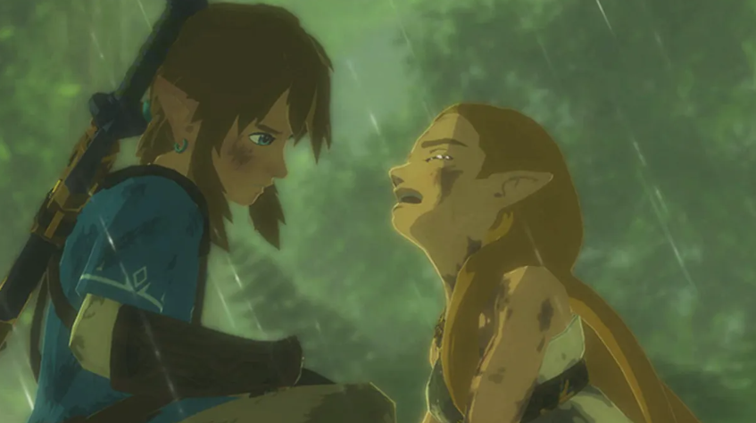

## Why Deferred Rendering is Challenging for Stylized Cartoon Shading

게임 그래픽 기술이 발전하면서 현실감 있는 렌더링 결과를 보여주는 게임들은 대부분 **디퍼드 렌더링(Deferred Rendering)**을\
채택하게 되었다. 불필요한 중복 없이 수백 개의 광원을 한번에 처리할 수 있다는 강력한 장점 때문이다. 그럼 디퍼드 렌더링은\
**포워드 렌더링(Forward Rendering)**에 비해 모든 점에서 나은가?

  

당연히 그렇지 않다. 특히 젤다의 전설이나 길티 기어 같은 게임에서 사용되는 카툰 렌더링(Cell Shading)'에서는 여전히\
고전적인 포워드 렌더링이 선호된다. 그렇다면 왜 카툰 렌더링에서 디퍼드 렌더링은 덜 사용될까. 무엇이 문제일까.

---

### 1. G-Buffer의 정보 제한과 표현의 제약

디퍼드 렌더링의 핵심은 geometry 정보를 G-Buffer에 저장한 뒤, 이를 기반으로 라이팅을 수행하는 것이다.\
문제는 G-Buffer에 저장할 수 있는 정보가 제한되어 있다는 점이다.

일반적인 디퍼드 렌더링은 다음과 같은 공통 데이터를 저장한다:

Normal
Albedo
Roughness / Metallic
Depth

이러한 구조는 물리 기반 렌더링(PBR)처럼 공통된 수식으로 처리되는 경우에는 매우 효율적이다.\
하지만 카툰 렌더링은 단순한 물리 기반 조명 모델을 넘어서, 아티스트가 의도한 특정 위치에 그림자를 배치하거나,\
부위별로 다른 Ramp Texture를 사용하는 등 스타일 특화 데이터를 필요로 한다.

이러한 데이터를 G-Buffer에 추가하려면:

버퍼 확장 필요
메모리 사용량 증가
대역폭(bandwidth) 증가

결과적으로 디퍼드 렌더링에서도 개별적인 셰이딩을 구현할 수는 있지만, 그만큼 비용이 빠르게 증가하고 구조가 복잡해진다.

> Ramp Texture 은 카툰 렌더링에서 자주 사용되는데, 밝기를 특정한 색으로 맵핑한 테이블이다.\
> 따라서 현실감 있는, 실제 물리적인 빛이 아니라 아티스트가 의도한 대로 색상과 톤으로 결과물을 제어할 수 있다.

### 2. Anti-Aliasing(MSAA)  문제

카툰 렌더링에서 가장 중요한 요소 중 하나는 깨끗하고 매끄러운 외곽선이다. 하지만 디퍼드 렌더링의 경우\
하드웨어 MSAA를 사용했을 때 각 샘플마다 G-buffer를 저장해야 하기 때문에 비용이 너무 크다.

이 때문에 디퍼드 렌더링에서는 FXAA나 TAA 같은 후처리 기반 안티앨리어싱을 사용하는 경우가 많다.\
그러나 이러한 방식은 이미지 전체를 부드럽게 만드는 과정에서, 카툰 렌더링 특유의 선명한 외곽선과 디테일을 흐리게 만드는 단점이 있다.

### 3. 외곽선 구현 방식의 차이

카툰 렌더링의 상징인 외곽선을 만드는 가장 대중적인 방법은 모델을 뒤집어 확장하는 Inverted Hull 방식이다. 이 방식은 포워드\
렌더링에서는 추가 패스를 통해 직관적으로 구현할 수 있지만, Screen Space에서 처리하려는 디퍼드 렌더링 설계와 어울리지 않다. 

디퍼드에서도 Depth나 normal buffer를 검출해 edge를 다시 그릴 수 있지만, 이 경우 캐릭터 내부의 디테일한 선을 표현하는 데\
한계가 있으며 아티스트가 선의 굵기나 색상을 세밀하게 제어하기 어렵다.

#### 정확한 edge 표현의 한계에 대한 참고자료  >>> [Wireframe Outline Rendering](<../05_misc/Wireframe Outline Rendering.md>)

디퍼드 렌더링은 많은 광원을 효율적으로 처리하는 데 강력한 장점을 가지지만, 카툰 렌더링처럼 스타일 표현이 중요한 경우에는\
다음과 같은 제약이 존재한다:

> G-Buffer 구조로 인한 데이터 표현의 한계
> MSAA 사용의 높은 비용
> geometry 기반 외곽선 기법과의 비효율적인 결합

따라서 디퍼드 렌더링이 카툰 렌더링에 적합하지 않다기 보다는 같은 결과를 얻기 위해 더 많은 비용과 복잡한 설계가\
필요하다는 점에서 포워드 렌더링이 여전히 선호된다.