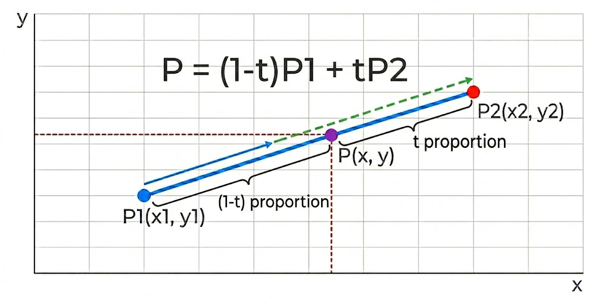
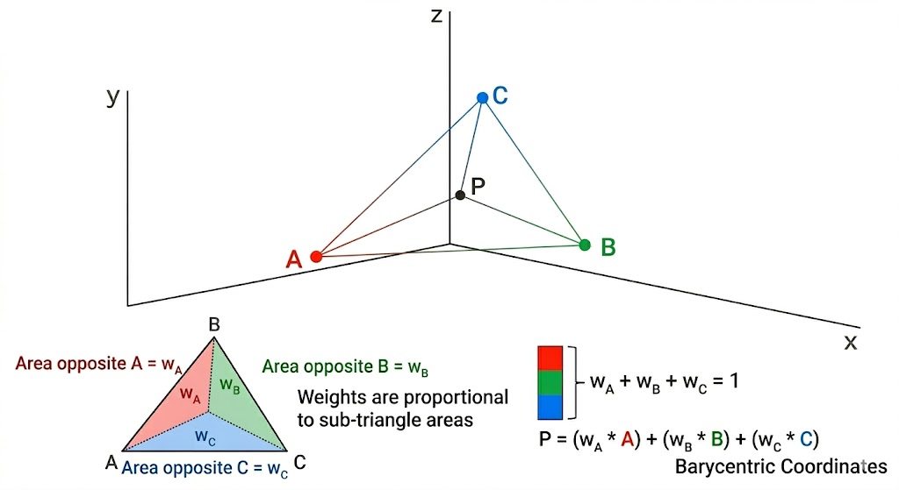
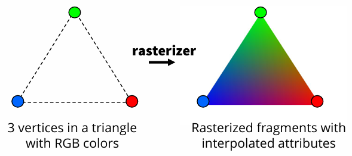

## From Vertices to Pixels, The Journey of Interpolation

그래픽스에서 주요하게 다루어지는 보간(interpolation)을 정리한다.\
그래픽스에서 보간이란 이산적인 데이터의 벌어진 틈을 우리의 눈이 볼 수 있도록 연속적인 데이터로 채워넣는 걸 가리킨다.\
또 그래픽스에서 vertex 데이터를 fragment로 전달하는 방법이자 rasterization의 핵심 원리이며,\
그 결과 화면에 띄울 fragment를 만들어지고 우리는 부드러운 색상과 텍스처를 얻게 된다

### 1. Linear Interpolation + affine combination
가장 기초가 되는 선형 보간(Lerp)은 두 점을 잇는 직선 위에서 특정 지점의 값을 결정한다.\
선형 보간의 수식은 다음과 같다.
$$
두\ 점\ P_0,\ P_1과\ 매개변수\ t \in [0, 1]에\ 대해\\
P(t) = (1 - t)P_0 + tP_1
$$
Lerp라는 이름이 익숙하다면 기하학적 접근 외에도 수식이 여기저기 두루 사용된다는 걸 알 수 있을 테다.

위 식은 결국 두 점에 합이 1이 되는 계수를 곱해서 더하는 것인데 이건 곧 아핀 결합(Affine Combination)이다.\
아핀 결합은 점들을 원점에 의존하지 않는 방식으로 섞는다. 따라서 좌표계를 평행이동해도 함께 같은 만큼 이동할 뿐,\
기하학적인 관계는 변하지 않는다. 특히 두 점의 아핀 결합은 항상 그 두 점이 만드는 직선 위에 놓이게 된다.\
따라서 직선 위 점의 위치를 가리키는 좌표계로 쓸 수 있다.

  

### 2. barycentric coordinate + triangle rasterization
선분 위의 선형 보간을 삼각형으로 확장하면 barycentric coordinate가 된다. 식은 다음과 같다.

삼각형의 세 정점을 V_1, V_2, V_3라고 할 때, 내부의 임의의 점 P는

$$
P = w_1V_1 + w_2V_2 + w_3V_3,\quad w_1 + w_2 + w_3 = 1,\quad w_i \ge 0
$$

눈치 챘겠지만, 위의 식에서 단순히 확장한 것에 불과하다.\
직선이 아니라 삼각형 내부 점의 위치를 가리키는 좌표계다.\
그렇다면 이것이 더 확장되면 어떻게 될까?\
convex hull에 대해 추가로 공부해보자.

  

vertex shader와 pixel shader 사이에 위치한 레스터라이저에서는 이 좌표계를 이용해\
vertex들의 attribute를 interpolation하게 되고 fragment가 탄생한다.\
아래 익숙한 그림이 만들어지는 과정이다

  

하드웨어 래스터라이저는 화면 공간으로 투영된 삼각형의 각 pixel이 세 vertex으로부터\
어느 정도 비중(Weight)을 갖는지 계산한다. 이 과정에서 단순히 좌표만 사용하는 게 아니라\
Color, Normal, UV Coordinate 같은 Vertex Attribute도 함께 보간되어 각 픽셀에 고유한 값을 만든다.\

### 3. Perspective Correct Interpolation
Perspective Divide가 수행되면 3차원 공간의 직선이 화면(2D) 공간에서는 비선형적으로 투영된다.\
이 때문에 화면 공간에서 일반적인 선형 보간을 수행하면, 실제 3D 공간의 거리 비율을 반영하지 못해 텍스처가 왜곡되는\
'Texture Affine Warp' 현상이 발생한다. 이를 해결하기 위해 하드웨어는 Perspective-Correct Interpolation을 수행한다.\
래스터라이저는 화면 공간에서 속성을 직접 보간하는 대신, 다음 두 값을 선형 보간한다.

$$
1/w\ \\
A/w
$$

이제 (A/w)를 (1/w)로 나누어, 원근이 교정된 원래의 속성값 A를 복원한다.

$$
\frac{A /w}{1 /w} = A
$$

이 과정은 현대 GPU에서 완전히 자동화되어 처리되며 개발자는 줄곧 그랬듯 셰이더 코드는 vertex shader와 pixel shader만 신경쓰면 된다.