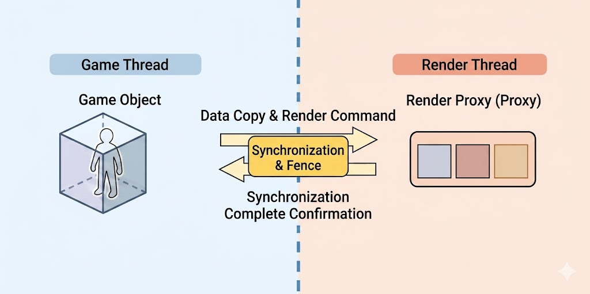

## Proxy

이제 프록시를 들었을 때 컴퓨터 네트워크의 프록시 밖에 떠오르지 않는다면 위기다.\
여기서는 언리얼엔진에서 프록시란 무엇인지 왜 쓰는 건지 간단히 정리한다.\
다행히 네트워크에서 익숙한 프록시랑 그 의미가 상당히 비슷하다.\
기본적으로 프록시란 **진짜를 대리**해준다.

### 1. Scene Proxy

먼저 게임 스레드와 렌더 스레드 사이의 데이터를 분리하고 동기화하는데 사용된다.

여기서 게임 스레드란 게임 로직을 담당하며 매 프레임마다 위치나 속성이 변할 수 있다.
    보통 컴포넌트를 말한다.
이어서 렌더 스레드란 실제 렌더링에 필요한 데이터를 복사해 가지고 있다.
    Vertex Buffer, Index Buffer, Material 등이 그 데이터다.

  

게임 스레드에 존재하는 UPrimitiveComponent는 메모리 GC(Garbage Collection) 대상인데,\
게임 로직에 의해 수시로 값이 변한다. 렌더 스레드가 이 데이터를 직접 읽으려고 하면 Race Condition 이 발생하여\
크래시가 날 수 있다. 따라서 렌더 스레드가 안전하게 접근할 수 있는 전용 대리 객체를 만들어 렌더링에 필요한\
최소한의 데이터만 복사해 둔다.

### 2. Networking Proxies

이것도 마차가지로 언리얼 기반 게임에서 네트워크 동기화와 관련된다.\
Autonomous Proxy와 Simulated Proxy가 사용된다.

Autonomous Proxy는 내가 조종하는 캐릭터, **플레이어**를 말한다.
    클라이언트로부터 입력을 받으며 최종 상태는 서버의 확인을 받는다.
그 다음 Simulated Proxy는 다른 사람들이 조종하는 **다른 플레이어**를 말한다.
    서버로부터 데이터를 받아 원본의 움직임을 흉내낸다.

### 3. Optimization proxies

성능 최적화를 위해서도 사용된다.\
대표적으로 HLOD proxy, Proxy Mesh 같은 것들이다.

멀리 있는 static mesh를 하나의 단순한 mesh로 합치는 걸 HLOD proxy라고 한다.
    Draw Call을 획기적으로 줄인다.
Proxy Mesh는 복잡한 폴리곤을 하나의 mesh로 구워버린다.
    언리얼에서 'Proxy LOD 도구'를 활용할 수 있다.