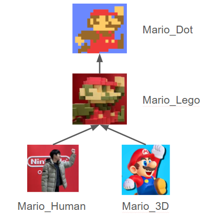

## RTTI (Run-Time Type Identification)

RTTI 란 런타임에 객체의 실제 타입 정보를 확인할 수 있는 걸 말한다.\
이를 위해 타입 정보가 런타임에 접근 가능한 형태로 저장된다. 여기서는 이렇게\
런타임에 접근 가능한 타입 관련 정보를 Run-Time Meta Data 라고 칭하겠다.

### 1. Run-Time Meta Data

익숙한 형태의 **런타임 클래스 메타 데이터**는 다음과 같다.

```cpp
class ENGINE_API UClass
{
public:
    ...
    //Meta Data - 클래스의 이름과 부모 클래스에 대한 포인터를 들고 있다.
    //여기서 상속계층이 만들어진다.
	UClass(FString InName, UClass* InSuperClass, CreateFunc InCreateFunc);
	
	const FString& GetName() const;
	UClass* GetSuperClass() const;

    //RTTI - 런타임 중에 객체가 어느 타입의 자식인지 판단한다.
    //상속 계층을 타고 올라가며 찾는다. 
	bool IsChildOf(const UClass* Other) const;
    ...
private:
	FString Name;
	UClass* SuperClass = nullptr;
    ...
};
```

**런타임에 위와 같은 메타 데이터를 기록할 수 있기에** SuperClass 를 기반으로 한 IsA 등의 RTTI 기능을 제공할 수 있다.

<p>
  
</p>

어떤 클래스로부터 파생되었는지를 런타임 중에 파악하는 걸 C++에서 제공하는 기능이 아니라\
직접 구현하게 되면 상위의 개념인 Reflection으로 발전시킬 수 있다.

### 2. RTTI에서 Reflection으로

메타 데이터라는 개념에 대해 단순히 위의 코드 속 클래스에 국한해 생각해선 안된다.\
클래스 멤버 함수에 대해서도 다음과 같이 메타 데이터를 정의할 수 있다.

```cpp
class ENGINE_API UFunction
{
public:
    ...
    //함수명을 반환합니다.
    const FString& GetName() const;
    //함수 파라미터의 반환값과 메모리 크기를 반환합니다.
    int32 GetParamsSize() const;
    ...
    
private:
    FString Name;
    //이 함수가 선언된 클래스를 가리킵니다.
    //어떤 타입의 객체에서 실행될 수 있는지 검사합니다.
    UClass* OwnerClass;
    ...
};
```

RTTI가 개념적으로 어떤 클래스에서 파생되었는지 그 타입을 확인하는 것에서 그친다면\
Reflection 은 위의 예시처럼 어떤 이름과 변수를 가지고 있는지까지 파악한다.

### 3. UE Run-Time Meta Data

언리얼에선 UClass, UFunction, FProperty, UStruct, UEnum 등의 다양한 런타임 메타데이터를 관리한다.

> 그런데 왜 타입을 식별하는 RTTI 를 넘어서 이렇게 많은 메타데이터를 관리하는 걸까?\
> 특히 우리는 도대체 왜 dynamic_cast 가 있는데 이렇게 직접 RTTI를 만들어 확장하고 있는 걸까?

우선 단순하게 성능을 비교하면 dynamic_cast 보다 더 좋다.

dynamic_cast 을 사용할 때 가장 큰 문제는 가상함수 테이블이 있는 클래스에서만 작동하는데다\
컴파일 타임에 타입 정보가 생성되어 바이너리에 포함되며, 런타임에는 이를 기반으로 타입 검사가 수행된다.

반면에 언리얼에서의 Cast<T>는 UObject라면 일관되게 전부 작동한다. 또 블루프린트처럼 런타임 중 생성된\
타입에 대해서도 문제 없이 식별한다.

모 코치님의 의견을 빌리면 게임 엔진 제작에 있어 RTTI를 직접 구현하는 이유는 언리얼의 블루프린트 시스템에 있다.\
C++ 과 블루프린트는 서로 다른 컴파일 시스템이기에 컴파일 타임에 서로의 정보를 알 수 없다.

그런데도 블루프린트에서 C++ 의 함수를 호출할 수 있는 이유는 UFunction 이라는 런타임 메타데이터를 통해\
함수 정보를 찾고, 이를 기반으로 런타임에 함수를 호출할 수 있기 때문이다. 다시 말해 타입 정보를 이용해서 런타임에\
코드의 동작을 바꾸거나, 객체를 다루는 방식 자체를 바꾼다는 의미다.

### 4. GC, Serialization, Replacation

이외에도 메타데이터는 객체 생성 및 복사, 직렬화, 가비지 컬렉션, 네트워크 동기화 등
엔진이 객체를 일반화하여 관리하는 데 필요한 다양한 정보를 포함하고 있다.

#### 4.1. 가비지 컬렉션 (Garbage Collection)

C++에는 본래 포인터가 가리키는 대상이 유효한지 자동으로 알 방법이 없다.\
하지만 언리얼은 메타데이터를 통해 이를 해결한다.

UClass는 해당 클래스가 가진 모든 FProperty()를 통해 멤버 변수에 대한 목록을 들고 있다.\
GC가 발생하면 엔진은 Root Set을 시작으로 참조 그래프를 순회하며 FProperty 중 객체 포인터 타입인 것들을 찾아낸다.\
그 결과 참조 그래프를 통해 아무도 참조하지 않는 객체를 안전하게 찾아 메모리에서 해제할 수 있다.

#### 4.2. 직렬화 (Serialization)

직렬화는 객체의 상태를 파일로 저장하거나 불러오거나 혹은 복사할 수 있는 기능입니다.\
여기서는 리플렉션 정보를 통해 멤버 변수의 이름과 데이터 타입을 알고 있다.

따라서 코드 구조가 약간 바뀌더라도, 이름과 타입을 대조하여 데이터를 복구할 수 있게 된다.

#### 4.3. 네트워크 복제 (Replication)

멀티플레이 게임에서 서버의 데이터를 클라이언트에 동기화하는 과정이 필수적이다.\
이때 특정 변수에 복제 플래그 메타데이터를 심어둔다.

엔진은 매 프레임마다 모든 변수를 검사하는 대신, 메타데이터에 마킹된 변수들만 추려내어 값이 변했는지
확인한다. 변했을 경우에만 데이터를 패킷으로 압축하여 전송한다.