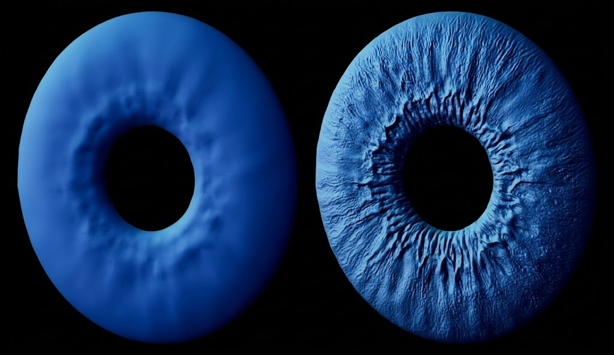

## Bridging Geometry and Texture through Normal Maps

(해당 글은 퀄리티가 너무 낮아 차후 수정 필요)

최신 게임 속 캐릭터를 자세히 들여다 보면 모공 하나하나가 살아있는 것 같지만, 결국 실시간 그래픽스인 이상 그 모델은\
조악한 삼각형으로 이루어진 눈속임에 불과하다. 평평한 바닥에 입체감을 불어넣는 기술은 핵심은 Normal Map Baking 이다.\
그러나 이 기술은 조금만 계산이 어긋나도 Seam 문제가 생기는데 여기서는 이런 것들을 다룬다.

1. Normal Map Baking

Normal Map Baking은 High-poly 모델의 표면 방향 정보를 Low-poly 모델의 텍스처 공간으로 투영하는 과정이다.\
High-poly 모델은 매우 정교한 표면을 가지고 있지만, 실시간 렌더링에는 부담이 된다. 반면 Low-poly 모델은 효율적이지만\
디테일이 부족하다. Baking은 이 둘을 연결하는 과정으로, High-poly의 각 표면에서 계산된 normal vector를 Low-poly의\
UV 공간에 기록한다.

이때 normal vector는 RGB 값으로 인코딩된다. 렌더링 단계에서는 이 값을 다시 벡터로 복원하고, 이를 이용해 조명 계산에 사용되는\
표면 방향을 대체한다. 결과적으로 실제 geometry는 단순하지만, 빛에 어떻게 반응할 지 지정해 입체감을 살리다.

이 과정은 단순히 텍스처를 생성하는 것이 아니라, 고해상도 기하학 정보를 저해상도 표현으로 변환하는 최적화다.

  

2. Smoothing과 Seam

문제는 3D 표면 정보를 2D UV 공간으로 펼칠 때 발생한다. Smoothing 이라는 개념을 마주하게 된다. Smoothing 은 Vertex 가 가진 normal 데이터를 어떻게 처리할지의 문제다.

Soft Edge : 인접한 폴리곤들이 정점 하나에서 하나의 평균화된 노멀을 공유한다.

Hard Edge : 정점 하나가 여러 개의 노멀 정보를 가져야 한다. 하지만 GPU는 한 점에 두 개의 데이터를 동시에 담을 수 없기에, 내부적으로 정점을 복제하여 물리적으로 분리한다. 즉, 위치는 같지만 데이터가 다른 쌍둥이들이 생겨난다.

한편 UV Seam은 모델의 표면을 UV로 펼칠 때 잘라낸 경계선이다. 이 둘이 서로 어긋날 때 문제가 발생한다.\
특히, Soft Edge로 연결된 표면에서 UV Seam이 존재하면, 동일한 geometry 위치라도 UV seam이 생기면 같은 위치라도\
UV 방향이 달라지게 되고 곧 tangent 방향도 틀어졌다는 의미다.

tangent space는 폴리곤 표면에 붙어있는 나침반이다. UV Seam에서 종이를 가위로 자르듯 표면을 잘라버리면,\
잘린 양쪽의 나침반의 바늘은 서로 다른 곳을 가리키게 된다. normal map은 나침반을 기준으로 방향을 지시하는데,\
나침반 자체가 틀어졌으니 렌더링 엔진은 빛을 엉뚱한 방향으로 반사하고 그 결과 경계선에 줄무늬가 생긴다.

다시 말해 Normal map은 tangent space 기준으로 해석되기 때문에, 서로 다른 tangent space에서 해석될 수 있고 이것이 Seam 문제다.

3. 해결 원칙

이 문제를 피하기 위해서는 Hard Edge가 있는 곳에 반드시 UV Seam을 둔다.\
Hard Edge는 이미 geometry에서 normal이 끊어진 지점이므로, tangent space 또한 분리되는 것이 자연스럽다.\
반대로, Soft Edge를 유지하려면 가능한 한 UV도 연속적으로 유지해야 한다.

geometry의 불연속성과 tangent space의 불연속성을 일치시켜 해결할 수 있다.