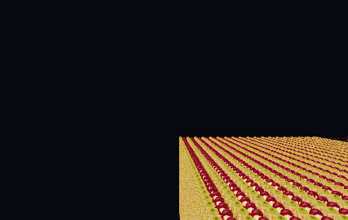
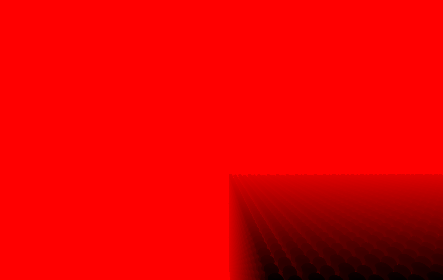
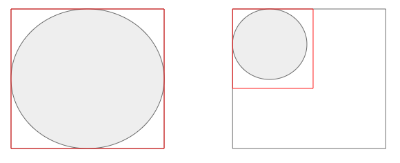
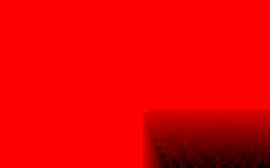
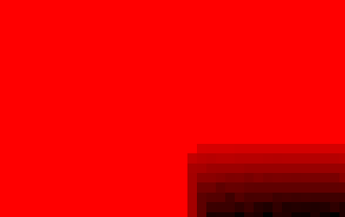
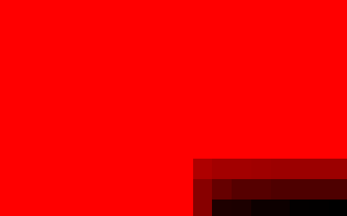

### HiZ Occlusion Culling

화면에 5만 개의 오브젝트가 있다고 가정해보자.  
실제로는 많은 오브젝트가 화면 밖에 있거나 다른 물체에 가려져 있지만, GPU는 기본적으로 "그릴 후보"로 모두 처리하려고 한다.

이때 **이미 가려져서 결과에 보이지 않을 오브젝트를 미리 제외**하면, 드로우콜과 픽셀 셰이딩 비용을 줄일 수 있다.  
HiZ Occlusion Culling은 이 목적을 위해 Depth 정보를 계층적으로 활용하는 기법이다.

핵심 요약:
- 깊이 텍스처(Depth Map)를 사용해 "가려짐 여부"를 빠르게 판단한다.
- 원본 해상도만 쓰지 않고, 축소된 깊이 정보를 함께 사용해 테스트 수를 줄인다.

렌더링 결과와 대응되는 Depth Map은 다음과 같다.

### 왜 "Hierarchical" 인가?

HiZ를 쓰지 않으면, 오브젝트가 차지하는 화면 영역의 Depth를 거의 픽셀 단위로 확인해야 한다.  
예를 들어 투영된 영역이 80x80이면 최대 6400개의 비교가 필요하다.

그런데 모든 상황에서 픽셀 단위 검사가 필요할까?

위 그림처럼 오브젝트가 큰 덩어리로 보이는 경우에는, 더 거친 해상도의 깊이 정보만으로도 보수적인 판단이 가능하다.  
오브젝트가 작게 보이는 경우에는 더 작은 블록 단위의 정보를 선택하면 된다.

즉, 오브젝트의 스크린 크기에 맞춰  
`1/1 -> 1/4 -> 1/16 -> ...`  
처럼 적절한 레벨의 깊이 정보를 선택하면, 정확도는 유지하면서 비교 횟수를 크게 줄일 수 있다.

### HiZ Depth Pyramid

Depth Map 하나를 여러 해상도로 축소해 만든 계층 구조(Depth Pyramid, Mip chain)를 미리 준비해두고,  
Occlusion Test 시 필요한 레벨만 골라 사용하는 것이 HiZ의 핵심이다.

아래는 Depth Mip 4 (74x47) ~ 6 (18x11) 예시다.

### 정리

HiZ Occlusion Culling은 "보이지 않을 가능성이 높은 오브젝트를 먼저 거르는" 최적화다.  
핵심은 **원본 Depth만 쓰는 것이 아니라, 계층화된 Depth를 오브젝트 크기에 맞춰 선택**한다는 점이다.  
그래서 많은 오브젝트가 존재하는 씬에서 비용 대비 효과가 크다.
