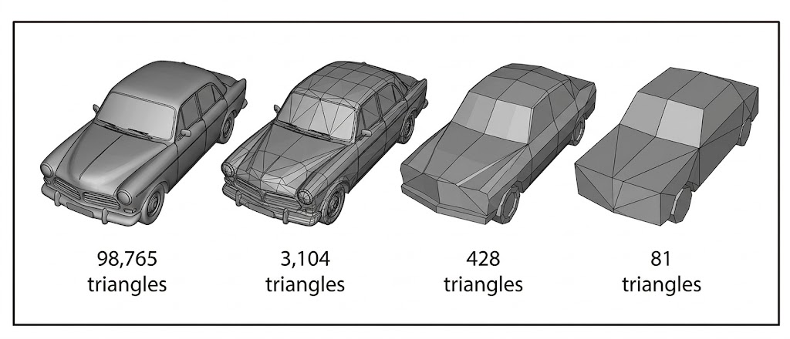

### LOD란 무엇인가

LOD(Level of Detail)는 카메라에서 멀리 있는 오브젝트를 더 단순한 형태로 그려서\
성능을 개선시킨다.

핵심은 "멀리 있는 물체는 화면에서 차지하는 픽셀 수가 적으므로, 가까운 물체와 같은 수준의\
geometry를 항상 유지할 필요는 없다"는 점이다. 따라서 거리나 화면 점유율에 따라\
정점 수가 적은 메시, 더 단순한 머테리얼, 혹은 더 낮은 해상도로 바꿔 그릴 수 있다.\
이것이 가능한 가장 큰 이유는 사람의 눈이 멀리 있는 물체의 정교함에 크게 주목하지 않는다는\
점도 있지만, 결정적으로 우리가 마주보고 있는 디스플레이가 가지는 해상도 한계점 때문이다.

  

위 그림처럼 가까운 차량은 높은 디테일로 보이지만, 멀어진 차량은 실루엣과 큰 형태만 유지해도\
시각적으로 큰 차이가 나지 않을 수 있다.

### 1. LOD는 무엇을 줄여 주는가

LOD를 적용하면 주로 GPU가 처리해야 할 geometry를 줄일 수 있다.\
대표적으로 vertex processing, triangle rasterization로 인한 오버헤드와\
overdraw 일부를 줄이는 ``데 도움이 된다.

다만 LOD가 모든 병목을 해결하는 것은 아니다. draw call 수가 그대로라면 CPU가 제출하는\
렌더링 명령 수 자체는 크게 줄지 않을 수 있다. 즉 LOD는 '오브젝트 하나를 얼마나 무겁게 그리느냐'를\
줄이는 데 강하고, '오브젝트를 몇 번 호출하느냐' 문제는 별도 최적화가 필요하다. 여기에 필요한 게\
메시 Batching, Indirect Draw, Culling, 인스턴싱이다. Material Sotring처럼 CPU와 GPU에서의\
병목을 줄이는 것도 필요하다.

### 2. 어떻게 적용하는가

가장 일반적인 방법은 하나의 오브젝트에 대해 여러 단계의 메시를 미리 준비해 두고,\
거리 또는 화면 점유율에 따라 적절한 레벨을 선택하는 것이다. 단순 거리 기반이라면 너무 큰\
오브젝트의 경우 그 변화가 실시간으로 눈에 띌 수 있다. 그래서 화면에 어느 정도 크기로\
그려지는지 신경써야 한다.

예를 들어:

- 가까울 때는 원본 메시
- 중간 거리에서는 정점 수를 줄인 중간 단계 메시
- 아주 멀 때는 더 단순한 저해상도 메시

이 방식은 런타임에 메시를 즉석에서 깎는 것이 아니라, 보통 에셋 준비 단계나 로딩 단계에서\
미리 만든 여러 LOD 메시를 상황에 따라 선택해서 사용하는 구조다.

### 3. 관련 기법들

- Impostor
  - 멀리 있는 3D 오브젝트를 2D 이미지나 카메라에 따라 다르게 보여주는 몇 장의 텍스처로 대체한다.
- Billboard
  - 카메라를 향하도록 정렬된 단순한 평면에 텍스처를 붙여 표현하는 방식이다.
- HLOD
  - 여러 오브젝트를 더 큰 단위로 묶어 단순화된 대표 표현으로 교체하는 방식이다.

이들은 모두 넓은 의미에서는 멀리 있는 것을 더 싸게 그리기 위한 기법이지만, 일반적인 메시 LOD와는\
적용 방식과 제약이 다르다.

### 4. LOD의 한계에 대해

삼각형 수가 많은 메시를 많이 그리는 상황에서는 LOD가 GPU 부하를 줄이는 데 의미가\
있을 수 있다. 예를 들어 멀리 있는 사과에 대해 더 단순한 메시를 사용하면, 장면 전체의 총 triangle 수를\
줄일 수 있다.

다만 이 방식은 화면에 실제로 보이는 형태를 바꾸는 최적화이므로, 허용 가능한 품질 저하의 정도를\
먼저 정해야 겠다. 오브젝트가 작고 멀리 있을 때는 효과적이지만, 화면에서 크게 보이는 대상에 무리하게\
적용하면 갑자기 다른 모델이 튀어나오는 게 발견되는 팝핑(popping) 현상이 일어날 수 있다.\
LOD의 단계를 늘린다고 이 문제를 해결하기는 쉽지 않다. 이와 관련해 밉맵(Mipmap)을 공부하면 좋겠다.

### 정리

LOD는 멀리 있는 오브젝트를 대충 그려 GPU 기하 처리 비용을 낮추는 최적화다.\
특히 정교한데 화면에서는 작게 보이는 메시가 많을 때 효과적이다.

반면 draw call 수 자체를 줄이는 기법은 아니다.
