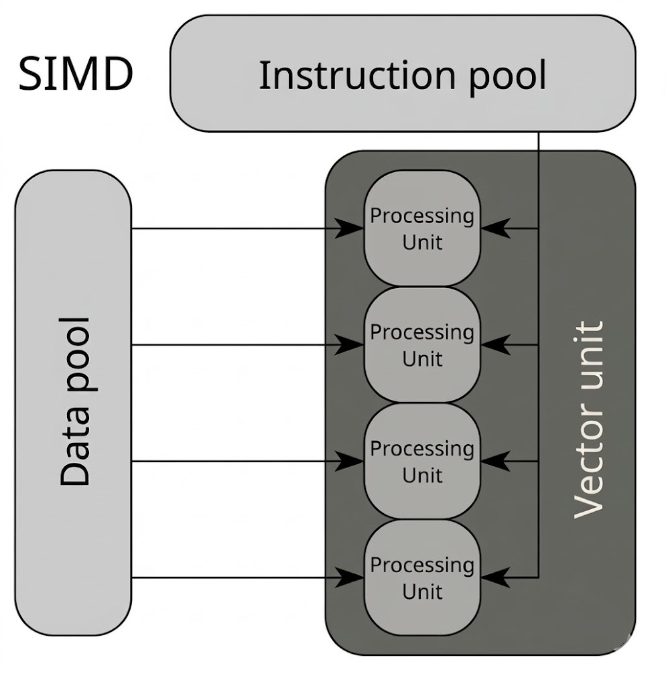

### SIMD란 무엇인가

SIMD는 Single Instruction, Multiple Data의 약자다.

하나의 명령어로 여러 개의 데이터 lane에 같은 연산을 적용하는 방식이라고 보면된다.\
즉 스칼라 코드처럼 값을 하나씩 처리하기보다, 벡터 레지스터에 여러 값을 담아 같은 연산을\
병렬로 수행하는 것이다. 아래 이미지가 그럴듯 하다.

<p>
  
</p>

DirectXMath 같은 수학 라이브러리도 내부적으로 SIMD를 활용한다. 다만 SIMD가 무한히\
많은 데이터를 한 번에 처리하는 것은 아니며, 실제 처리 개수는 CPU가 지원하는 ISA, 레지스터 폭,\
그리고 원소 크기에 따라 달라진다. 예를 들어 256-bit AVX 레지스터라면 `float`는 8개,\
`double`은 4개를 한 번에 다룰 수 있다.

SISD라고 하는데, 한번에 하나의 데이터만 다룬다는 점에서 스칼라라는 이름을 쓴다.\
반면에 SIMD는 동일한 연산이 여러 데이터에 동시에 적용되도록 연산 방식을 벡터화한다고 설명된다.

### SIMD는 어떻게 사용할 수 있는가?

컴파일 과정에서 코드가 최적화되어 SIMD로 바뀌는 경우가 있다. 즉 스칼라 연산이 벡터 연산으로\
변환되어 실행된다고 볼 수 있겠다. 다만 자동 벡터화는 컴파일러가 코드의 형태와 이득을 보고\
판단하는 것이며, 개발자가 항상 강제로 지정하는 것은 아니다.

개발자는 타깃 ISA 옵션을 활성화하고, 벡터화하기 쉬운 형태로 코드를 작성하거나, 필요하면\
intrinsics를 직접 써서 SIMD 연산을 명시적으로 사용할 수 있다.

SIMD는 CPU가 이미 제공하는 명령어 집합을 사용하는 것이므로 별도의 라이브러리를 링크하는\
문제와는 다르다. 다만 intrinsics를 직접 쓰는 경우에는 플랫폼과 ISA에 맞는 헤더가 필요하다.\
예를 들어 x86 계열에서는 `<immintrin.h>`를 사용하는 경우가 많지만, 이것이 SIMD의 유일한\
방법은 아니다.

```c
// 8개 삼각형의 각 정점 좌표를 SoA 형태로 준비해 두었고,
// 각 배열이 32-byte aligned 되어 있다고 가정하면
// AVX 레지스터로 한 번에 로드해 이후 교차 판정 계산에 사용할 수 있다.
const __m256 V0XVec = _mm256_load_ps(V0X);
const __m256 V0YVec = _mm256_load_ps(V0Y);
const __m256 V0ZVec = _mm256_load_ps(V0Z);
const __m256 V1XVec = _mm256_load_ps(V1X);
const __m256 V1YVec = _mm256_load_ps(V1Y);
const __m256 V1ZVec = _mm256_load_ps(V1Z);
const __m256 V2XVec = _mm256_load_ps(V2X);
const __m256 V2YVec = _mm256_load_ps(V2Y);
const __m256 V2ZVec = _mm256_load_ps(V2Z);
```

위 코드는 교차 판정 전체를 보여주는 것은 아니고, SIMD 계산에 쓰일 데이터를\
벡터 레지스터로 불러오는 예시라고 보는 편이 맞다. 만약 메모리 정렬이 보장되지 않는다면\
`_mm256_loadu_ps` 같은 unaligned load를 사용해야 한다.

### 그럼 어디서나 쓸 수 있는 만능 아닌가?

SIMD를 모든 코드에 항상 효과적으로 적용할 수 있는 것은 아니다.

데이터 의존성이 강하거나, 메모리 접근이 불규칙하거나, 분기 구조가 복잡하면 자동 벡터화가\
어려워질 수 있다. 분기가 있다고 해서 SIMD를 못 쓰는 것은 아니지만, 마스킹이나 추가 처리\
때문에 효율이 떨어질 수 있다.

또한 SIMD는 계산량만이 아니라 데이터 배치의 영향도 크게 받는다.\
레지스터에 한 번에 실어 나르기 좋은 형태로 데이터가 정리되어 있어야 이점이 커진다.

### 어디에 쓰기 좋은가?

같은 연산을 많은 데이터에 반복 적용하는 작업에서 SIMD의 장점이 잘 드러난다.\
예를 들어 여러 개의 ray, AABB, triangle에 대해 비슷한 수식을 반복 계산하는 경우가 그렇다.

따라서 렌더링, 물리, 충돌 판정, 기하 연산처럼 수치 계산이 반복되는 구간에서 SIMD를\
적용하는 경우가 많다.

### 그 외 이야기들

SIMD의 성능은 데이터 배치에 많은 영향을 받는다. 특히 여러 개의 같은 속성을 한 번에 읽어\
와야 하는 경우에는 AoS(Array of Structures)보다 SoA(Structure of Arrays)가 더 유리한\
경우가 많다.

멀티쓰레딩은 일을 여러 코어나 스레드로 나누는 방식이고, SIMD는 한 코어 안에서 같은 연산을\
여러 데이터에 동시에 적용하는 방식이다. 현대 컴퓨터 아키텍처에서는 둘을 함께 사용한다.
