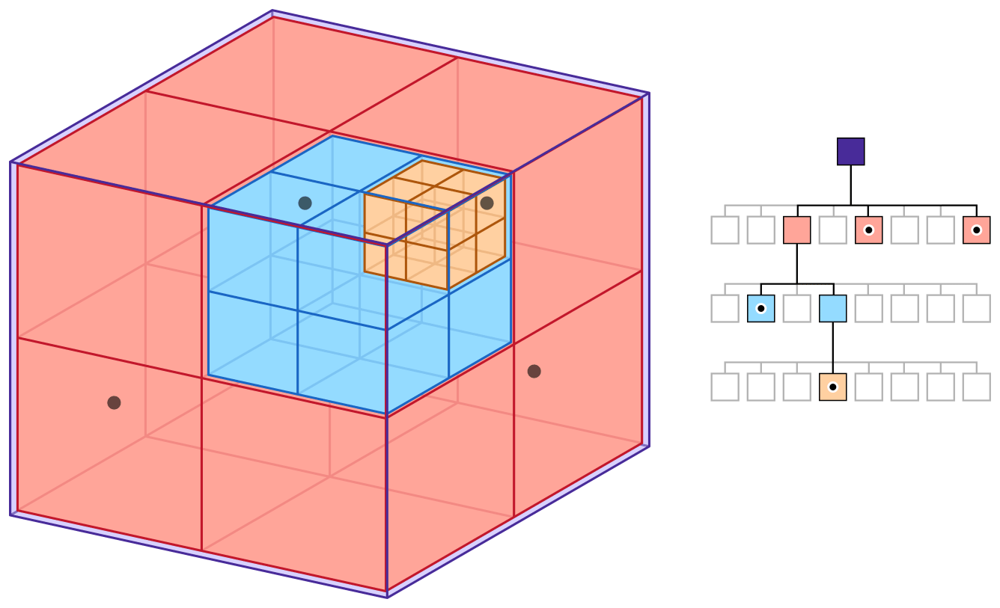
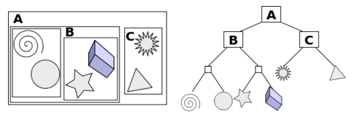

여기서 소개하는 BVH(Bounding Volume Hierarchy)는 씬 안의 오브젝트들을 계층적으로 묶어\
빠르게 후보를 줄이는 Scene BVH를 뜻한다.

레이 트레이싱 문맥에서는 비슷한 계층 구조를 TLAS/BLAS라고 부르기도 하지만, 이 문서에서는\
scene-level BVH만 다룬다. 오브젝트 내부를 트리 형태로 나누는 Mesh BVH는 별도 문서에서 다룬다.

### 1. 간단한 이론 소개
교재를 요약한다.
(토마스 아케나인 몰러 외 5인,『리얼-타임 렌더링』, 권구주 외 2인 옮김, 에이콘출판, 2023, 1074쪽.)

BVH는 bounding volume을 계층적으로 쌓아 만든 트리 구조다.

1. 각 노드는 자신이 담당하는 오브젝트 집합을 감싸는 bound를 가진다. scene BVH에서는 보통\
AABB를 많이 사용하지만, BVH 자체가 AABB로만 구성되어야 하는 것은 아니다.

2. 내부 노드는 자식 노드들이 담당하는 영역 전체를 감싸는 bound를 가진다. 리프 노드는 실제\
교차 판정 단계로 넘길 오브젝트 또는 오브젝트 참조를 담는다.

3. 핵심은 모든 오브젝트를 매번 직접 검사하지 않고, ray와 교차하지 않는 큰 묶음을 먼저\
버릴 수 있게 만드는 것이다. 즉 BVH는 계층적 가지치기를 통해 탐색 범위를 줄인다.

### 2. picking에서 사용되는 구체적인 원리

Picking에서는 보통 ray를 쏘고, 최종적으로는 실제 오브젝트와의 더 정밀한 교차 판정을 수행한다.\
Scene BVH는 이 과정에서 검사해야 할 오브젝트 수를 빠르게 줄여준다.

우선 씬의 오브젝트들을 여러 묶음으로 나누고, 각 묶음을 감싸는 AABB를 재귀적으로 구성해 트리를 만든다.

(1) picking이 발생하면 루트 노드의 bound와 ray를 먼저 교차 검사한다.

(2) 어떤 노드가 miss라면 그 노드 아래에 있는 모든 오브젝트를 한 번에 제외할 수 있다.

(3) hit인 노드만 자식으로 내려가며 계속 검사한다.

(4) 리프 노드에 도달하면 그 노드가 담고 있는 실제 오브젝트들에 대해 더 정밀한 판정을 수행한다.

(5) 이렇게 찾은 hit들 중 가장 가까운 결과를 고르거나, 필요하면 가까운 후보부터 탐색해\
추가 가지치기를 하는 방식으로 최적화할 수 있다.

즉 Scene BVH는 AABB와 별도 단계라기보다, 각 노드의 bound를 검사하면서 내려가는 탐색 구조라고\
보는 편이 정확하다.

### 3. Octree와의 차이점

Octree의 느낌은 아래 사진과 같다. 공간 자체를 축 기준으로 재귀적으로 분할하고, 각 오브젝트는\
분할된 공간에 배치된다.

  

BVH의 느낌은 아래 사진과 같다. 공간을 먼저 일정하게 쪼개기보다, 오브젝트 집합을 재귀적으로 묶고\
각 묶음을 감싸는 bound를 둔다.

  

정리하면 Octree는 공간 분할에 가깝고, BVH는 오브젝트 묶음의 계층 구조에 가깝다.\
둘 다 후보를 줄이는 데 쓰이지만, 무엇을 기준으로 계층을 만든다는 점에서 차이가 있다.\
만일 오브젝트가 많이 분산되어 있다면 BVH를 써야 겠다. 그러나 사과가 5만 개 정도 쌓여있는\
도저히 상식으로는 이해할 수 없는 극단적인 케이스에서는 Octree가 낫다.

## 4. BVH 방식의 단점과 극복

BVH도 결국 트리다. 트리가 다 그렇듯이 치우쳐지면 최악이다. 그렇기에 새 오브젝트가 추가되거나 움직일 때마다\
트리의 구조가 바뀔 수 있다.

정적 scene에서는 BVH를 미리 빌드해 둘 수 있고, 동적 scene에서는 오브젝트 이동에 맞춰 refit이나\
rebuild 같은 갱신 전략이 필요하다. 여기서 refit은 일단 오브젝트가 이동해서 바운딩 박스에 그 오브젝트를\
집어넣는 것이다. 이후 재귀적으로 올라가며 업데이트하는데 이 과정에서 코스트가 적지만 트리 구조는 점차 망가진다.\
rebuild는 최적의 트리를 전부 새로 만든다. 코스트가 크지만 트리 구조는 이상적으로 남는다.

이 둘의 중간쯤 되는 게 BVH rotate이라고 할 수 있겠다. 레드블랙트리의 rotate과 같다. 서브 트리에 대해\
국소적으로 구조를 바꾼다. 이 과정에서 개발자가 원하는 방향으로 서브트리의 구조를 지켜낸다. 

## 5. split 방식에 대해

BVH의 성능은 어떤 기준으로 오브젝트를 나누고, 리프를 어느 크기에서 멈추느냐에 크게 영향을 받는다.

이를테면 leaf node에 일정 개수 이상의 오브젝트가 들어오면 분할한다든가, 어떤 축을 기준으로 나눌지,\
자식 노드의 bound가 얼마나 겹치지 않게 만들지 같은 선택이 트리의 형태를 결정한다.

중요한 것은 단순히 트리를 균등하게 나누는 것만이 아니다. 실제 탐색 비용은 노드의 겹침 정도, 리프 크기,\
트리 깊이, 순회 순서 등에 함께 좌우된다. 그래서 BVH를 만들 때는 split 휴리스틱이 중요하며,\
대표적으로 SAH(surface area heuristic) 같은 기준이 자주 언급된다.
metry가 들어왔을 때 분할하는 기준 값이라든가 그렇다.\
구조의 변동이 쉽다는 점이 Octree와의 차이점이라 볼 수 있다. 
