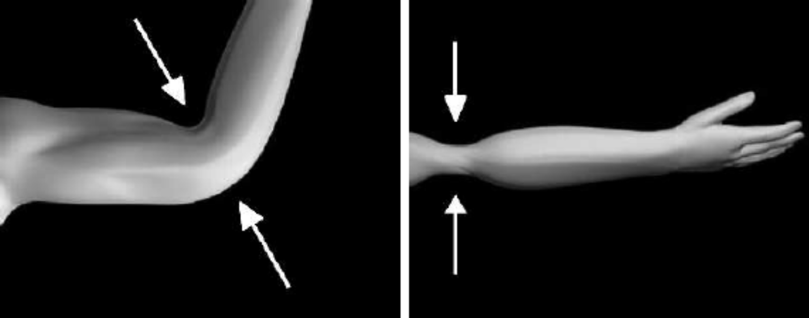

## Common Artifacts in Linear Blend Skinning
### 1.Overview of Linear Blend Skinning

Linear Blend Skinning, 즉 LBS는 각 정점에 여러 뼈의 변환 행렬을 가중치로 섞어 적용하는 방식이다.\
구현이 단순하고 계산 비용이 낮아서 실시간 렌더링에서 사용되어 왔지만, 뼈의 회전이 크게 일어나는 부위에서는 거슬리는 아티팩트가 생긴다.\
아래 이미지가 보여주는 대표적인 두 가지 현상이 바로 LBS에서의 고질적인 문제인 Joint Collapse 그리고 Candy Wrapper 이다.

  

### 2. Joint Collapse at Bent Joints

왼쪽 이미지처럼 팔꿈치나 무릎이 크게 굽혀질 때 발생하는 현상이다.\
팔을 굽히면 위팔 뼈와 아래팔 뼈가 서로 다른 회전을 가지게 되고, 팔꿈치 주변 정점들은 두 뼈의 영향을 동시에 받는다.\
이때 LBS는 각 뼈의 변환 결과를 단순히 가중 평균하기 때문에, 현실처럼 살과 근육의 부피가 유지되지 않는다.\
그 결과 관절 안쪽이 심하게 찌그러지거나 접히고, 피와 근육의 이동을 반영해야 할 바깥쪽도 자연스럽게 부풀지 못한다.\
사람의 팔꿈치가 형태가 유지되어 접히는 게 아니라, 정점들이 중간 위치로 끌려가면서 관절 부위가 납작해지는 것이다.

### 3. The Candy Wrapper Effect During Twisting

오른쪽 이미지처럼 팔이나 손목을 축 방향으로 비틀 때 나타나는 현상이다.\
사탕 포장지를 양쪽에서 비틀면 가운데가 얇게 꼬이듯이, 메시도 비틀림 중심부에서 부피가 줄어들며 이상하게 수축한다.\
이 현상은 LBS가 회전을 선형적으로 섞기 때문에 발생한다. 회전은 본래 구면적인 성질을 가지는 변환인데,\
행렬이나 변환된 위치를 단순 선형 보간하면 올바른 회전 경로가 보존되지 않는다.\
특히 서로 반대 방향에 가까운 회전이 섞이면, 정점들이 원래의 원통형 단면을 유지하지 못하고 중심축 쪽으로 말려 들어간다.

### 4. Why Linear Blending Causes These Artifacts

결국 LBS의 핵심 한계는 변환을 단순히 선형 혼합한다는 점에 있다. 위치는 부드럽게 보간되는 것처럼 보이지만,\
회전과 부피 보존은 제대로 처리되지 않는다. 그래서 관절이 굽혀질 때는 팔꿈치가 무너지고, 축 방향으로 비틀릴 때는 캔디 래퍼처럼 메시가 꼬인다.\
이런 문제를 줄이기 위해서는 보정용 블렌드 셰이프, 보조 뼈, Dual Quaternion Skinning 같은 방법을 사용해야 한다.