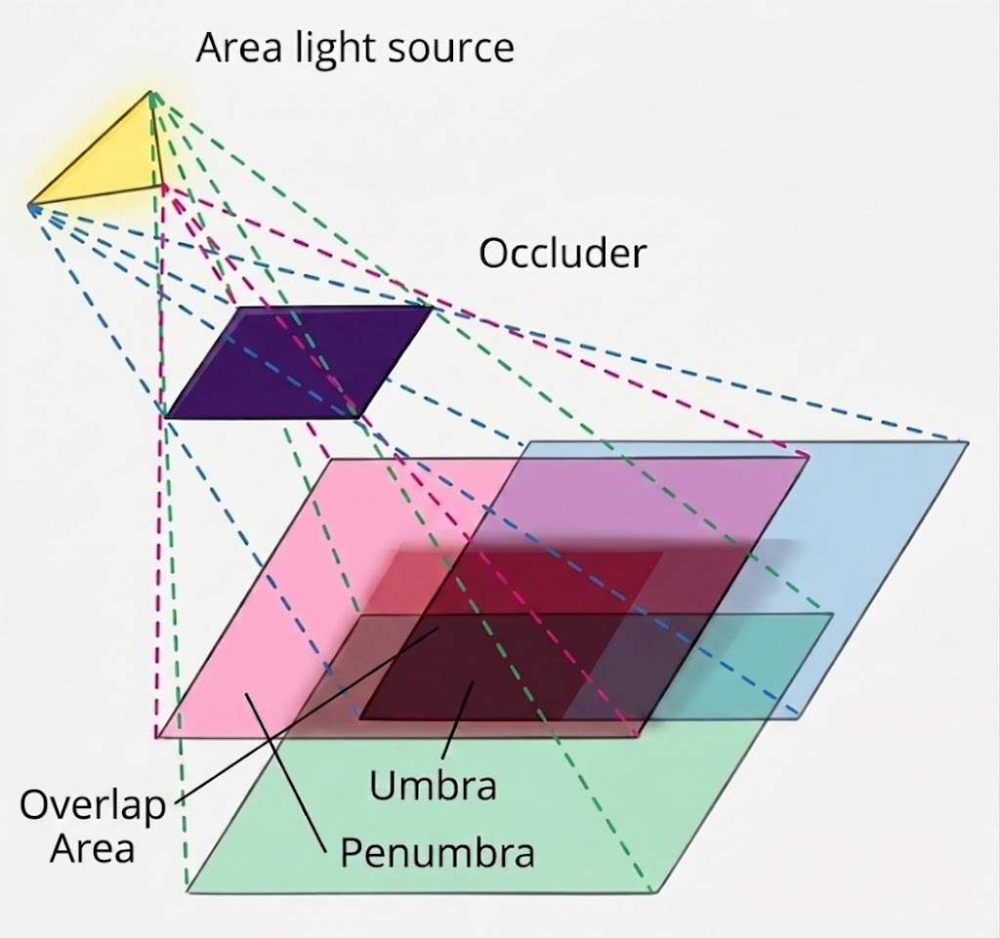

## Penumbra, Why Directional Light isn`t enough

### 1. Area Light

그래픽스 프로그래밍에서 자주 사용하는 Directional Light와 Point Light는 현실의 빛을 그대로 재현한 것이 아니다.\
계산을 쉽게 만들기 위한 근사이다. Directional Light는 모든 빛이 완전히 평행하게 들어온다고 가정하고, Point Light는\
빛이 하나의 무한히 작은 점에서 방출된다고 가정하기 때문이다.

이 가정은 렌더링에서는 매우 유용하지만, 실제 세계를 완전히 설명하지는 못한다. 태양조차도 하늘의 한 점이 아니라 일정한\
Angular Size를 가진 Disk처럼 보인다. 실내 조명 역시 전구, 형광등, LED 패널처럼 실제 Area를 가진다. 즉 현실의 많은\
광원은 Area Light에 가깝고, 이 면적이 존재하는 순간 그림자는 단순한 검은 경계가 아니라 점진적으로 흐려지는 구조를 갖게 된다.

### 2. Umbra(본그림자)와 Penumbra(반그림자)

  

Area Light가 물체에 의해 가려질 때, 그림자는 크게 Umbra와 Penumbra로 나뉜다.

Umbra는 광원의 모든 영역이 차폐물에 의해 가려진 영역이다. 이 영역에서는 Direct Light가 도달하지 않기 때문에 가장\
어두운 그림자가 생긴다. 다만 현실에서는 Ambient Light, Indirect Light, Global Illumination 같은 다른 빛이 들어올\
수 있으므로, 실제 화면에서 항상 완전한 검정이 되는 것은 아니다.

Penumbra는 광원의 일부는 보이고 일부는 가려지는 영역이다. 이 영역에서는 빛이 0 또는 1처럼 단순하게 끊기지 않고,\
광원의 보이는 비율에 따라 서서히 변한다. 그래서 그림자의 경계가 날카롭게 잘리는 대신 부드러운 그라데이션을 형성한다.\
광원의 면적이 클수록, 그리고 차폐물과 그림자를 받는 표면 사이의 거리가 멀수록 Penumbra는 더 넓어진다.

### 3. 왜 Directional Light만으로는 부족한가

Directional Light는 태양광을 근사하기에 편리하다. 태양은 지구에서 매우 멀리 있기 때문에, 대부분의 렌더링 상황에서는\
빛이 거의 평행하게 들어온다고 보아도 큰 문제가 없다. 하지만 태양은 실제로는 Angular Size를 가진 Area Light이다.\
이 작은 각크기 때문에 현실의 태양 그림자도 완전히 날카롭지 않고, 물체와 바닥 사이의 거리에 따라 경계가 조금씩 흐려진다.

기본적인 Shadow Map은 이런 차이를 잘 표현하지 못한다. Shadow Map은 광원 기준에서 장면의 깊이를 저장한 뒤, 카메라에서 보이는\
픽셀이 광원에서 보이는 깊이보다 뒤에 있는지 비교하여 Shadowed 또는 Lit를 판단한다. 이 방식은 그림자 여부를 거의 이진값처럼 다루기\
때문에, 경계가 지나치게 날카롭거나 해상도 부족으로 계단 현상처럼 보이기 쉽다.