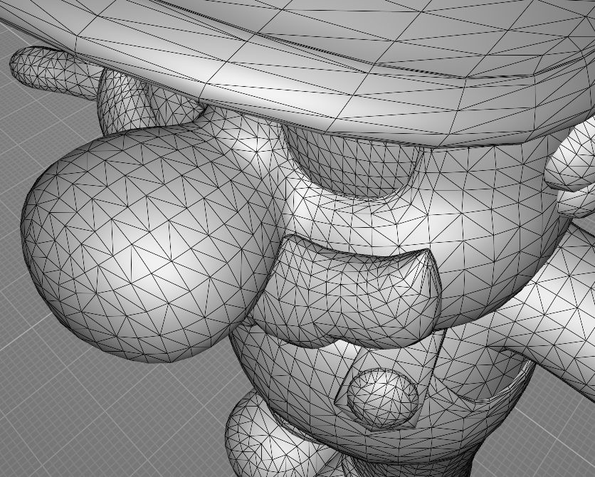
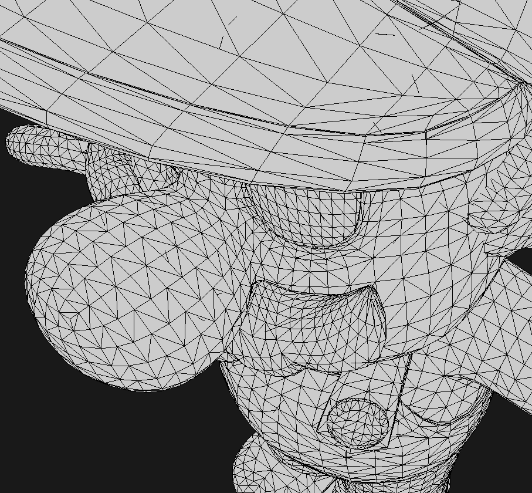

윈도우 3D viewer를 모방해 obj 파일을 띄울 수 있는 viewer를 만들었고 그 결과는 아래와 같았다. 좌측이 윈도우 3D, 우측이 viewer이다.

우측은 와이어프레임을 별도의 패스로 다시 그리는 방식이며 이런 방식은 동일한 geometry를 두 번 렌더링하게 된다.
우선 solid pass에서 채워진 폴리곤이 깊이 버퍼를 기록하고, 이후 wireframe pass에서 같은 위치의 edge를 다시 그리게 되는데,
이때 depth를 공유하게 된다. 따라서 픽셀의 선후 관계가 불분명해지는 z-fighting이 발생한다.

### 왜 depth bais로는 부족한가?
depth bias는 이 문제를 완화하기 위해 wireframe을 미세하게 앞으로 밀어내는 기법인데 bias 값은 화면 해상도, 깊이 분포, 투영 행렬에 따라 다르게 작용하기 때문에
모든 상황에서 안정적인 결과를 보장하지 못한다. 특히 곡면의 경우에는 내부 edge가 드러나거나 외곽선이 끊어지는 문제가 발생한다. 정해진 상수 값만큼 카메라를 향해
외곽선을 이동시켰기 때문에 발생하는 문제다.

### 그렇다면 무엇이 더필요한가?
이러한 한계를 해결하기 위해 도입되는 방식이 screen-space edge detection이다. 이 기법은 geometry를 다시 그리지 않고, 이미 렌더링이 완료된 화면 정보를 기반으로 경계를 추출한다.
최종 color buffer나 그 이전 단계에서 생성된 depth buffer와 normal buffer를 입력으로 사용하여, 각 픽셀 주변과의 차이를 분석함으로써 edge를 판단한다. 예를 들어 어떤 픽셀의 depth 값이 인접 픽셀과 급격히 달라진다면 이는 물체의 앞뒤 관계가 바뀌는 지점, 즉 실루엣이나 겹침 경계일 가능성이 높다. 또한 normal 값이 크게 변화하는 경우는 표면의 방향이 급격히 꺾이는 지점으로, 면과 면 사이의 경계로 해석할 수 있다. 이러한 기준을 바탕으로 픽셀 단위에서 임계값을 적용해 edge 여부를 판별하고, 해당 픽셀에 별도의 색을 덧입혀 선처럼 표현한다.

geometry를 추가로 렌더링하지 않기 때문에 z-fighting 자체가 발생하지 않는다. 모든 처리가 culling되어 이루어지므로 depth bias에 의존할 필요가 없고, 시점 변화나 모델 복잡도와 관계없이 안정적인 결과를 얻을 수 있다. 또한 동일한 버퍼를 기반으로 하기 때문에 일관된 외곽선 표현이 가능하다.

다만 screen-space edge detection은 메시의 실제 topology를 그대로 보여주는 방식은 아니다. 삼각형의 모든 edge를 정확히 표현하는 것이 아니라, 화면상에서 시각적으로 의미 있는 경계만을 추출한다. 따라서 내부 삼각형 구조를 모두 드러내는 디버깅 목적의 wireframe과는 성격이 다르다.