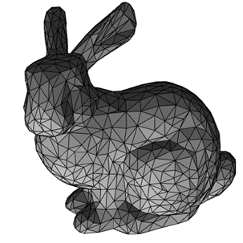

## OBJ

아래 이미지 어딘가 익숙하지 않은가? \
3D 모델링에서 샘플로 자주 쓰이는 스탠포드 토끼(Stanford bunny)다. \
요 근래에는 찾아보기 힘들지만 2D 그래픽스에서의 레나 포르센 포지션이라 할 수 있겠다.

<p>
  
</p>

아무튼 이런 파일들이 우리 눈에 보이기 전에는 어떻게 표현되는지 궁금하지 않은가? \
그 중 대표격이 OBJ다. FBX, glTF, GLB 등도 있다.

.obj 파일은 텍스트 파일이다. 메모장이나 txt파일로 변환해 열면 앞에 붙은 \
알파벳을 보고 뒤의 수치가 무엇을 의미하는지 쉽게 알 수 있다. 1번부터 번호를 매길 \
텐데, OBJ의 특징이니 크게 불편해하지 않길 바란다. 주석은 #을 사용한다.

OBJ는 요즘에도 꽤 쓰인다. 그러나 용량도 크고 파싱 비용도 커서 실시간 렌더링에는 \
잘 안 쓰인다. 그럼 왜 배우는가. 우리에게는 성능이 최우선 아닌가? 앞서 말했듯 OBJ는 \
사람이 이해하기 쉽고, 구조가 단순하다. 오래된 만큼 여러 툴에서 지원한다.

## v (vertex)
```
e.g. v 1.000000 0.000000 0.000000
```
정점을 의미하며 각각 x,y,z를 의미한다.

## vt (vertex texture | vertex texture coordinate)
```
e.g. vt 1.000000 0.000000
```
uv 좌표다.

## vn (vertex normal)
```
e.g. vn 0.000000 0.000000 1.000000
```
법선 벡터를 저장한 배열이며, face의 각 vertex corner가 인덱스로 참조한다. \
하나의 위치 정점(v)에 대해 여러 개의 normal이 참조될 수 있다.

## f (face)
면을 의미하며, 어떤 정점들을 연결해 geometry를 만들 것인지 명시한다.
```
e.g. f 1 2 3
```
이 경우는 1,2,3번 정점을 연결한 면이라는 의미다.
```
e.g. f 1/1 2/2 3/3
```
이건 1,2,3번이 각각 1,2,3번 UV에 대응된다는 의미다.
```
e.g. f 1/1/1 2/2/1 3/3/1
```
이건 위의 경우에 더해 normal까지 연결한다. 마지막의 경우 \
vertex corner의 위치는 v 3번, uv는 vt 3번, normal은 vn 1번이고 \
이 3개가 모여 face를 이룬다.
```
e.g. f 3//2 4//2 5//2
```
이건 UV가 없다.

## o (object)
```
e.g. o Cube
```
이건 오브젝트의 이름이다. 파일 하나에 여러 오브젝트가 있을 수 있다.

## g (group)
```
e.g. g Body
```
이건 그룹을 의미한다.

## mtllib (material library)
```
e.g. mtllib house.mtl
```
이 OBJ가 사용한 머티리얼 파일을 의미한다.

## usemtl (use material)
```
e.g. usemtl Brick \n f 1/1/1 2/2/1 3/3/1
```
이후 정의되는 face들에 적용될 머티리얼을 명시한다. \
섹션과 비슷하다고 보면 이해하기 쉽겠다.

## s (smoothing)
```
e.g. s 1 \n f 1/1/1 2/2/1 3/3/1
```
smoothing 처리를 명시하며 같이 묶이면 face는 normal을 공유해 \
마치 이어진 표면처럼 부드럽게 처리된다.

### 아래는 예시다

```
# Exported by Blender
mtllib sample.mtl
o Cube

v 0.000000 0.000000 0.000000
v 1.000000 0.000000 0.000000
v 1.000000 1.000000 0.000000
v 0.000000 1.000000 0.000000

vt 0.000000 0.000000
vt 1.000000 0.000000
vt 1.000000 1.000000
vt 0.000000 1.000000

vn 0.000000 0.000000 1.000000

usemtl Material001
s 1
f 1/1/1 2/2/1 3/3/1
f 1/1/1 3/3/1 4/4/1
```
해석하면 다음과 같다. \
머티리얼 파일은 sample.mtl \
오브젝트 이름은 Cube \
정점 4개가 있다 \
UV 4개가 있다 \
법선 1개가 있다 \
머티리얼 Material001을 사용한다 \
삼각형 2개로 사각형 한 면을 만든다